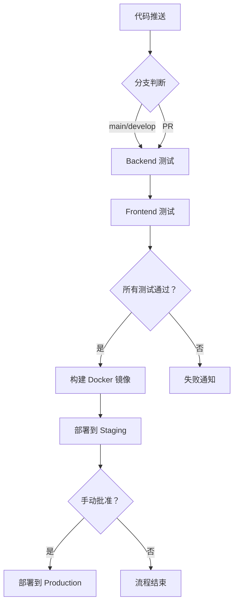

# CI/CD 配置说明

## 工作流概述

本项目使用 GitHub Actions 实现自动化 CI/CD 流程。

### 触发条件

- **Push**: main 或 develop 分支
- **Pull Request**: 针对 main 分支

### 工作流程



## Jobs 详解

### 1. Backend Test

**运行环境**: Ubuntu Latest + MySQL 8.0

**步骤**:
1. 设置 Go 环境 (1.21)
2. 缓存 Go modules
3. 安装依赖（包括 swag）
4. 生成 Swagger 文档
5. 编译代码
6. 运行单元测试（带 race detector）
7. 上传覆盖率到 Codecov
8. 运行性能基准测试

**输出**:
- 测试覆盖率报告
- 性能基准数据

### 2. Backend Docker Build

**触发条件**: Backend Test 通过 && Push 到 main 分支

**步骤**:
1. 设置 Docker Buildx
2. 登录 Docker Hub
3. 构建并推送镜像
4. 使用 Registry Cache 加速

**镜像标签**: `ddd-scaffold:{commit-sha}`

### 3. Frontend Test

**运行环境**: Ubuntu Latest + Node.js 18

**步骤**:
1. 设置 Node.js 环境
2. 缓存 node_modules
3. 安装依赖
4. 构建生产版本
5. 运行测试
6. 上传覆盖率到 Codecov

**输出**:
- 构建产物（build/）
- 测试覆盖率报告

### 4. Frontend Docker Build

**触发条件**: Frontend Test 通过 && Push 到 main 分支

**步骤**:
1. 设置 Docker Buildx
2. 登录 Docker Hub
3. 构建并推送前端镜像
4. 使用多阶段构建优化体积

**镜像标签**: `ddd-scaffold-frontend:{commit-sha}`

### 5. Deploy Staging

**触发条件**: Backend & Frontend Docker Build 成功 && Push 到 main 分支

**步骤**:
1. Checkout 代码
2. 部署到 Staging 环境

**部署方式**（可选）:
- Kubernetes: `kubectl apply -f deployments/k8s/staging/`
- Docker Compose: `docker-compose -f docker-compose.staging.yml up -d`
- 云平台 API 调用

## 本地测试 CI/CD

### 使用 act 工具

[act](https://github.com/nektos/act) 允许你在本地运行 GitHub Actions：

```bash
# 安装 act
brew install act

# 运行所有工作流
act

# 运行特定 job
act backend-test

# 模拟 push 事件
act push

# 使用不同的 secret 文件
act -s .env.secrets
```

## 缓存策略

### Go Modules

```yaml
- name: Cache Go modules
  uses: actions/cache@v3
  with:
    path: ~/go/pkg/mod
    key: ${{ runner.os }}-go-${{ hashFiles('**/go.sum') }}
```

### Node Modules

```yaml
- name: Cache Node modules
  uses: actions/cache@v3
  with:
    path: frontend/node_modules
    key: ${{ runner.os }}-node-${{ hashFiles('frontend/package-lock.json') }}
```

### Docker Layer Cache

```yaml
cache-from: type=registry,ref=${{ secrets.DOCKER_USERNAME }}/ddd-scaffold:buildcache
cache-to: type=registry,ref=${{ secrets.DOCKER_USERNAME }}/ddd-scaffold:buildcache,mode=max
```

## Secrets 配置

需要在 GitHub Settings -> Secrets and variables -> Actions 中配置：

| Secret Name | 描述 | 示例值 |
|-------------|------|--------|
| `DOCKER_USERNAME` | Docker Hub 用户名 | `myusername` |
| `DOCKER_PASSWORD` | Docker Hub 密码或 Access Token | `ghp_xxxx` |
| `KUBE_CONFIG_STAGING` | Staging 环境 KubeConfig（Base64） | `base64 ~/.kube/config` |

## 故障排查

### Job 失败

1. **查看日志**: GitHub Actions -> 具体 Workflow -> 失败的 Job
2. **重试 Job**: 点击 "Re-run jobs"
3. **本地复现**: 使用 `act` 工具在本地运行

### 缓存问题

```bash
# 清除缓存
gh cache delete --all

# 或者在 UI 中删除
Settings -> Actions -> Caches -> Delete all caches
```

### Docker 构建慢

- 检查 Registry Cache 是否生效
- 使用多阶段构建减少最终镜像大小
- 优化 .dockerignore 文件

## 性能优化建议

1. **并行化**: 前后端测试并行执行 ✅
2. **缓存**: 充分利用各种缓存机制 ✅
3. **自托管 Runner**: 对于频繁项目，考虑使用自托管 Runner
4. **并发构建**: 使用 `strategy.matrix` 并行测试多个 Go 版本

## 监控与告警

### Workflow 状态通知

可以添加 Slack/Discord/邮件通知：

```yaml
- name: Notify on failure
  if: failure()
  uses: slackapi/slack-github-action@v1.23.0
  with:
    channel-id: '#ci-cd-alerts'
    slack-message: "Workflow failed: ${{ github.workflow }}"
  env:
    SLACK_BOT_TOKEN: ${{ secrets.SLACK_BOT_TOKEN }}
```

### 指标采集

- Workflow 运行时长
- 成功率统计
- 缓存命中率
- Docker 镜像大小趋势

---

## 下一步优化

- [ ] 添加 E2E 测试
- [ ] 集成 SonarQube 代码质量检查
- [ ] 自动发布 Release Notes
- [ ] Canary 部署支持
- [ ] 自动回滚机制
