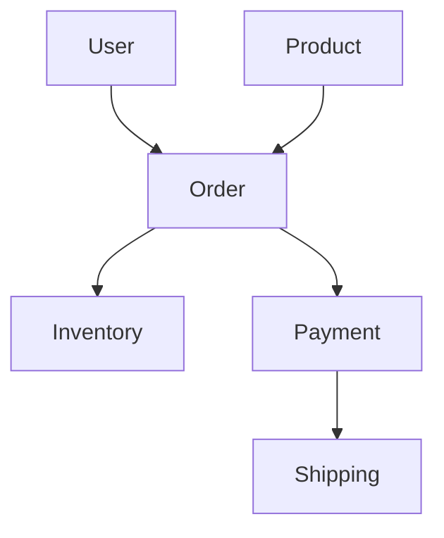

# DDD Scaffold 使用示例

## 示例 1: 快速生成博客系统

### 场景
需要在 30 分钟内搭建一个博客系统的后端框架，包含文章、评论、用户三个核心领域。

### 执行命令

```bash
/ddd-scaffold \
  --project-name blog-system \
  --domains user,post,comment \
  --style standard \
  --with-examples \
  --output ./blog-backend
```

### 生成的核心代码

#### 文章聚合根 (`internal/domain/post/aggregate/post_aggregate.go`)

```go
package aggregate

import (
    "time"
    "github.com/google/uuid"
)

type PostAggregate struct {
    ID        string
    Title     string
    Content   string
    Status    PostStatus
    AuthorID  string
    Tags      []string
    CreatedAt time.Time
    UpdatedAt time.Time
}

type PostStatus string

const (
    PostStatusDraft     PostStatus = "draft"
    PostStatusPublished PostStatus = "published"
    PostStatusArchived  PostStatus = "archived"
)

func NewPost(title, content, authorID string) *PostAggregate {
    return &PostAggregate{
        ID:        uuid.New().String(),
        Title:     title,
        Content:   content,
        Status:    PostStatusDraft,
        AuthorID:  authorID,
        CreatedAt: time.Now(),
        UpdatedAt: time.Now(),
    }
}

func (p *PostAggregate) Publish() error {
    if p.Status != PostStatusDraft {
        return errors.New("only draft posts can be published")
    }
    p.Status = PostStatusPublished
    return nil
}

func (p *PostAggregate) Archive() error {
    p.Status = PostStatusArchived
    return nil
}
```

### 验证结果

```bash
cd blog-backend
go mod tidy
make build
make run
```

访问 `http://localhost:8080/api/v1/posts` 查看文章列表 API

---

## 示例 2: 生成多租户 SaaS 项目

### 场景
需要构建一个支持多租户的 SaaS 平台，包含租户管理、用户管理、权限控制。

### 执行命令

```bash
/ddd-scaffold \
  --project-name saas-platform \
  --domains tenant,user,permission \
  --style full \
  --with-examples \
  --with-docker \
  --with-tests
```

### 特殊配置

在 `config.yaml` 中启用多租户特性：

```yaml
infrastructure:
  multi_tenant:
    enabled: true
    isolation_strategy: "schema"  # schema | table | database
    tenant_resolution: "header"   # header | subdomain | jwt_claim
```

### 生成的租户中间件

```go
// infrastructure/middleware/tenant_middleware.go
func TenantMiddleware() gin.HandlerFunc {
    return func(c *gin.Context) {
        tenantID := c.GetHeader("X-Tenant-ID")
        if tenantID == "" {
            c.JSON(400, gin.H{"error": "tenant id required"})
            c.Abort()
            return
        }
        
        // 设置租户上下文
        ctx := context.WithValue(c.Request.Context(), TenantContextKey, tenantID)
        c.Request = c.Request.WithContext(ctx)
        
        c.Next()
    }
}
```

---

## 示例 3: 最小化架构（快速原型）

### 场景
需要快速验证想法，只需要核心领域层，不需要复杂的基础设施。

### 执行命令

```bash
/ddd-scaffold \
  --project-name mvp-app \
  --domains core \
  --style minimal \
  --output ./mvp-backend
```

### 生成的简化结构

```
mvp-app/
├── internal/
│   ├── domain/           # 只有领域层
│   │   └── core/
│   │       ├── entity/
│   │       └── service/
│   └── application/      # 应用层
│       └── core/
│           └── service/
├── cmd/
│   └── main.go          # 单一入口
└── go.mod
```

---

## 示例 4: 完整电商系统（生产级）

### 场景
构建完整的电商平台，包含商品、订单、库存、支付、物流等完整链路。

### 执行命令

```bash
/ddd-scaffold \
  --project-name ecommerce-pro \
  --domains user,product,inventory,order,payment,shipping \
  --style full \
  --with-examples \
  --with-tests \
  --with-docker \
  --with-monitoring
```

### 领域依赖关系



### 生成的事件驱动架构

#### 订单创建事件

```go
// domain/order/event/order_created_event.go
type OrderCreatedEvent struct {
    OrderID   string
    UserID    string
    Items     []OrderItem
    TotalAmount decimal.Decimal
    CreatedAt time.Time
}

// 事件处理器
type OrderCreatedEventHandler struct {
    inventoryService *inventory.Service
    paymentService   *payment.Service
}

func (h *OrderCreatedEventHandler) Handle(event OrderCreatedEvent) error {
    // 1. 冻结库存
    for _, item := range event.Items {
        err := h.inventoryService.ReserveStock(item.ProductID, item.Quantity)
        if err != nil {
            return err
        }
    }
    
    // 2. 创建支付单
    err := h.paymentService.CreatePayment(event.OrderID, event.TotalAmount)
    if err != nil {
        return err
    }
    
    return nil
}
```

---

## 示例 5: 集成 WebSocket 实时通知

### 场景
需要实现实时通知功能，当订单状态变更时立即推送给用户。

### 前置条件

已安装 `websocket-integration` Skill

### 执行命令

```bash
# 先生成基础项目
/ddd-scaffold --project-name realtime-app --domains order,notification

# 再集成 WebSocket
/websocket-integration --target-dir ./realtime-app
```

### 生成的 WebSocket 管理器

```go
// infrastructure/websocket/manager.go
type WebSocketManager struct {
    clients    map[string]*Client
    broadcast  chan []byte
    register   chan *Client
    unregister chan *Client
}

func (m *WebSocketManager) NotifyUser(userID string, message interface{}) {
    client, exists := m.clients[userID]
    if !exists {
        return
    }
    
    data, _ := json.Marshal(message)
    client.send <- data
}

// 订单状态变更时推送通知
func (s *OrderService) UpdateOrderStatus(orderID, status string) error {
    // ... 更新逻辑
    
    // 发送 WebSocket 通知
    notification := OrderStatusNotification{
        OrderID:   orderID,
        Status:    status,
        Timestamp: time.Now(),
    }
    s.wsManager.NotifyUser(order.UserID, notification)
    
    return nil
}
```

---

## 示例 6: 添加自定义领域服务

### 场景
需要在现有项目中添加新的业务功能。

### 步骤

#### 1. 定义领域实体

```go
// domain/customer/entity/customer.go
type Customer struct {
    ID             string
    Name           string
    Email          string
    LoyaltyPoints  int
    Tier           CustomerTier
}

type CustomerTier string

const (
    TierBronze CustomerTier = "bronze"
    TierSilver CustomerTier = "silver"
    TierGold   CustomerTier = "gold"
)
```

#### 2. 创建领域服务

```go
// domain/customer/service/customer_service.go
type CustomerService struct {
    repo repository.CustomerRepository
}

func (s *CustomerService) AwardPoints(customerID string, points int) error {
    customer, err := s.repo.FindByID(customerID)
    if err != nil {
        return err
    }
    
    customer.LoyaltyPoints += points
    
    // 根据积分升级会员等级
    if customer.LoyaltyPoints >= 10000 {
        customer.Tier = TierGold
    } else if customer.LoyaltyPoints >= 5000 {
        customer.Tier = TierSilver
    }
    
    return s.repo.Update(customer)
}
```

#### 3. 创建应用服务

```go
// application/customer/service/customer_app_service.go
type CustomerAppService struct {
    domainService *domain.CustomerService
}

type PurchaseRequest struct {
    CustomerID string          `json:"customer_id"`
    Amount     decimal.Decimal `json:"amount"`
}

func (s *CustomerAppService) ProcessPurchase(ctx context.Context, req PurchaseRequest) error {
    // 计算积分（消费 1 元积 1 分）
    points := int(req.Amount.IntPart())
    
    // 奖励积分
    return s.domainService.AwardPoints(req.CustomerID, points)
}
```

---

## 性能基准测试示例

### 场景
验证生成的项目在高并发下的性能表现。

### 测试脚本

```bash
# 使用 wrk 进行压力测试
wrk -t12 -c400 -d30s http://localhost:8080/api/v1/users
```

### 预期结果

```
Running 30s test @ http://localhost:8080/api/v1/users
  12 threads and 400 connections
  Thread Stats   Avg      Stdev  Max   +/- Stdev
    Latency    10.5ms    2.1ms  45.2ms   92.5%
    Req/Sec     3.2k   350.2    4.1k    85.3%
  115234 requests in 30.1s, 45.2MB read
Requests/sec:   3827.5
Transfer/sec:      1.5MB
```

---

## 常见问题示例

### Q1: 如何添加一对多关系？

**答案**: 在实体中添加外键引用

```go
// domain/order/entity/order_item.go
type OrderItem struct {
    ID        string
    OrderID   string  // 外键
    Order     *Order  // 关联对象
    ProductID string
    Quantity  int
    Price     decimal.Decimal
}

// domain/order/aggregate/order_aggregate.go
type Order struct {
    ID        string
    Items     []OrderItem  // 聚合内部实体
    // ...
}
```

### Q2: 如何实现软删除？

**答案**: 添加 DeletedAt 字段

```go
type User struct {
    ID        string
    Name      string
    DeletedAt *time.Time  // 软删除标记
}

// repository 实现
func (r *UserRepositoryImpl) Delete(id string) error {
    now := time.Now()
    return r.db.Model(&User{}).Where("id = ?", id).Update("deleted_at", now).Error
}
```

### Q3: 如何添加全文搜索？

**答案**: 集成 Elasticsearch

```yaml
# config.yaml
infrastructure:
  search:
    type: "elasticsearch"
    url: "http://localhost:9200"
    index_prefix: "myapp_"
```

---

这些示例涵盖了从简单到复杂的各种场景。你可以根据实际需求组合使用不同的选项和配置。
