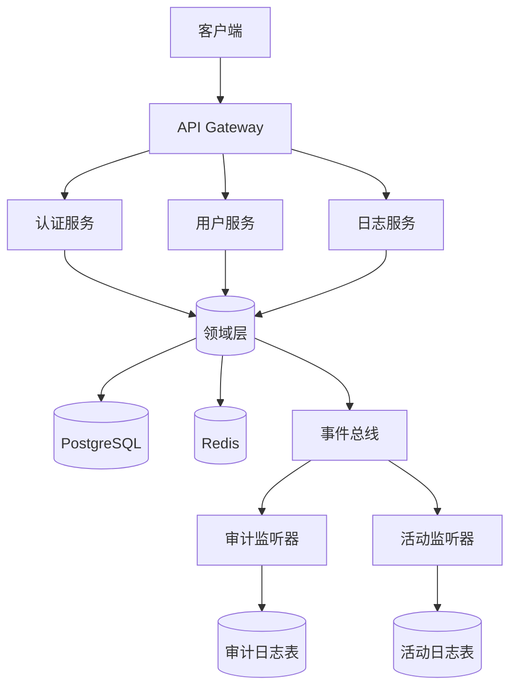

# Go DDD Scaffold

基于领域驱动设计（DDD）的企业级 Go 后端脚手架项目。

## 🎯 项目简介

本项目提供一个生产就绪的 DDD 架构模板，包含完整的用户认证、权限管理、审计日志等核心功能，帮助团队快速启动企业级 Go 项目。

### 核心特性

- ✅ **DDD 四层架构**：Domain → Application → Infrastructure → Transport
- ✅ **事件驱动设计**：领域事件发布/订阅机制
- ✅ **统一错误处理**：标准化错误码与响应格式
- ✅ **JWT 认证体系**：访问令牌 + 刷新令牌 + 设备管理
- ✅ **审计日志**：自动记录关键操作
- ✅ **Prometheus 监控**：内置 HTTP/认证/数据库指标采集与 Grafana 仪表板
- ✅ **完整运维文档**：监控配置、故障排查、性能调优指南
- ✅ **Swagger API 文档**：自动生成 OpenAPI 规范
- ✅ **数据库迁移**：SQL 迁移脚本管理

## 📚 文档导航

### 快速开始
- [🚀 快速开始指南](docs/development/GETTING_STARTED.md) - 5 分钟运行项目
- [📖 开发指南](docs/development/DEVELOPMENT_GUIDE.md) - 开发规范与流程

### 架构设计
- [🏗️ DDD 架构设计](docs/architecture/DDD_ARCHITECTURE.md) - 架构理念与分层设计
- [🎯 领域模型](docs/architecture/DOMAIN_MODEL.md) - 聚合根、实体、值对象
- [⚡ 事件风暴](docs/architecture/EVENT_STORMING.md) - 领域事件设计

### API 文档
- [📡 API 接口文档](http://localhost:8080/swagger/index.html) - Swagger UI（启动服务后访问）

### 数据库
- [🗄️ 数据库设计](docs/database/SCHEMA_DESIGN.md) - 表结构与 ER 图
- [🔄 迁移指南](docs/database/MIGRATION_GUIDE.md) - 数据库版本管理

### 部署运维
- [🐳 Docker 部署](docs/deployment/DOCKER_DEPLOYMENT.md) - 容器化部署
- [📊 监控配置指南](docs/operations/MONITORING_SETUP.md) - Prometheus + Grafana
- [🔍 故障排查指南](docs/operations/TROUBLESHOOTING.md) - 常见问题诊断
- [✅ 生产检查清单](docs/deployment/PRODUCTION_CHECKLIST.md) - 上线前检查

## 🚀 快速开始

### 前置要求

- Go 1.21+
- PostgreSQL 14+
- Redis 7+
- Docker & Docker Compose（可选）

### 启动服务

```bash
# 1. 克隆项目
git clone <repository-url>
cd ddd-scaffold

# 2. 启动基础设施（PostgreSQL + Redis）
docker-compose up -d postgres redis

# 3. 运行数据库迁移
cd backend
make migrate up

# 4. 启动 API 服务
make run api

# 5. 访问 Swagger 文档
# http://localhost:8080/swagger/index.html
```

详细步骤请参考：[快速开始指南](docs/development/GETTING_STARTED.md)

## 📁 项目结构

```
ddd-scaffold/
├── backend/                    # Go 后端服务
│   ├── cmd/                    # 应用入口
│   │   ├── api/               # API 服务
│   │   ├── worker/            # 异步任务 Worker
│   │   └── cli/               # CLI 工具
│   ├── internal/              # 内部代码（不对外暴露）
│   │   ├── domain/            # 领域层（实体、值对象、领域事件）
│   │   ├── app/               # 应用层（用例服务、DTO）
│   │   ├── infra/             # 基础设施层（数据库、Redis、消息队列）
│   │   ├── transport/         # 传输层（HTTP Handler、Middleware）
│   │   └── listener/          # 事件监听器
│   ├── pkg/                   # 公共工具包
│   ├── migrations/            # 数据库迁移脚本
│   ├── configs/               # 配置文件
│   └── api/swagger/           # Swagger 文档
├── docs/                      # 项目文档
├── scripts/                   # 运维脚本
├── docker-compose.yml         # Docker 编排
└── prometheus.yml             # Prometheus 配置
```

## 🛠️ 常用命令

```bash
# 开发
make run api                   # 启动 API 服务
make run worker                # 启动 Worker
make swagger gen               # 生成 Swagger 文档

# 数据库
make migrate up                # 执行数据库迁移
make migrate down              # 回滚数据库迁移

# 测试
make test                      # 运行所有测试
make test-short                # 运行单元测试（跳过集成测试）
make coverage                  # 生成测试覆盖率报告

# 代码质量
make fmt                       # 格式化代码
make vet                       # 静态代码检查
make lint                      # 代码 linting

# 构建
make build                     # 构建 API 服务
make build-worker              # 构建 Worker
make cli                       # 构建 CLI 工具
```

## 🏗️ 技术栈

### 核心框架
- **Web 框架**：[Gin](https://github.com/gin-gonic/gin)
- **ORM**：[GORM](https://gorm.io/)
- **数据库**：PostgreSQL
- **缓存**：Redis
- **异步任务**：[Asynq](https://github.com/hibiken/asynq)

### 认证与安全
- **JWT**：[golang-jwt](https://github.com/golang-jwt/jwt)
- **密码加密**：bcrypt
- **参数验证**：[go-playground/validator](https://github.com/go-playground/validator)

### 监控与可观测性
- **指标采集**：Prometheus
- **可视化**：Grafana
- **链路追踪**：自定义 Trace ID 中间件
- **日志**：结构化日志（zap）

### 开发工具
- **API 文档**：[Swag](https://github.com/swaggo/swag)
- **数据库迁移**：[go-migrate](https://github.com/golang-migrate/migrate)
- **代码检查**：golangci-lint

## 📊 系统架构



## 🤝 贡献指南

1. Fork 本仓库
2. 创建特性分支（`git checkout -b feature/AmazingFeature`）
3. 提交更改（`git commit -m 'feat: 添加某个特性'`）
4. 推送到分支（`git push origin feature/AmazingFeature`）
5. 提交 Pull Request

## 📄 开源协议

本项目采用 MIT 协议 - 详见 [LICENSE](LICENSE) 文件

## 📮 联系方式

- 问题反馈：[GitHub Issues](https://github.com/shenfay/go-ddd-scaffold/issues)
- 讨论交流：[GitHub Discussions](https://github.com/shenfay/go-ddd-scaffold/discussions)
