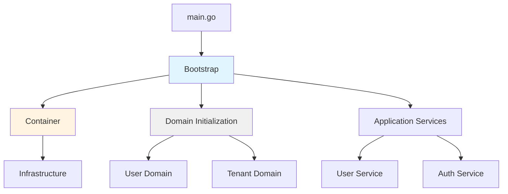
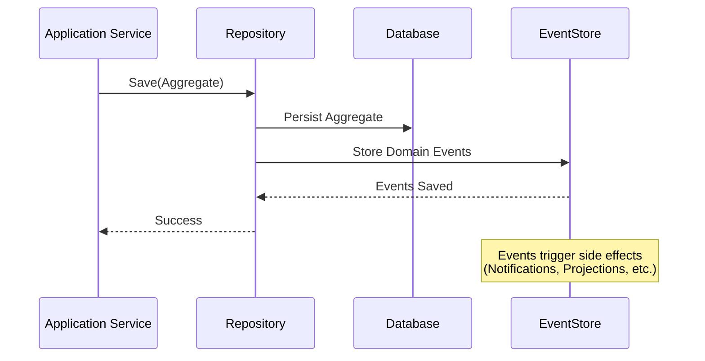
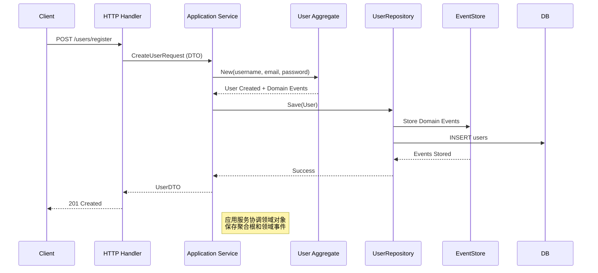
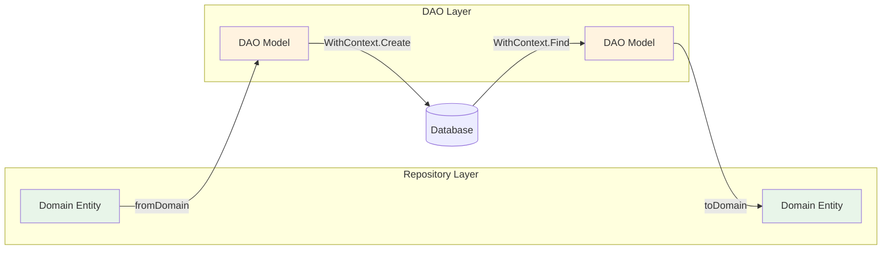
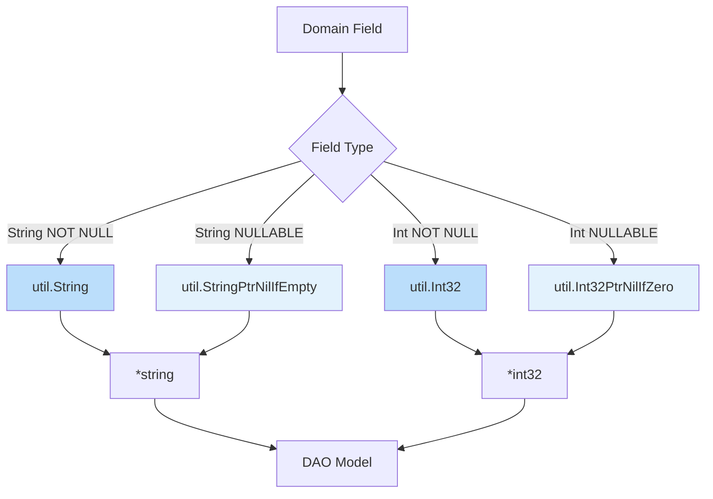

# Go DDD Scaffold

企业级 DDD 单体应用脚手架，基于领域驱动设计和事件驱动架构构建的标准化企业应用开发平台。

## 项目概述

这是一个面向企业级应用场景的完整 DDD 架构单体应用模板，提供：

- ✅ 标准化的领域驱动设计实践
- ✅ 自动路由注册机制
- ✅ 完整的领域事件机制
- ✅ 企业级安全和合规特性
- ✅ 高性能和可扩展性设计

## 核心架构特色

### DDD + Composition Root 分层架构

```
┌──────────────────────────────────────────────┐
│         Presentation Layer                    │
│  (HTTP Handlers / gRPC / Middleware)          │
├──────────────────────────────────────────────┤
│         Application Layer                     │
│  (Use Cases / Services / DTOs)                │
├──────────────────────────────────────────────┤
│           Domain Layer                        │
│  (Entities / Value Objects / Aggregates)      │
├──────────────────────────────────────────────┤
│       Infrastructure Layer                    │
│  (Persistence / External Services / Cache)    │
└──────────────────────────────────────────────┘
            ↑
    Bootstrap (Composition Root)
    - 创建所有依赖
    - 组装依赖关系
    - 类型安全，零运行时错误
```

### Composition Root 模式

项目采用 **Composition Root** 模式进行依赖管理：



- ✅ **Bootstrap** 负责创建和组装所有领域组件
- ✅ **Container** 仅管理基础设施和 HTTP 路由
- ✅ **类型安全**：消除运行时类型断言，编译期检查
- ✅ **职责清晰**：各组件职责边界明确

**详细说明**: [Container 重构说明](docs/architecture/container-refactoring.md) | [开发规范](docs/guides/development-guidelines.md)

### 事件驱动架构



- ✅ 完整的领域事件机制
- ✅ 事件存储和回放能力  
- ✅ 异步事件处理（用于触发副作用）

## 主要流程

### 1. 用户注册流程



### 2. Repository-DAO 数据流转



**详细实现**: [Repository-DAO 使用指南](docs/guides/repository-dao-usage.md)

### 3. 智能指针转换流程



**技术细节**: [util/cast.go 方法命名规范](docs/guides/repository-dao-usage.md#类型转换工具)

## 目录结构

```
go-ddd-scaffold/
├── cmd/                    # 应用程序入口
│   ├── api/               # REST API 服务（main.go + domains.go）
│   ├── worker/            # 后台工作任务
│   └── cli/               # 命令行工具（代码生成/迁移管理）
├── internal/              # 内部包
│   ├── domain/            # 领域层（核心业务逻辑）
│   │   ├── user/          # 用户领域
│   │   ├── tenant/        # 租户领域
│   │   └── common/        # 通用领域概念
│   ├── bootstrap/         # Composition Root（依赖组装）
│   │   ├── bootstrap.go   # 应用启动器
│   │   └── user_domain.go # 用户领域初始化
│   ├── container/         # 基础设施容器
│   │   └── container.go   # Container 实现（HTTP 路由）
│   ├── application/       # 应用层（用例编排）
│   │   ├── auth/          # 认证服务
│   │   ├── user/          # 用户应用服务
│   │   └── shared/        # 共享应用组件
│   ├── interfaces/        # 接口层（适配器）
│   │   ├── http/          # HTTP 接口（路由自动注册）
│   │   ├── grpc/          # gRPC 接口
│   │   └── messaging/     # 消息接口
│   └── infrastructure/    # 基础设施层
│       ├── persistence/   # 数据持久化（DAO + Repository）
│       ├── messaging/     # 消息传递
│       ├── eventstore/    # 事件存储
│       ├── cache/         # 缓存实现
│       └── config/        # 配置管理
├── configs/               # 配置文件（.env + .yaml）
├── migrations/            # 数据库迁移脚本
├── docs/                  # 文档
│   ├── architecture/      # 架构设计文档
│   ├── guides/            # 开发指南
│   ├── implementation/    # 实现细节
│   └── reference/         # 技术参考
├── deployments/           # 部署配置（Docker + K8s）
├── tools/                 # 开发工具（CLI/Generator）
├── shared/                # 共享库（DDD 基础/CQRS/Response）
└── go.mod                 # Go 模块定义
```

## 快速开始

### 开发环境要求
- Go 1.21+
- PostgreSQL 15+
- Redis 7+

### 使用 Makefile（推荐）

```bash
# 查看所有可用命令
make help

# 安装依赖（GORM/gen、swag 等）
make install-deps

# 启动开发服务器（热重载）
make run

# 构建应用
make build

# 运行测试
make test

# 健康检查
make health
```

### 手动启动

```bash
# 1. 安装依赖
go mod tidy

# 2. 启动应用
# 重要：使用 ./cmd/api/ 而非 ./cmd/api/main.go，以包含 domains.go
go run ./cmd/api/

# 或者先编译再运行
go build -o bin/api ./cmd/api
./bin/api
```

**注意**：必须使用 `go run ./cmd/api/` 而不是 `go run ./cmd/api/main.go`，因为 `domains.go` 包含了领域路由的自动注册导入。

### 验证启动成功

```bash
# 健康检查
curl http://localhost:8080/health

# 预期响应
{
  "code": 0,
  "message": "success",
  "data": {
    "status": "healthy"
  }
}
```

## 技术组件

### 核心框架
- **Web 框架**: [Gin](https://github.com/gin-gonic/gin) v1.12.0 - 高性能 HTTP Web 框架
- **ORM**: [GORM](https://github.com/go-gorm/gorm) v1.31.1 - Go 语言 ORM 库
- **代码生成**: [GORM/gen](https://gorm.io/gen/) v0.3.27 - 类型安全的 DAO 代码生成器
- **API 文档**: [Swaggo](https://github.com/swaggo/swag) v1.16.6 - OpenAPI/Swagger 文档生成

### 数据存储
- **数据库驱动**: [PostgreSQL](https://github.com/lib/pq) v1.11.2 - PostgreSQL 数据库驱动
- **连接池**: [pgx/v5](https://github.com/jackc/pgx) v5.6.0 - PostgreSQL 工具包
- **读写分离**: [dbresolver](https://gorm.io/plugin/dbresolver) v1.6.2 - GORM 插件
- **缓存**: [Redis](https://github.com/redis/go-redis) v9.18.0 - Redis 客户端

### 任务队列与监控
- **任务队列**: [asynq](https://github.com/hibiken/asynq) v0.25.1 - 分布式任务队列系统
- **任务监控**: [asynqmon](https://github.com/hibiken/asynqmon) v0.6.2 - 类似 Flower 的任务监控 UI

### 配置与日志
- **JWT**: [golang-jwt/jwt/v5](https://github.com/golang-jwt/jwt) v5.3.1 - JWT 令牌生成与验证
- **密码加密**: [golang.org/x/crypto](https://pkg.go.dev/golang.org/x/crypto) v0.49.0 - 密码哈希和加密
- **参数验证**: [go-playground/validator](https://github.com/go-playground/validator) v10.30.1 - 结构体验证

### 配置与日志
- **配置管理**: [Viper](https://github.com/spf13/viper) v1.21.0 - 配置文件解决方案
- **环境变量**: [spf13/cast](https://github.com/spf13/cast) v1.10.0 - 类型转换工具
- **日志框架**: [Zap](https://go.uber.org/zap) v1.27.1 - 高性能结构化日志
- **文件监听**: [fsnotify](https://github.com/fsnotify/fsnotify) v1.9.0 - 配置文件热重载

### 安全与认证
- **CLI 框架**: [Cobra](https://github.com/spf13/cobra) v1.10.2 - 命令行工具框架

### 工具库
- **时间处理**: [Carbon v2](https://github.com/dromara/carbon) v2.6.16 - 日期时间处理库
- **UUID**: [google/uuid](https://github.com/google/uuid) v1.6.0 - UUID 生成
- **JSON 处理**: [goccy/go-json](https://github.com/goccy/go-json) v0.10.5 - 高性能 JSON 库
- **YAML 解析**: [goccy/go-yaml](https://github.com/goccy/go-yaml) v1.19.2 - YAML 解析器

### 命令行工具
- **CLI 框架**: [Cobra](https://github.com/spf13/cobra) v1.10.2 - 命令行工具框架

---

## 企业级特性

### 📬 事件驱动架构
- ✅ **纯事件溯源** - `domain_events` 表仅记录历史，不含状态字段
- ✅ **asynq 任务队列** - 负责任务调度、重试、超时管理
- ✅ **asynqmon 监控** - 类似 Flower 的 Web UI，实时监控
- ✅ **职责分离** - EventStore 专注溯源，asynq 专注调度

详细文档：[事件驱动架构设计](docs/architecture/event-driven-architecture.md)

### 🔐 安全合规
- ✅ 多因素认证支持（MFA）
- ✅ 完整的审计日志（所有关键操作可追溯）
- ✅ RBAC 权限控制系统（角色 - 权限矩阵）
- ✅ 数据加密和隐私保护（传输中 + 静态）

### ⚡ 性能优化
- ✅ 多级缓存架构（Redis + 内存）
- ✅ 读写分离设计（主从数据库）
- ✅ 查询优化器（执行计划分析）
- ✅ 连接池管理（高效资源复用）

### 📊 可观测性
- ✅ 分布式追踪（OpenTelemetry 兼容）
- ✅ 结构化日志（JSON 格式，ELK 集成）
- ✅ 性能监控（Prometheus + Grafana）
- ✅ 健康检查（实时状态反馈）

---

## 开发指南

详细的技术文档请参考：
- 📐 [架构设计文档](docs/architecture/) - 整体架构和设计原则
- 📖 [DDD 模式指南](docs/ddd-patterns/) - DDD 模式详解
- 🛠️ [开发规范](docs/guides/development-guidelines.md) - 编码规范和最佳实践
- 🗄️ [Repository-DAO 使用指南](docs/guides/repository-dao-usage.md) - Repository 层实现细节
- 🔄 [类型转换和时间处理](docs/guides/util-packages-guide.md) - util 包使用手册

---

## 许可证

Apache 2.0 License