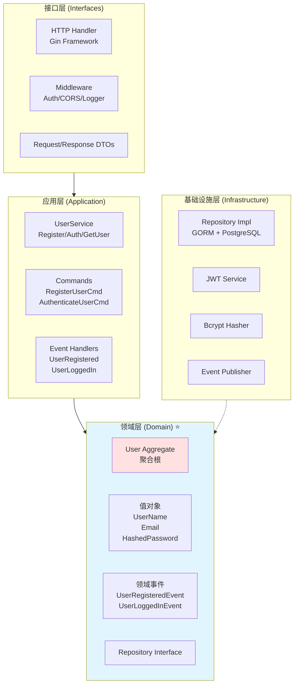

## 📊 架构图集

### Clean Architecture 分层架构



**说明：**
- **依赖方向**：外层依赖内层，内层不依赖外层
- **领域层**：核心业务逻辑，不依赖任何框架
- **接口层**：处理 HTTP 请求，转换为应用层命令
- **基础设施层**：实现技术细节（数据库、缓存等）

---

### Composition Root 设计

```mermaid
graph TB
    Bootstrap[Bootstrap<br/>Composition Root]
    
    subgraph DomainComponents[领域组件]
        UserHandlers[user.*Handler]
        TenantHandlers[tenant.*Handler]
    end
    
    subgraph InfraComponents[基础设施组件]
        DB[PostgreSQL DB]
        Redis[Redis Cache]
        Logger[Zap Logger]
    end
    
    subgraph HttpComponents[接口层组件]
        HttpHandlers[HTTP Handlers]
        Router[Gin Router]
    end
    
    Bootstrap --> DomainComponents
    Bootstrap --> InfraComponents
    Bootstrap --> HttpComponents
    
    style Bootstrap fill:#ffe1e1
    style DomainComponents fill:#e1f5ff