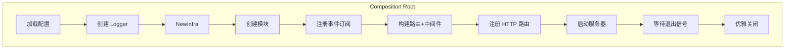
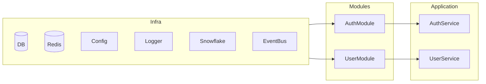

# Bootstrap + Module 架构设计

## 概述

本项目从 Container（Service Locator 反模式）迁移到 Go 惯用的「构造函数注入 + Infra 结构体 + Module 模式」。这一架构重构带来以下改进：

- **依赖显式化**：所有依赖在构造函数参数中声明，消除隐式耦合
- **生命周期清晰**：资源创建与销毁由 Composition Root 统一管理
- **可测试性提升**：模块可独立测试，依赖可轻松 mock
- **符合 Go 惯例**：无需 DI 框架，保持代码简洁

## 设计理念

### Go 惯用思想

1. **无 DI 框架**：Go 社区推崇「构造函数注入」而非反射式依赖注入
2. **接口由消费者定义**：接口放在使用方包中，而非实现方
3. **显式优于隐式**：依赖关系在代码中清晰可见
4. **组合优于继承**：通过嵌入接口和结构体组合实现复用

### 核心组件

| 组件 | 职责 | 位置 |
|------|------|------|
| Infra | 基础设施组件容器（纯数据结构体） | `internal/bootstrap/infra.go` |
| Module | 业务模块封装（接口定义） | `internal/bootstrap/module.go` |
| Composition Root | 依赖组装入口 | `cmd/*/main.go` |

## Infra 结构体

### 设计原则

- **纯数据结构体**：仅存放组件引用，无业务逻辑
- **无 Get*() 方法**：直接访问公开字段，减少间接层
- **不管理生命周期**：资源的创建和销毁由 `NewInfra()` 返回的 cleanup 函数处理

### 字段说明

```go
// Infra 基础设施组件集合
// 纯数据结构体，用于存放所有基础设施组件
type Infra struct {
    DB             *gorm.DB
    Redis          *redis.Client
    Logger         *zap.Logger
    Config         *config.AppConfig
    Snowflake      *snowflake.Node
    EventPublisher kernel.EventPublisher
    EventBus       kernel.EventBus       // 同步事件总线，用于领域事件订阅
    AsynqClient    *asynq.Client
    ErrorMapper    *kernel.ErrorMapper
}
```

| 字段 | 类型 | 用途 |
|------|------|------|
| DB | `*gorm.DB` | PostgreSQL 数据库连接 |
| Redis | `*redis.Client` | Redis 缓存客户端 |
| Logger | `*zap.Logger` | 结构化日志 |
| Config | `*config.AppConfig` | 应用配置 |
| Snowflake | `*snowflake.Node` | 分布式 ID 生成器 |
| EventPublisher | `kernel.EventPublisher` | 异步事件发布（Asynq） |
| EventBus | `kernel.EventBus` | 同步事件总线 |
| AsynqClient | `*asynq.Client` | 异步任务队列客户端 |
| ErrorMapper | `*kernel.ErrorMapper` | 错误码映射器 |

### NewInfra() 初始化流程

```go
func NewInfra(cfg *config.AppConfig, logger *zap.Logger) (*Infra, func(), error) {
    var cleanups []func()

    // 1. 初始化 PostgreSQL (GORM)
    gormDB, err := initGormDB(cfg.Database, logger)
    // ...cleanups append

    // 2. 初始化 Redis
    redisClient, err := initRedis(cfg.Redis, logger)
    // ...cleanups append

    // 3. 初始化 Snowflake ID 生成器
    snowflakeNode, err := snowflake.NewNode(nodeID)

    // 4. 初始化 Asynq Client
    asynqClient := task_queue.NewClient(...)
    // ...cleanups append

    // 5. 初始化 EventPublisher
    eventPub := domain_event.NewAsynqPublisher(...)

    // 6. 初始化 ErrorMapper
    errorMapper := kernel.NewErrorMapper()

    // 7. 初始化 EventBus（同步事件总线）
    eventBus := kernel.NewSimpleEventBus()

    // 构建 cleanup 函数（按逆序执行）
    cleanup := func() { runCleanups(cleanups) }

    return &Infra{...}, cleanup, nil
}
```

**cleanup 机制**：资源按创建顺序的逆序释放，确保依赖关系正确处理。

## Module 接口体系

### 基础接口

```go
// Module 基础接口：所有模块必须实现
type Module interface {
    Name() string
}
```

### 可选能力接口

```go
// HTTPModule 可选能力：支持 HTTP 路由注册
type HTTPModule interface {
    Module
    RegisterHTTP(group *gin.RouterGroup)
}

// EventModule 可选能力：支持事件订阅注册
type EventModule interface {
    Module
    RegisterSubscriptions(bus kernel.EventBus)
}

// GRPCModule 可选能力：支持 gRPC 服务注册（预留）
// type GRPCModule interface {
//     Module
//     RegisterGRPC(srv *grpc.Server)
// }
```

### 类型断言分发机制

Composition Root 通过类型断言检测模块能力并分发注册：

```go
modules := []bootstrap.Module{authMod, userMod}

// 注册事件订阅
for _, m := range modules {
    if em, ok := m.(bootstrap.EventModule); ok {
        em.RegisterSubscriptions(infra.EventBus)
    }
}

// 注册 HTTP 路由
for _, m := range modules {
    if h, ok := m.(bootstrap.HTTPModule); ok {
        h.RegisterHTTP(api)
    }
}
```

## Composition Root

`cmd/api/main.go` 是 HTTP API 服务的 Composition Root，负责整个应用的组装：



### 组装流程

```go
func main() {
    // 1. 加载配置
    configLoader := config.NewConfigLoader(nil)
    appConfig, _ := configLoader.Load(env)

    // 2. 创建 Logger
    appLogger, _ := logging.New(logConfig)

    // 3. 创建基础设施（替代 Container）
    infra, cleanup, _ := bootstrap.NewInfra(appConfig, logger)
    defer cleanup()

    // 4. 创建模块（替代 Factory）
    userMod := module.NewUserModule(infra)
    authMod := module.NewAuthModule(infra)
    modules := []bootstrap.Module{authMod, userMod}

    // 4.1 注册事件订阅
    for _, m := range modules {
        if em, ok := m.(bootstrap.EventModule); ok {
            em.RegisterSubscriptions(infra.EventBus)
        }
    }

    // 5. 构建路由和中间件
    router := gin.New()
    router.Use(middleware.TraceIDMiddleware(), ...)

    // 5.1 注册模块路由
    api := router.Group("/api/v1")
    for _, m := range modules {
        if h, ok := m.(bootstrap.HTTPModule); ok {
            h.RegisterHTTP(api)
        }
    }

    // 6. 启动服务器 + 优雅关闭
    srv := &http.Server{Addr: addr, Handler: router}
    // ...
}
```

### 依赖流向图



## 多入口架构

项目支持多种运行入口，各入口复用相同的 `Infra` 和模块体系：

### cmd/api — HTTP API 服务

- 主入口：`cmd/api/main.go`
- 职责：对外提供 RESTful API
- 特性：注册 HTTPModule、EventModule

### cmd/worker — Asynq 异步任务处理

- 主入口：`cmd/worker/main.go`
- 职责：处理异步任务（领域事件消费）
- 特性：复用 Infra，创建 Asynq Server

```go
func main() {
    // 加载配置 + Logger（与 API 相同）
    // ...

    // 创建基础设施
    infra, cleanup, _ := bootstrap.NewInfra(appConfig, logger)
    defer cleanup()

    // 创建 Asynq Server
    srv := task_queue.NewServer(task_queue.Config{...})

    // 创建任务处理器
    processor := task_queue.NewProcessor(logger)
    mux := asynq.NewServeMux()
    mux.HandleFunc(task_queue.TaskTypeDomainEvent, processor.ProcessTask)

    // 启动 Worker
    srv.Run(mux)
}
```

### cmd/cli — 脚手架命令行工具

- 主入口：`cmd/cli/main.go`
- 职责：代码生成、数据库迁移等开发辅助
- 特性：按需创建 Infra（仅 CLI 需要的组件）

## 与旧架构对比

### 原 Container 的问题

| 问题 | 描述 |
|------|------|
| Service Locator 反模式 | 依赖通过 `container.Get*()` 隐式获取 |
| 依赖不透明 | 无法从函数签名看出依赖关系 |
| 测试困难 | 需要 mock 整个 Container |
| 生命周期混乱 | 资源创建散落在各处 |

### 新架构如何解决这些问题

| 解决方案 | 效果 |
|------|------|
| 构造函数注入 | 依赖在参数中显式声明 |
| Infra 纯数据结构体 | 组件集中管理，无隐式逻辑 |
| Module 封装 | 每个模块自行组装依赖链 |
| cleanup 函数 | 资源释放集中、有序 |

### 迁移路径

1. **创建 Infra**：将 Container 中的组件迁移到 Infra 字段
2. **定义 Module 接口**：抽象出 HTTPModule、EventModule 等能力接口
3. **重构业务模块**：每个模块实现相应接口，内部组装依赖链
4. **改造 main.go**：使用 NewInfra + 模块注册替代 Container
5. **删除旧代码**：移除 Container 及相关 Factory
