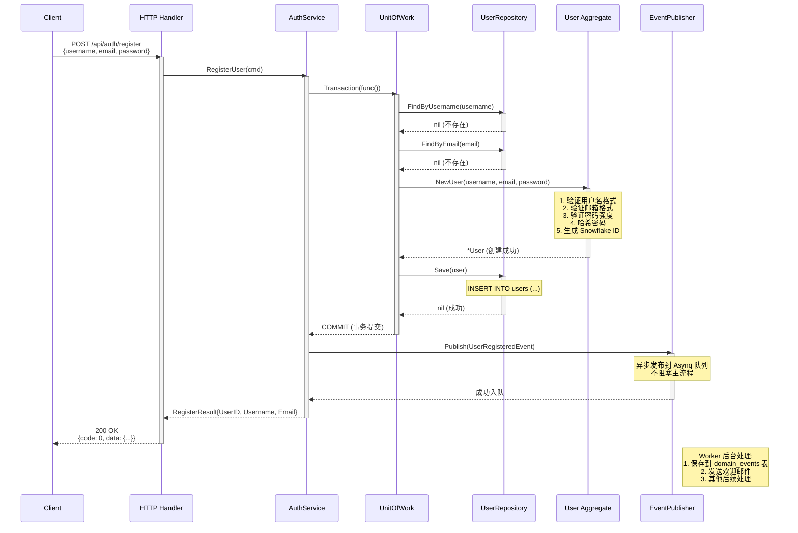
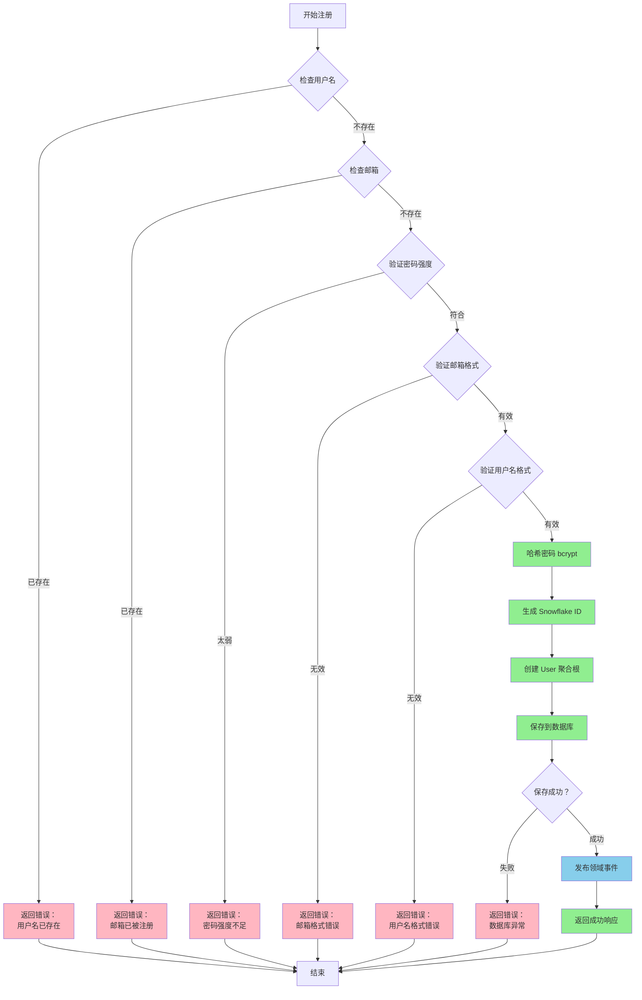
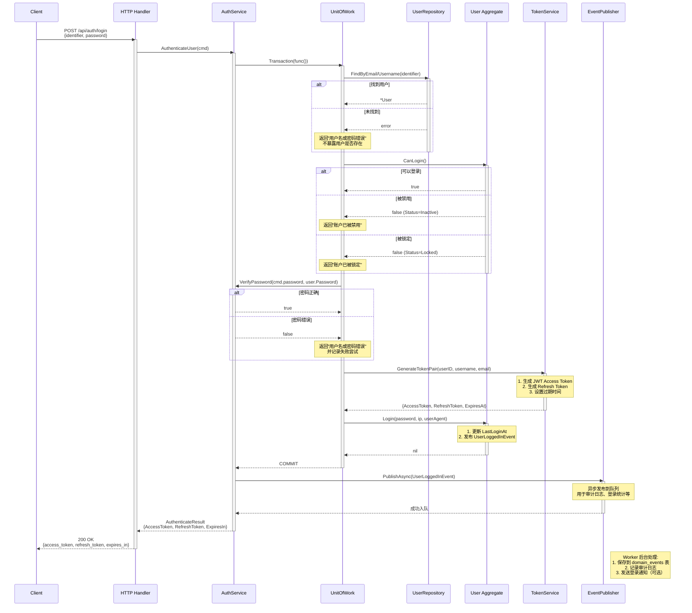
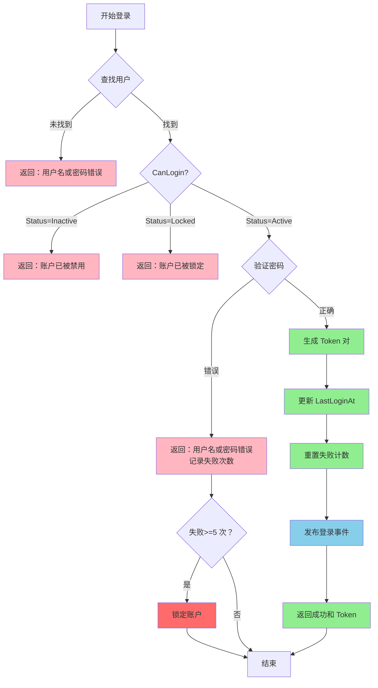
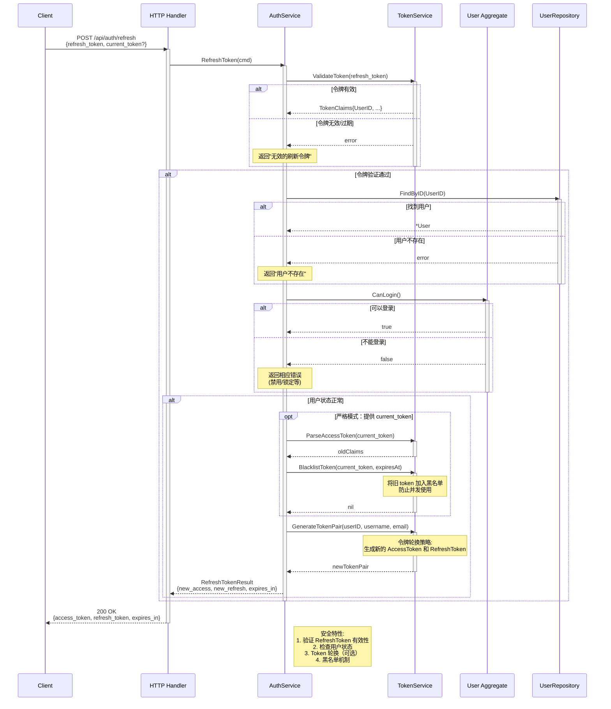
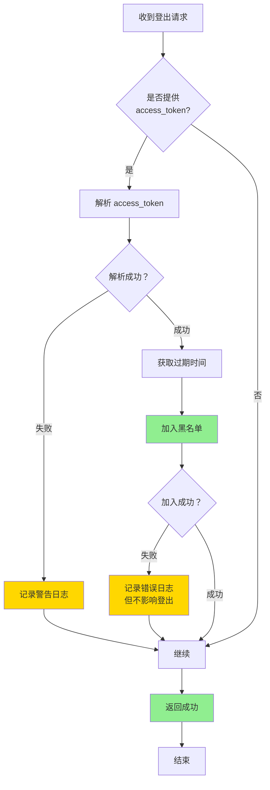
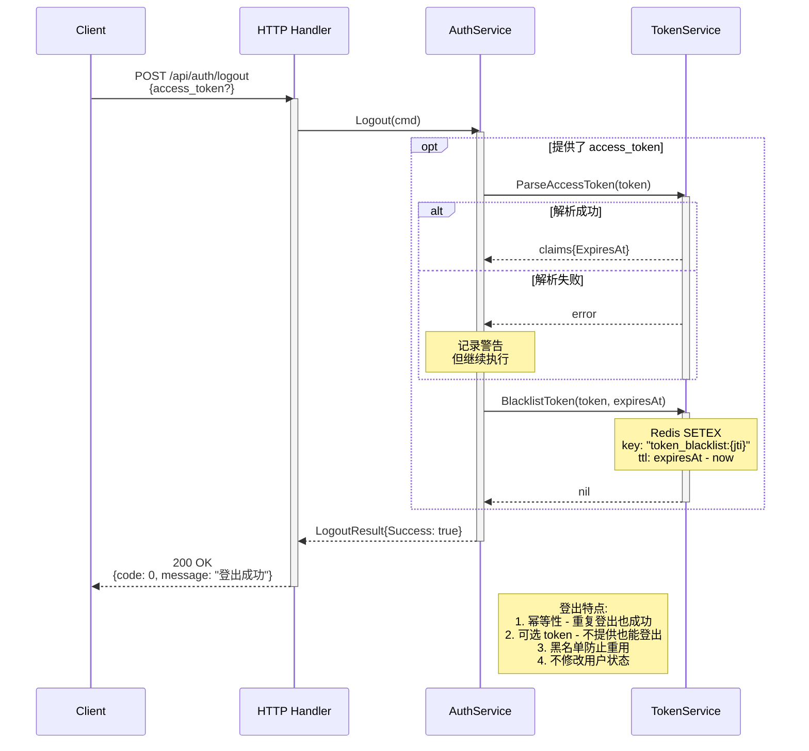
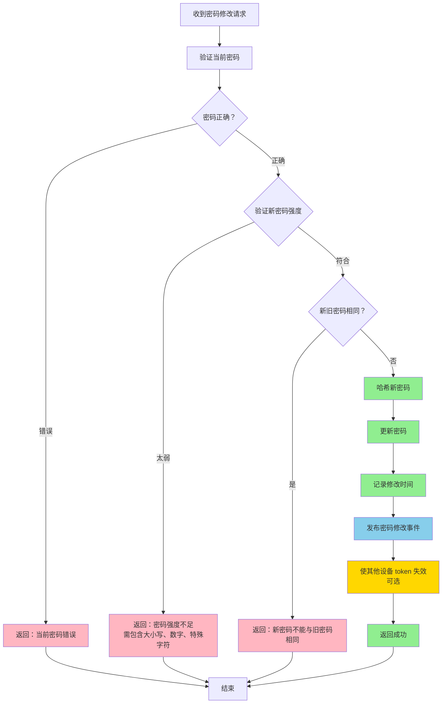

# 核心业务流程图

## 📝 用户注册流程

### 完整业务流程图



### 注册流程关键决策点



---

## 🔑 用户登录流程

### 完整登录时序图



### 登录流程决策树



---

## 🔄 Token 刷新流程

### Token 刷新时序图



---

## 🚪 用户登出流程

### 登出流程图



### 登出时序图



---

## 👤 用户资料更新流程

### 更新资料时序图

```mermaid
sequenceDiagram
    participant Client
    participant Middleware as Auth Middleware
    participant Handler as HTTP Handler
    participant Service as UserService
    participant UoW as UnitOfWork
    participant Repo as UserRepository
    participant User as User Aggregate
    participant Cache as UserCache

    Client->>Middleware: PUT /api/user/profile<br/>Authorization: Bearer {token}<br/>{display_name, avatar}
    activate Middleware
    Middleware->>Middleware: ValidateToken()
    alt 令牌有效
        Middleware-->>Handler: ctx with userID
    else 令牌无效
        Middleware-->>Client: 401 Unauthorized
        destroy Middleware
    end
    
    Handler->>Service: UpdateProfile(ctx, userID, req)
    activate Service
    
    Service->>UoW: Transaction(func())
    activate UoW
    
    UoW->>Repo: FindByID(userID)
    activate Repo
    Repo-->>UoW: *User
    deactivate Repo
    
    UoW->>User: UpdateProfile(displayName, avatar)
    activate User
    Note over User: 1. 验证 displayName 长度<br/>2. 验证 avatar URL 格式<br/>3. 更新属性<br/>4. 发布 UserProfileUpdatedEvent
    User-->>UoW: nil
    deactivate User
    
    UoW->>Repo: Save(user)
    activate Repo
    Note over Repo: UPDATE users SET ... WHERE id = ?
    Repo-->>UoW: nil
    deactivate Repo
    
    UoW-->>Service: COMMIT
    deactivate UoW
    
    Service->>Cache: Delete(userID)
    activate Cache
    Note over Cache: 清除缓存<br/>保证下次读取最新数据
    Cache-->>Service: nil
    deactivate Cache
    
    Service-->>Handler: nil (成功)
    deactivate Service
    
    Handler-->>Client: 200 OK<br/>{code: 0, message: "更新成功"}
    deactivate Handler
    
    Note right of Service: 关键点:<br/>1. 需要认证<br/>2. 事务保证一致性<br/>3. 清除缓存<br/>4. 发布领域事件
```

---

## 🔐 密码修改流程

### 密码修改流程图



---

## 🎯 错误处理流程

### 统一错误处理流程图

```mermaid
graph TD
    A[Controller 捕获异常] --> B{错误类型};
    
    B -->|BusinessError| C[提取错误码和消息];
    C --> D[返回标准响应<br/>{code, message}];
    
    B -->|ValidationError| E[收集验证错误];
    E --> F[返回 400<br/>{errors: [...]}];
    
    B -->|UnauthorizedError| G[返回 401<br/>Unauthorized];
    
    B -->|ForbiddenError| H[返回 403<br/>Forbidden];
    
    B -->|NotFoundError| I[返回 404<br/>Not Found];
    
    B -->|DBError| J[记录详细日志];
    J --> K[返回 500<br/>Internal Server Error];
    
    B -->|Panic| L[恢复 Panic];
    L --> M[记录堆栈跟踪];
    M --> N[返回 500<br/>服务异常];
    
    D --> O[结束];
    F --> O;
    G --> O;
    H --> O;
    I --> O;
    K --> O;
    N --> O;
    
    style C fill:#FFD700
    style D fill:#FF6B6B
    style J fill:#FF6B6B
    style K fill:#FF6B6B
    style M fill:#FF6B6B
    style N fill:#FF6B6B
```

---

## 📊 领域事件处理流程

### 事件发布与订阅流程

```mermaid
sequenceDiagram
    participant App as Application Service
    participant Pub as EventPublisher
    participant Queue as Asynq Queue
    participant Worker as Asynq Worker
    participant Store as EventStore
    participant Handler as DomainEventHandler

    Note over App: 业务操作完成<br/>产生领域事件
    
    App->>Pub: Publish(event)
    activate Pub
    
    pub Note over Pub: 1. 序列化事件为 JSON<br/>2. 创建 Asynq Task<br/>3. Push 到 Redis 队列
    
    Pub->>Queue: Enqueue(task)
    activate Queue
    Queue-->>Pub: task_id
    deactivate Queue
    
    Pub-->>App: nil (立即返回)
    deactivate Pub
    
    Note over App: 继续处理其他业务<br/>不等待事件处理
    
    par 异步并行处理
        Worker->>Queue: Dequeue(task)
        activate Worker
        
        Worker->>Store: Save(event)
        activate Store
        Note over Store: 保存到 domain_events 表<br/>用于事件溯源和审计
        Store-->>Worker: nil
        deactivate Store
        
        Worker->>Handler: Handle(event)
        activate Handler
        Note over Handler: 根据事件类型调用<br/>相应的处理器
        
        alt 有注册处理器
            Handler-->>Worker: nil
        else 无处理器
            Note over Worker: 记录警告日志<br/>但标记为成功
        end
        deactivate Handler
        
        Worker-->>Queue: Acknowledge(task_id)
        deactivate Worker
    end
    
    Note right of Worker: 重试机制:<br/>• 失败自动重试 (最多 3 次)<br/>• 指数退避<br/>• 最终失败记录到 dead letter queue
```

---

## 📚 参考文档

- [架构总览](./architecture-overview.md) - 整体架构介绍
- [Ports 模式设计](./ports-pattern-design.md) - Ports 模式详细说明
- [领域模型可视化](./domain-model-visual.md) - 领域模型图表
- [架构分层详解](./architecture-diagrams-detailed.md) - 分层架构图
