# CLI 工具架构图

## 整体架构

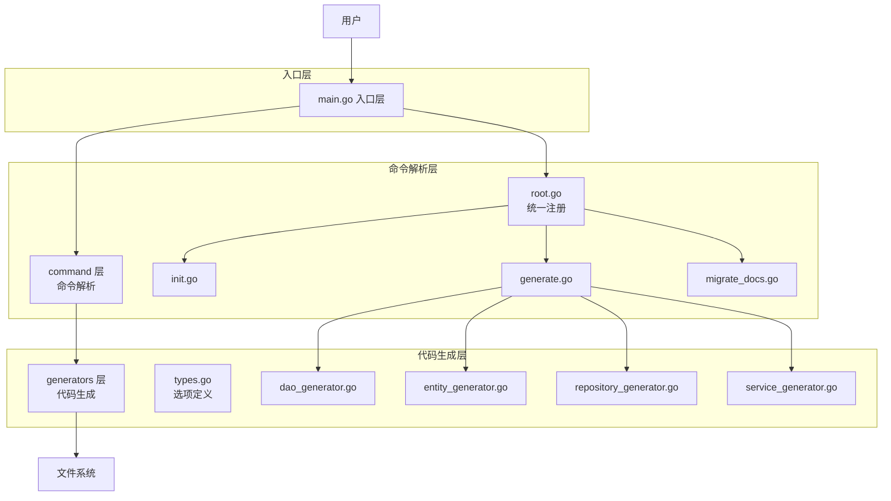

## 数据流

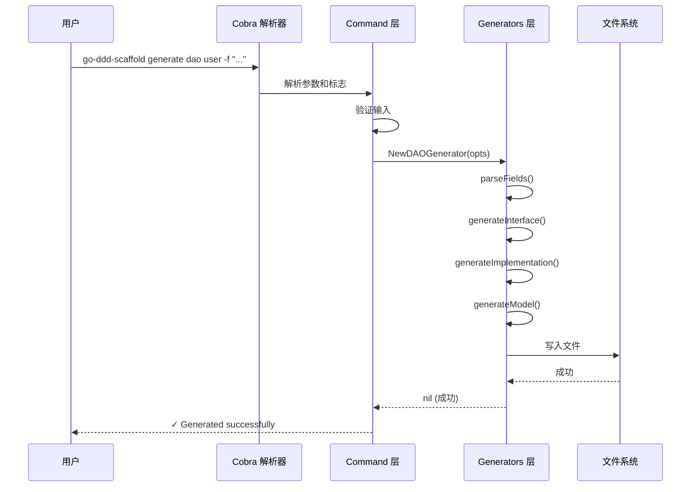

## 命令层次结构

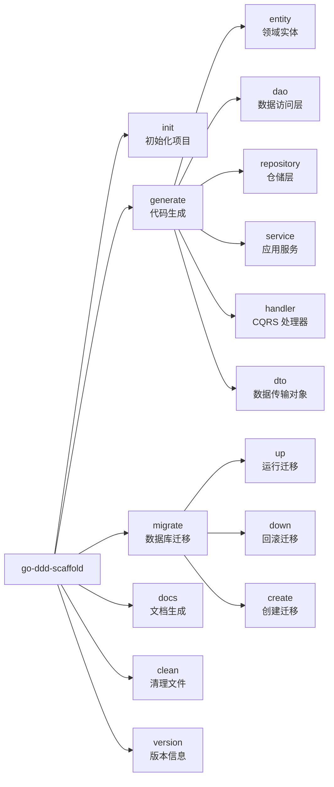

## 类型依赖关系

```mermaid
graph TB
    subgraph "Options 类型"
        DAOOpts[DAOOptions]
        EntityOpts[EntityOptions]
        RepoOpts[RepositoryOptions]
        ServiceOpts[ServiceOptions]
    end
    
    subgraph "Generators"
        DAOG gen[DAOGenerator]
        EntityG gen[EntityGenerator]
        RepoG gen[RepositoryGenerator]
        ServiceG gen[ServiceGenerator]
    end
    
    subgraph "Commands"
        DAOCmd[generateDAOCmd]
        EntityCmd[generateEntityCmd]
        RepoCmd[generateRepositoryCmd]
        ServiceCmd[generateServiceCmd]
    end
    
    DAOOpts --> DAOG gen
    EntityOpts --> EntityG en
    RepoOpts --> RepoG en
    ServiceOpts --> ServiceG en
    
    DAOCmd --> DAOG gen
    EntityCmd --> EntityG en
    RepoCmd --> RepoG en
    ServiceCmd --> ServiceG en
```

## 文件组织结构

```
cmd/cli/
├── main.go (35 lines)
│   └── 职责：启动程序，不包含业务逻辑
│
├── internal/
│   │
│   ├── command/ (命令定义层)
│   │   ├── root.go (~50 lines)
│   │   │   └── RegisterAll(): 统一注册所有命令
│   │   │
│   │   ├── init.go (~45 lines)
│   │   │   └── initCmd(): 项目初始化命令
│   │   │
│   │   ├── generate.go (~160 lines)
│   │   │   ├── generateCmd(): 生成根命令
│   │   │   ├── generateEntityCmd()
│   │   │   ├── generateDAOCmd()
│   │   │   ├── generateRepositoryCmd()
│   │   │   ├── generateServiceCmd()
│   │   │   ├── generateHandlerCmd()
│   │   │   └── generateDTOCmd()
│   │   │
│   │   ├── migrate_docs.go (~65 lines)
│   │   │   ├── migrateCmd()
│   │   │   └── docsCmd()
│   │   │
│   │   └── config.go (TODO)
│   │       └── configCmd(): 配置管理
│   │
│   └── generators/ (代码生成层)
│       ├── types.go (~75 lines)
│       │   └── 所有生成器的 Options 定义
│       │
│       ├── dao_generator.go (~580 lines)
│       │   ├── DAOGenerator 结构体
│       │   ├── NewDAOGenerator()
│       │   ├── Generate()
│       │   ├── parseFields()
│       │   ├── generateInterface()
│       │   ├── generateImplementation()
│       │   └── generateModel()
│       │
│       ├── entity_generator.go (TODO)
│       ├── repository_generator.go (TODO)
│       ├── service_generator.go (TODO)
│       ├── handler_generator.go (TODO)
│       ├── dto_generator.go (TODO)
│       │
│       ├── init_generator.go (~25 lines)
│       │   └── InitGenerator 存根
│       │
│       └── stubs.go (~30 lines)
│           └── 其他生成器存根
│
└── templates/ (可选)
    ├── dao/
    ├── entity/
    └── ...
```

## 命令执行流程示例

### 生成 DAO 的完整流程

```bash
go-ddd-scaffold generate dao user -f "username:string,email:string" -t users
```

**步骤分解**:

```
1. main.go
   └─ newRootCmd() → 创建根命令

2. command/root.go
   └─ RegisterAll() → 注册所有子命令
      └─ generateCmd() → 添加 generate 命令
         └─ generateDAOCmd() → 添加 dao 子命令

3. Cobra 框架
   └─ 解析命令行参数
      ├─ args[0] = "user"
      ├─ flags["fields"] = "username:string,email:string"
      └─ flags["table-name"] = "users"

4. command/generate.go
   └─ generateDAOCmd().RunE()
      ├─ opts.Name = "user"
      ├─ opts.Fields = "username:string,email:string"
      ├─ opts.TableName = "users"
      └─ NewDAOGenerator(opts)

5. generators/dao_generator.go
   └─ DAOGenerator.Generate()
      ├─ parseFields() → []Field
      │   ├─ Field{Name:"Username", Type:"string", GoType:"string"}
      │   └─ Field{Name:"Email", Type:"string", GoType:"string"}
      │
      ├─ generateInterface(fields)
      │   └─ 渲染模板 → user_dao.go
      │
      ├─ generateImplementation(fields)
      │   └─ 渲染模板 → user_dao_impl.go
      │
      └─ generateModel(fields)
          └─ 渲染模板 → user_model.go

6. 文件系统
   └─ 写入 3 个文件
      ├─ internal/infrastructure/dao/user_dao.go
      ├─ internal/infrastructure/dao/user_dao_impl.go
      └─ internal/infrastructure/dao/user_model.go
```

## 设计模式应用

### 1. Command Pattern（命令模式）

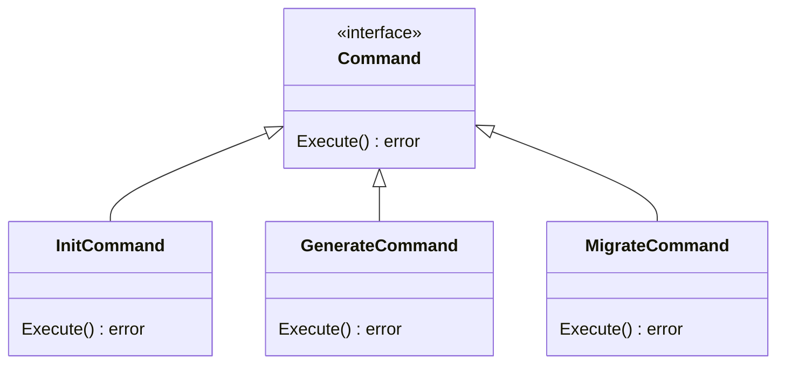

### 2. Strategy Pattern（策略模式）

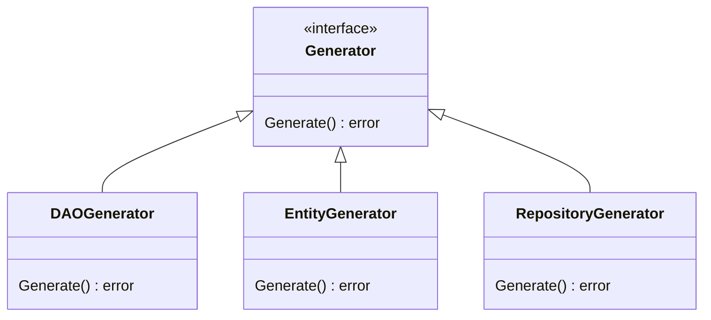

### 3. Factory Pattern（工厂模式）

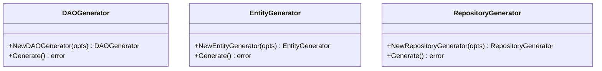

## 接口设计

### Generator 接口

```go
type Generator interface {
    Generate() error
}
```

所有生成器都实现这个接口：
- `DAOGenerator`
- `EntityGenerator`
- `RepositoryGenerator`
- `ServiceGenerator`
- `HandlerGenerator`
- `DTOGenerator`
- `InitGenerator`

### 统一的调用方式

```go
// Command 层调用
generator := generators.NewDAOGenerator(opts)
err := generator.Generate()  // 所有生成器使用相同的接口

if err != nil {
    return err
}
fmt.Println("✓ Generation completed")
```

## 配置系统架构

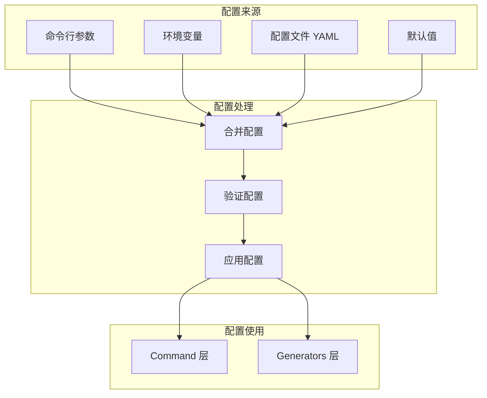

## 测试架构

```mermaid
graph TB
    subgraph "单元测试"
        UT1[测试 DAOGenerator]
        UT2[测试 EntityGenerator]
        UT3[测试 parseFields]
    end
    
    subgraph "集成测试"
        IT1[测试 generate dao 命令]
        IT2[测试 init 命令]
        IT3[测试完整流程]
    end
    
    subgraph "E2E 测试"
        E2E1[测试真实项目生成]
        E2E2[测试批量生成]
    end
    
    UT1 --> generators 层
    UT2 --> generators 层
    UT3 --> generators 层
    
    IT1 --> command 层
    IT2 --> command 层
    IT3 --> command 层 + generators 层
    
    E2E1 --> 完整 CLI
    E2E2 --> 完整 CLI
```

## 性能优化策略

### 1. 并行生成

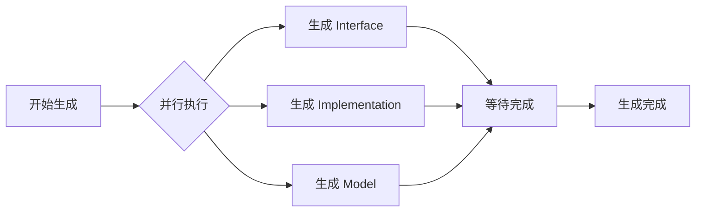

### 2. 模板缓存

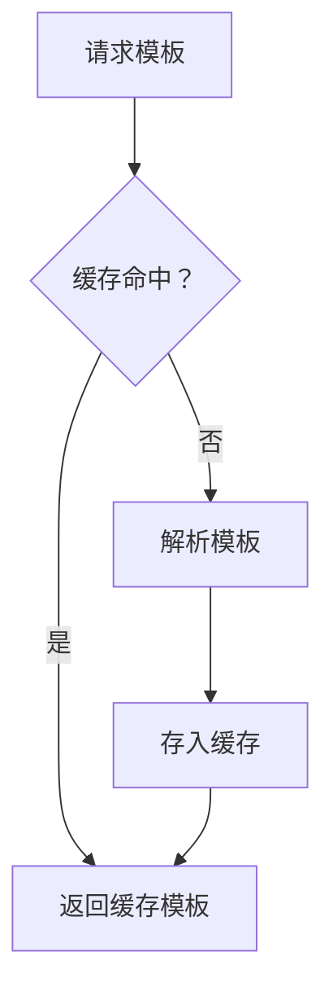

## 扩展点设计

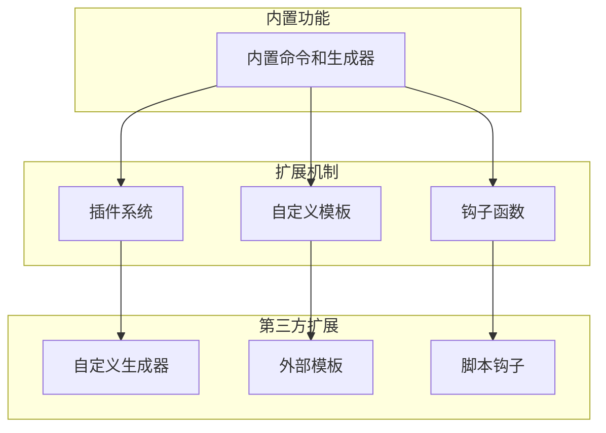

## 错误处理流程

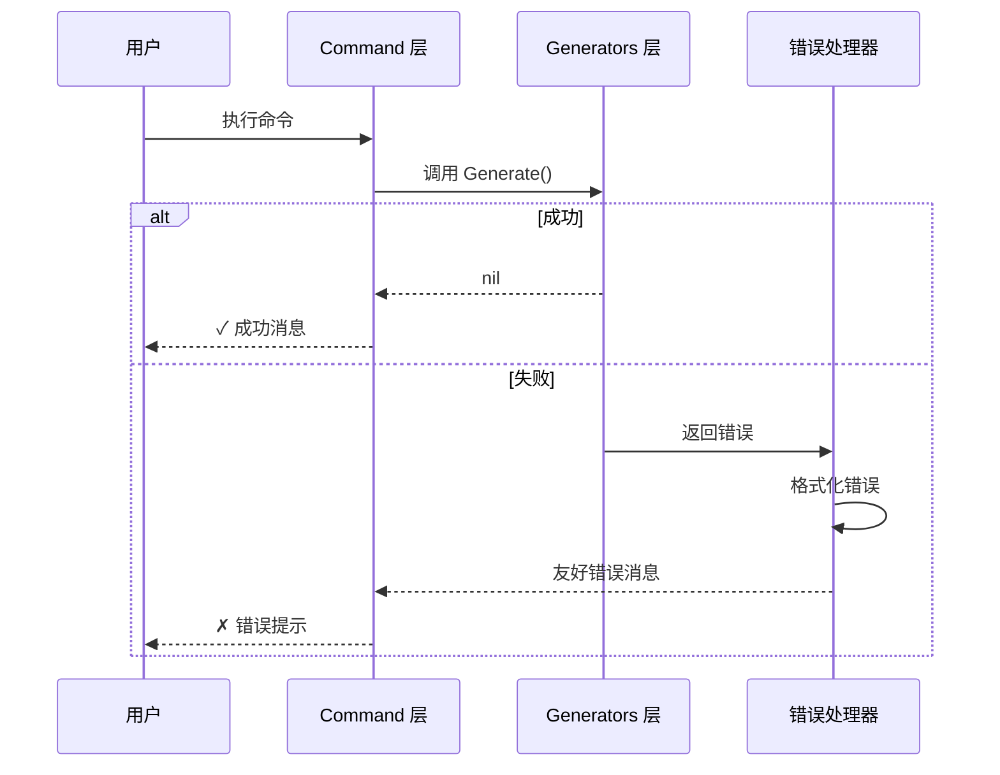

## 总结

通过以上多维度架构图，我们可以清晰地看到：

1. **分层清晰**: 入口层 → 命令层 → 生成层
2. **职责单一**: 每层只负责一件事
3. **易于扩展**: 遵循开闭原则
4. **可测试性强**: 各层独立，便于测试
5. **用户体验好**: 清晰的命令结构

这是一个**企业级、专业化、可扩展**的 CLI 工具架构设计。
