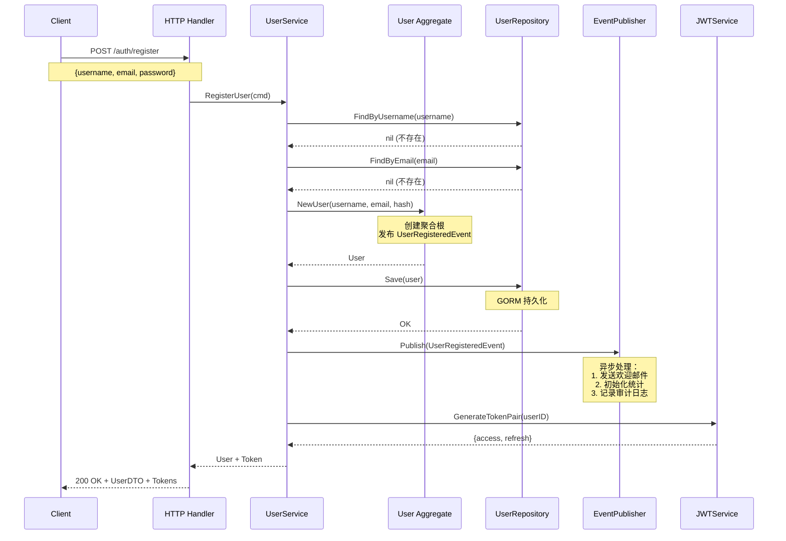
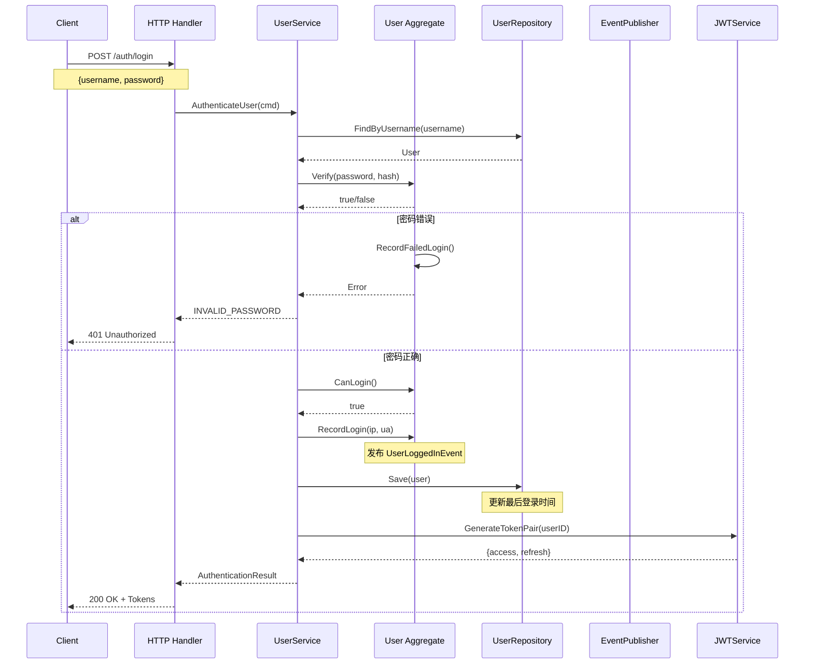
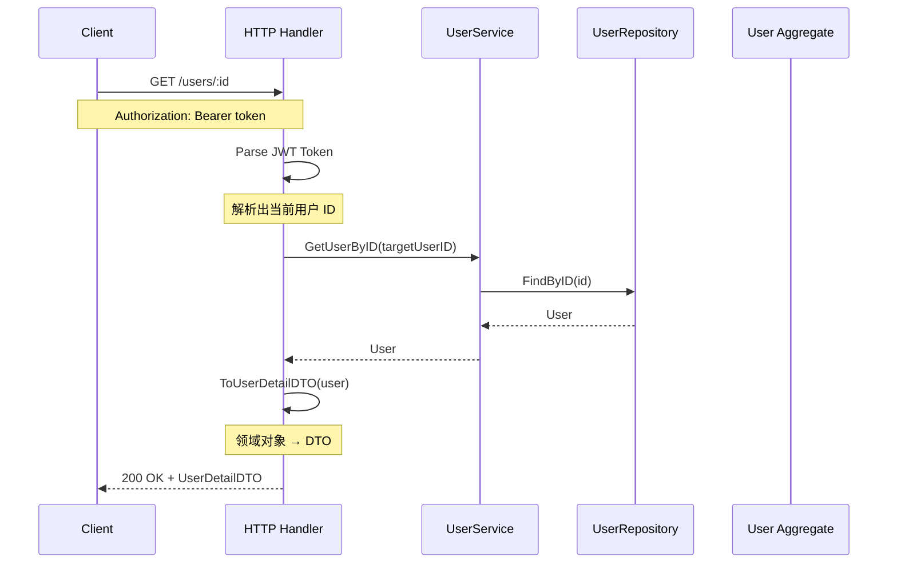
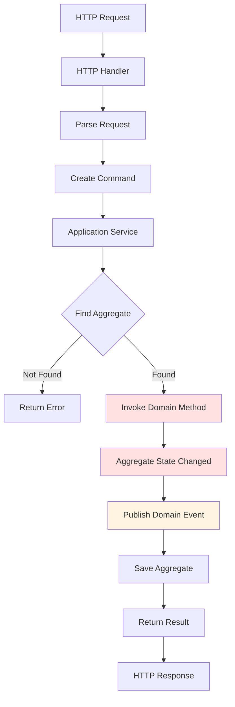
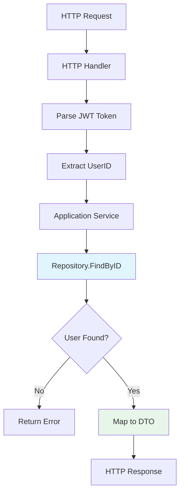
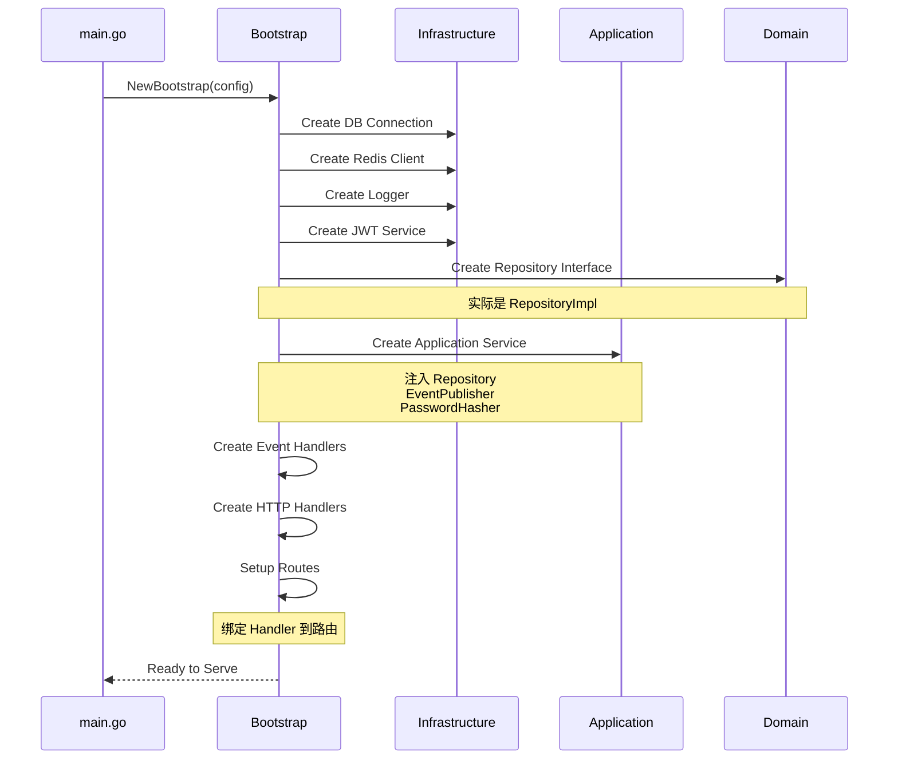

## 📊 核心业务流程图集

### 用户注册流程（时序图）

**关键点：**
1. ✅ 唯一性检查（用户名、邮箱）
2. ✅ 密码哈希（Bcrypt）
3. ✅ 领域事件发布
4. ✅ JWT 令牌生成（注册即登录）

---

### 用户登录流程（时序图）

**关键点：**
1. ✅ 密码验证（Bcrypt compare）
2. ✅ 登录失败计数
3. ✅ 领域事件发布
4. ✅ 登录日志记录

---

### 获取用户信息流程（流程图）

**关键点：**
1. ✅ JWT Token 解析
2. ✅ 权限验证（只能查看自己的信息）
3. ✅ 领域对象转换为 DTO

---

### Command 侧数据流（写操作）

---

### Query 侧数据流（读操作）

---

### Bootstrap 依赖注入组装流程

