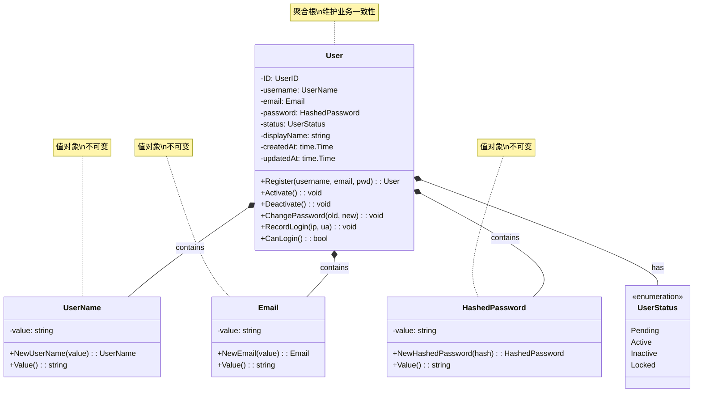
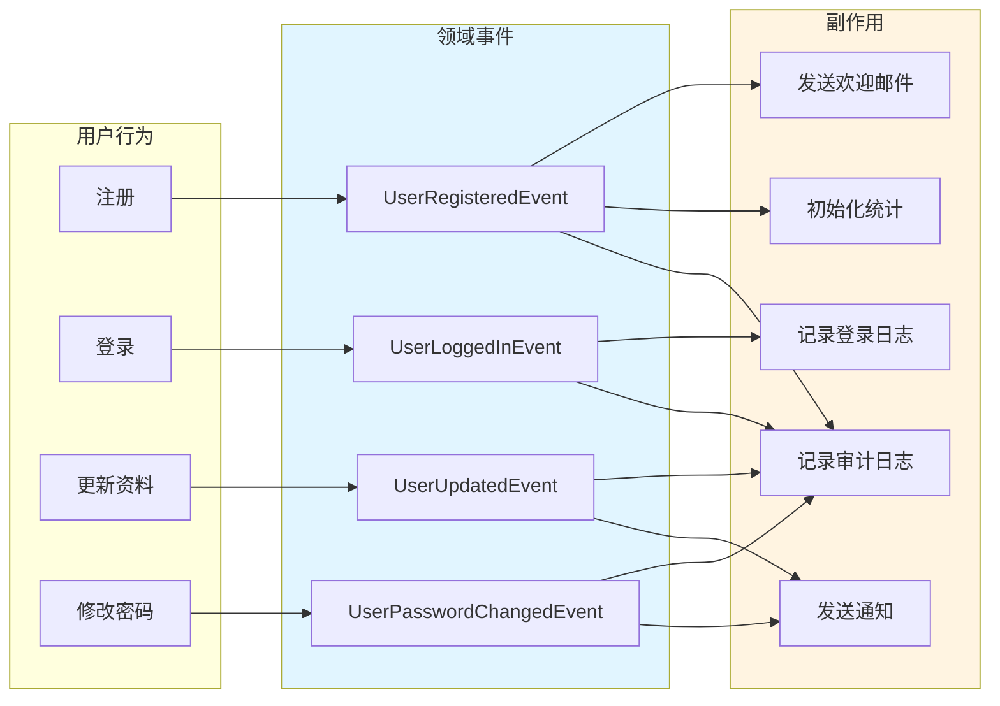

## 📊 领域模型图集

### User 聚合根结构

**说明：**
- **聚合根**：User 是聚合的根，所有外部访问都通过 User
- **值对象**：UserName、Email、HashedPassword 都是不可变的值对象
- **封装性**：外部不能直接修改内部状态，必须通过行为方法

---

### 领域事件关系图

**说明：**
- 领域事件由聚合根的行为触发
- 事件处理器监听事件并执行副作用
- 副作用不影响主流程，异步执行
