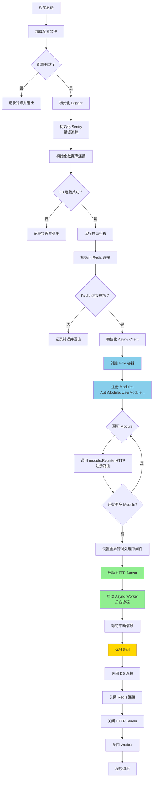
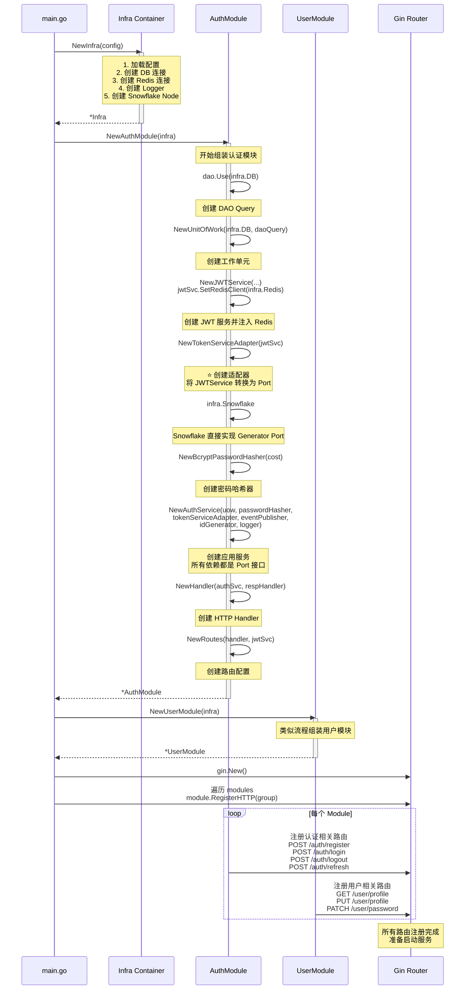
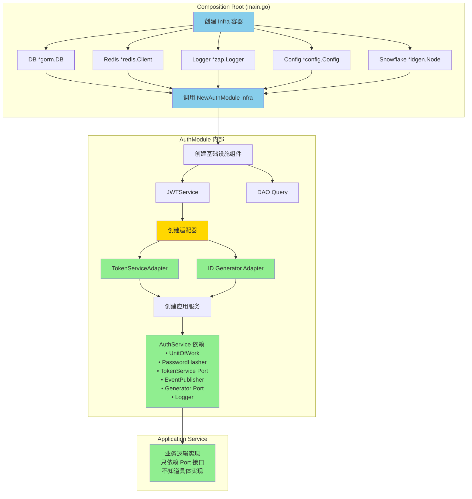
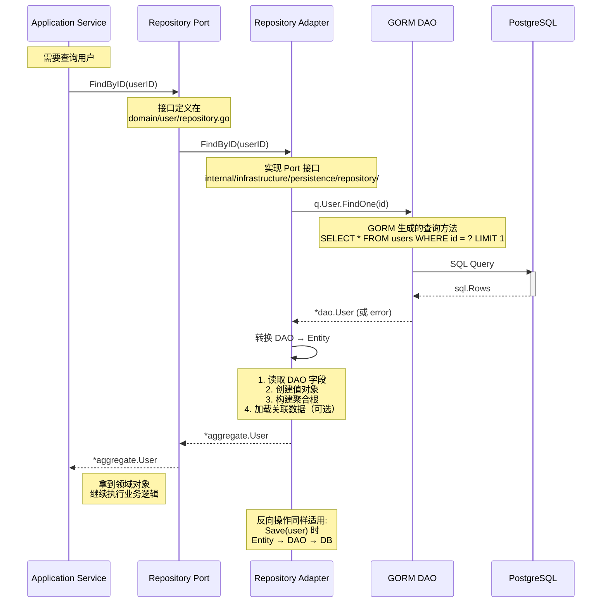
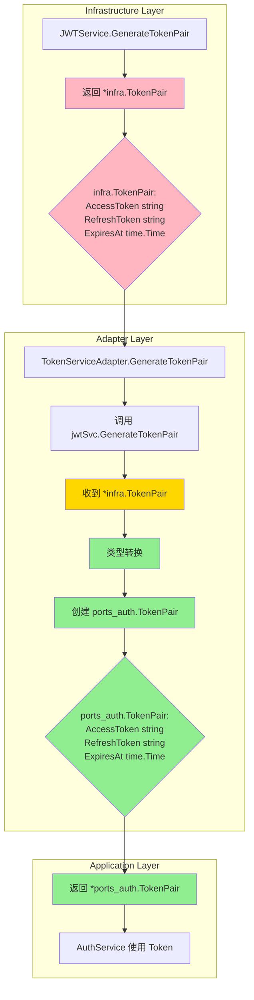
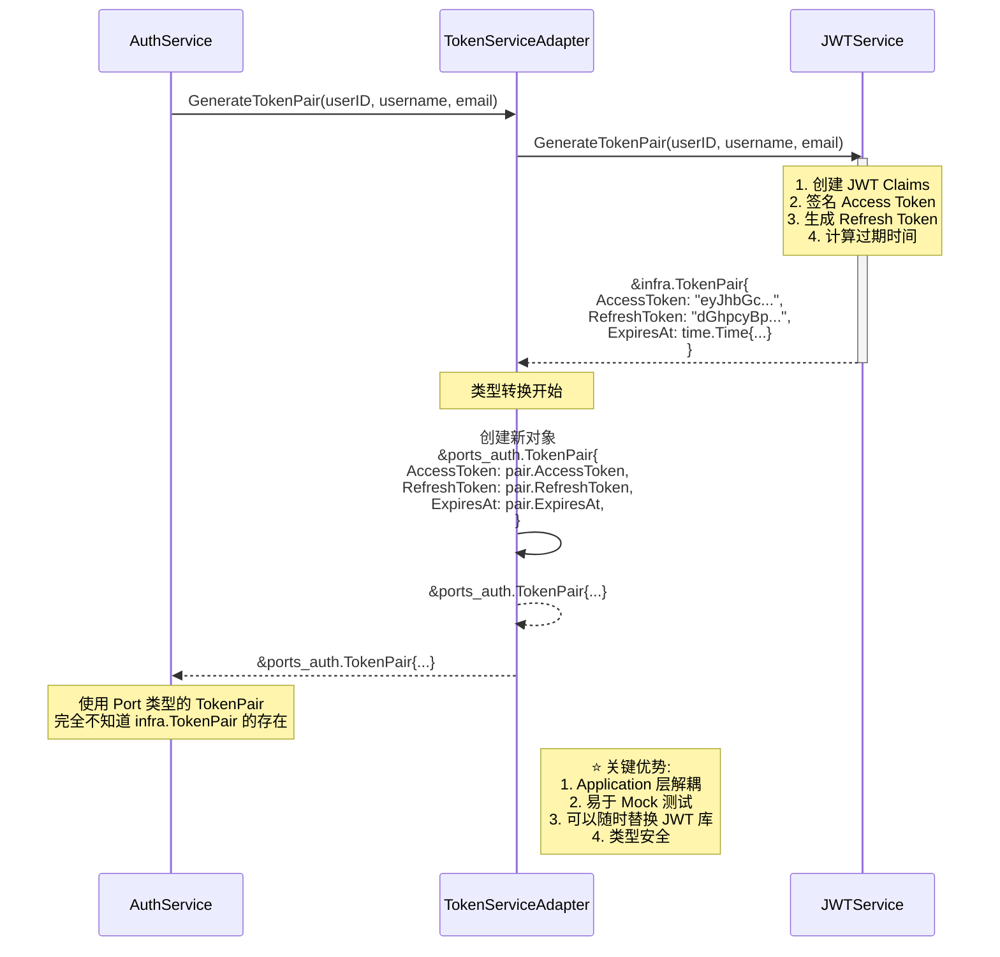
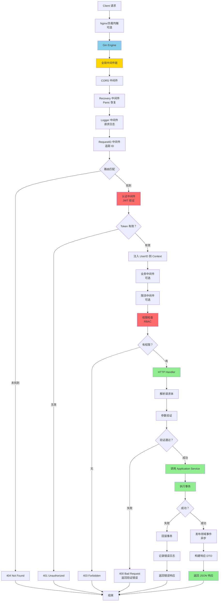
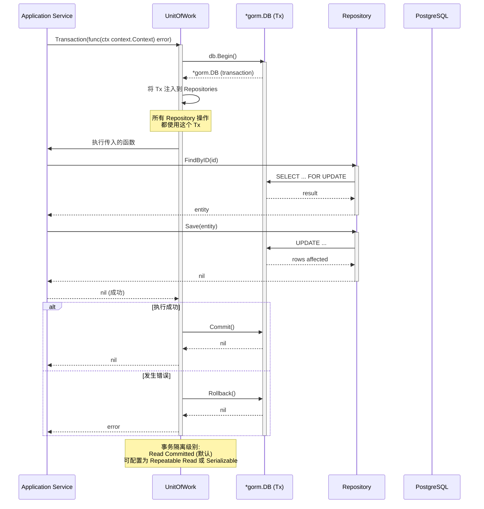

# 技术实现流程图

## 🏗️ 应用启动流程

### main.go 启动流程图



---

## 🔧 Module 注册流程

### Module 组装详细流程



---

## 🎯 依赖注入流程

### 构造函数注入详解



---

## 📦 Repository 适配器模式

### Repository 实现流程



---

## 🔄 TokenService 适配器转换流程

### 类型转换详细流程



### 详细转换代码流程



---

## 🌐 HTTP 请求处理流程

### 完整请求链路图



---

## 🗄️ 数据库操作流程

### UnitOfWork 事务管理流程



---

## 📨 领域事件异步处理流程

### 事件队列处理流程

```mermaid
graph TB
    A[领域事件产生] --> B[EventPublisher.Publish];
    B --> C{序列化事件为 JSON};
    
    C --> D[创建 Asynq Task];
    D --> E[Push 到 Redis Queue];
    E --> F[立即返回 nil];
    
    F --> G[事件入队成功];
    G --> H[主流程继续];
    
    par Asynq Worker 后台处理
        I[Worker 轮询队列] --> J{有新任务？};
        J -->|是 | K[Dequeue Task];
        K --> L[反序列化 JSON];
        L --> M[查找对应 Handler];
        
        M --> N{Handler 存在？};
        N -->|否 | O[记录警告];
        N -->|是 | P[调用 Handler];
        
        P --> Q{处理成功？};
        Q -->|是 | R[Acknowledge Task];
        Q -->|否 | S{重试次数 < 3?};
        
        S -->|是 | T[重新入队<br/>指数退避];
        S -->|否 | U[移入 Dead Letter Queue];
        
        R --> V[保存事件到<br/>domain_events 表];
        V --> W[Task 完成];
        
        O --> W;
        U --> W;
        T --> W;
    end
    
    style E fill:#87CEEB
    style F fill:#90EE90
    style R fill:#90EE90
    style V fill:#90EE90
    style U fill:#FF6B6B
```

---

## 📚 参考文档

- [架构总览](./architecture-overview.md) - 整体架构介绍
- [Ports 模式设计](./ports-pattern-design.md) - Ports 模式详细说明
- [业务流程图](./business-flow-diagrams.md) - 业务流程时序图
- [架构分层详解](./architecture-diagrams-detailed.md) - 分层架构图
