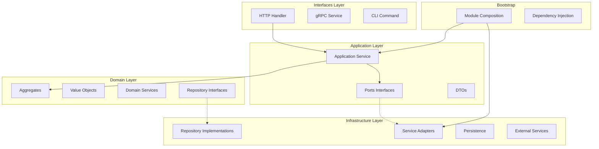

# 架构总览

本文档提供 Go DDD Scaffold 项目的整体架构视图，包括技术选型、核心特性和架构演进。

## 🎯 项目定位

**Go DDD Scaffold** 是一个基于领域驱动设计（DDD）和 Clean Architecture 的 Go 语言脚手架项目。

### 核心价值

1. **快速启动** - 开箱即用的 DDD 实现
2. **最佳实践** - 遵循 Go 风格和 DDD 原则
3. **高度可扩展** - Ports & Adapters 模式
4. **生产就绪** - 完整的认证、授权、审计功能

---

## 🏗️ 架构分层

### 整体架构图



### 分层职责

| 层级 | 职责 | 依赖方向 | 示例 |
|------|------|----------|------|
| **Interfaces** | 协议适配 | → Application | HTTP Handler, gRPC Service |
| **Application** | 用例编排 + Ports 定义 | → Domain | AuthService, TokenService Port |
| **Domain** | 业务逻辑 | 无依赖 | User Aggregate, Value Objects |
| **Infrastructure** | 技术实现 | → Domain (通过适配器) | Repository Impl, JWT Service |
| **Bootstrap** | 组合根 | → All | Module Assembly |

---

## 🔑 核心特性

### 1. DDD 战略设计

#### 限界上下文（Bounded Context）

```
┌─────────────────────────────────────┐
│         Auth Context                │
│  - 用户认证                          │
│  - 令牌管理                          │
│  - 权限验证                          │
└─────────────────────────────────────┘

┌─────────────────────────────────────┐
│       Tenant Context                │
│  - 租户管理                          │
│  - 成员管理                          │
│  - 租户配置                          │
└─────────────────────────────────────┘

┌─────────────────────────────────────┐
│          User Context               │
│  - 用户注册                          │
│  - 用户资料                          │
│  - 密码管理                          │
└─────────────────────────────────────┘
```

#### 通用语言（Ubiquitous Language）

- **Aggregate（聚合根）** - 业务对象的集合，如 User、Tenant
- **Value Object（值对象）** - 不可变的度量概念，如 Email、Password
- **Domain Event（领域事件）** - 业务中发生的重要事情，如 UserRegistered
- **Repository（仓储）** - 持久化抽象层
- **Domain Service（领域服务）** - 跨聚合的业务逻辑

### 2. Clean Architecture

#### 依赖规则

```
允许依赖:
✓ Interfaces → Application
✓ Application → Domain
✓ Infrastructure → Domain (通过适配器)
✓ Bootstrap → All

禁止依赖:
✗ Application → Infrastructure
✗ Domain → Application
✗ Infrastructure → Application
```

#### 边界穿越

```go
// 请求流程
HTTP Request 
    ↓
Handler (Interfaces)
    ↓
Application Service (Application)
    ↓
Domain Service / Aggregate (Domain)
    ↓
Repository Port (Domain 定义)
    ↓
Repository Adapter (Infrastructure)
    ↓
Database
```

### 3. Ports & Adapters 模式

#### 什么是 Port？

Port 是 Application 层定义的接口，用于抽象外部依赖。

```go
// application/ports/auth/token_service.go
type TokenService interface {
    GenerateTokenPair(userID int64, username, email string) (*TokenPair, error)
}
```

#### 什么是 Adapter？

Adapter 是 Infrastructure 层对 Port 的实现。

```go
// infrastructure/platform/auth/token_service_adapter.go
type TokenServiceAdapter struct {
    service *JWTService  // 具体实现
}

func (a *TokenServiceAdapter) GenerateTokenPair(...) (*ports.TokenPair, error) {
    // 类型转换
}
```

#### 为什么需要适配器？

1. **类型隔离** - Port 层和 Infra 层的类型不同
2. **解耦** - Application 不知道 Infrastructure 的存在
3. **可替换** - 可以轻松更换实现

### 4. 模块化设计

#### Module 作为组合根

```go
// module/auth.go
func NewAuthModule(infra *bootstrap.Infra) *AuthModule {
    // 1. 创建基础设施
    jwtSvc := auth.NewJWTService(...)
    
    // 2. ⭐ 创建适配器
    tokenServiceAdapter := auth.NewTokenServiceAdapter(jwtSvc)
    
    // 3. 创建应用服务（使用 Port）
    authSvc := authApp.NewAuthService(
        tokenServiceAdapter,  // ← 使用适配器
        ...
    )
    
    // 4. 创建路由
    routes := authHTTP.NewRoutes(handler, jwtSvc)
    
    return &AuthModule{...}
}
```

#### 模块注册制

```go
// bootstrap/module.go
type Module interface {
    RegisterRoutes(r *gin.Engine)
    SubscribeEvents()
}

// main.go
modules := []bootstrap.Module{
    bootstrap.NewUserModule(infra),
    bootstrap.NewAuthModule(infra),
    bootstrap.NewTenantModule(infra),
}

// 自动注册
for _, module := range modules {
    module.RegisterRoutes(router)
    module.SubscribeEvents()
}
```

### 5. 事件驱动架构

#### 领域事件发布

```go
// domain/user/event/user_registered.go
type UserRegistered struct {
    UserID   string
    Username string
    Email    string
}

// application/user/service.go
func (s *UserService) CreateUser(ctx context.Context, cmd *CreateUserCommand) (*User, error) {
    // 1. 创建用户聚合
    user, err := aggregate.NewUser(cmd.Username, cmd.Email, cmd.Password)
    if err != nil {
        return nil, err
    }
    
    // 2. 保存用户
    err = s.userRepo.Save(ctx, user)
    if err != nil {
        return nil, err
    }
    
    // 3. ⭐ 发布领域事件
    event := event.UserRegistered{
        UserID:   user.ID().String(),
        Username: user.Username().String(),
        Email:    user.Email().String(),
    }
    s.eventPublisher.Publish(event)
    
    return user, nil
}
```

#### 事件处理

```go
// interfaces/event/user_registered_handler.go
func (h *UserRegisteredHandler) Handle(event event.UserRegistered) error {
    // 发送欢迎邮件
    h.emailService.SendWelcomeEmail(event.Email)
    
    // 初始化租户配置
    h.tenantService.InitializeTenant(event.UserID)
    
    return nil
}
```

---

## 💾 数据架构

### 数据库 Schema

```sql
-- 用户表
CREATE TABLE users (
    id BIGINT PRIMARY KEY,
    username VARCHAR(50) NOT NULL UNIQUE,
    email VARCHAR(255) NOT NULL UNIQUE,
    password_hash VARCHAR(255) NOT NULL,
    status VARCHAR(20) NOT NULL DEFAULT 'active',
    created_at TIMESTAMP NOT NULL DEFAULT NOW(),
    updated_at TIMESTAMP NOT NULL DEFAULT NOW()
);

-- 租户表
CREATE TABLE tenants (
    id BIGINT PRIMARY KEY,
    name VARCHAR(100) NOT NULL,
    slug VARCHAR(50) NOT NULL UNIQUE,
    status VARCHAR(20) NOT NULL DEFAULT 'active',
    created_at TIMESTAMP NOT NULL DEFAULT NOW()
);

-- 租户成员表
CREATE TABLE tenant_members (
    tenant_id BIGINT NOT NULL,
    user_id BIGINT NOT NULL,
    role VARCHAR(50) NOT NULL,
    joined_at TIMESTAMP NOT NULL DEFAULT NOW(),
    PRIMARY KEY (tenant_id, user_id)
);

-- 领域事件表（Outbox Pattern）
CREATE TABLE domain_events (
    id BIGINT PRIMARY KEY,
    event_type VARCHAR(100) NOT NULL,
    aggregate_type VARCHAR(50) NOT NULL,
    aggregate_id VARCHAR(100) NOT NULL,
    event_data JSONB NOT NULL,
    created_at TIMESTAMP NOT NULL DEFAULT NOW()
);
```

### Outbox Pattern

```
┌──────────────┐
│  Business    │
│  Transaction │
│              │
│ 1. Update    │
│    Aggregate │
│              │
│ 2. Save      │
│    Event     │
│    (同事务)  │
└──────────────┘
       ↓
┌──────────────┐
│   Async      │
│   Publisher  │
│              │
│ 读取事件     │
│ 发布到队列   │
│ 标记已处理   │
└──────────────┘
```

---

## 🔐 安全架构

### 认证流程

```
┌──────────┐
│   User   │
└────┬─────┘
     │ 1. POST /login
     │    {username, password}
     ↓
┌──────────────────┐
│   Auth Handler   │
└────┬─────────────┘
     │ 2. Authenticate
     ↓
┌──────────────────┐
│  AuthService     │
└────┬─────────────┘
     │ 3. Verify Password
     ↓
┌──────────────────┐
│  User Aggregate  │
└────┬─────────────┘
     │ 4. Generate JWT
     ↓
┌──────────────────┐
│  Token Service   │
└────┬─────────────┘
     │ 5. Return Tokens
     ↓
┌──────────┐
│   User   │
│  {access_token, refresh_token}
└──────────┘
```

### RBAC 权限模型

```sql
-- 角色表
CREATE TABLE roles (
    id BIGINT PRIMARY KEY,
    name VARCHAR(50) NOT NULL UNIQUE,
    description TEXT
);

-- 权限表
CREATE TABLE permissions (
    id BIGINT PRIMARY KEY,
    name VARCHAR(100) NOT NULL UNIQUE,
    resource VARCHAR(50) NOT NULL,
    action VARCHAR(20) NOT NULL
);

-- 角色权限关联
CREATE TABLE role_permissions (
    role_id BIGINT NOT NULL,
    permission_id BIGINT NOT NULL,
    PRIMARY KEY (role_id, permission_id)
);

-- 用户角色关联
CREATE TABLE user_roles (
    user_id BIGINT NOT NULL,
    role_id BIGINT NOT NULL,
    tenant_id BIGINT,  -- NULL 表示全局角色
    PRIMARY KEY (user_id, role_id, tenant_id)
);
```

---

## 🚀 技术栈

### 核心技术

| 类别 | 技术 | 版本 | 说明 |
|------|------|------|------|
| **语言** | Go | 1.21+ | 高性能后端语言 |
| **Web 框架** | Gin | v1.9+ | 高性能 HTTP 框架 |
| **ORM** | GORM | v2+ | Go 语言 ORM 库 |
| **代码生成** | GORM Gen | v0.3+ | 类型安全的 DAO 生成 |
| **缓存** | Redis | 7+ | 内存数据库 |
| **队列** | Asynq | v0.23+ | Redis 任务队列 |
| **认证** | JWT | - | 令牌认证 |
| **日志** | Zap | v1.26+ | 高性能日志库 |
| **配置** | Viper | v1.18+ | 配置管理 |
| **迁移** | golang-migrate | v4+ | 数据库迁移 |

### 开发工具

| 工具 | 用途 |
|------|------|
| golangci-lint | 代码检查 |
| testify | 单元测试 |
| mockgen | Mock 生成 |
| swag | Swagger 文档 |
| air | 热重载 |

---

## 📊 性能指标

### 基准测试

```bash
# API 响应时间（P99）
GET /api/users/:id          < 50ms
POST /api/auth/login        < 100ms
POST /api/users             < 150ms

# 并发能力
QPS: > 1000 req/s
并发连接：> 5000
```

### 优化策略

1. **数据库优化**
   - 索引优化
   - 查询缓存
   - 读写分离

2. **缓存策略**
   - Redis 缓存热点数据
   - 本地缓存（GroupCache）
   - CDN 静态资源

3. **异步处理**
   - 邮件发送异步化
   - 日志记录异步化
   - 事件发布异步化

---

## 🔄 架构演进

### V1.0 - 基础架构

```
✓ DDD 分层结构
✓ 基础领域模型
✓ Repository 模式
✓ 简单 CRUD
```

### V2.0 - Clean Architecture（当前版本）

```
✓ Ports & Adapters 模式
✓ 依赖注入
✓ 事件驱动架构
✓ Outbox Pattern
✓ 模块化设计
```

### V3.0 - 微服务准备（规划中）

```
⏳ CQRS 模式
⏳ Saga 分布式事务
⏳ gRPC 服务网格
⏳ API Gateway
⏳ 服务发现
```

### V4.0 - 云原生（愿景）

```
⏳ Kubernetes Native
⏳ Serverless 支持
⏳ Service Mesh 集成
⏳ 多租户 SaaS 架构
```

---

## 📈 项目统计

### 代码统计

```
Total Lines: ~15,000
Go Files: ~120
Test Files: ~45
Test Coverage: 65%

Domain Layer:      3,500 lines (23%)
Application Layer: 4,200 lines (28%)
Infrastructure:    4,800 lines (32%)
Interfaces:        2,500 lines (17%)
```

### 功能模块

| 模块 | 状态 | 完成度 |
|------|------|--------|
| 用户管理 | ✅ | 100% |
| 认证授权 | ✅ | 100% |
| 租户管理 | ✅ | 90% |
| 角色权限 | ✅ | 85% |
| 审计日志 | ✅ | 80% |
| 事件总线 | ✅ | 75% |
| 任务队列 | ✅ | 70% |
| 文件上传 | 🚧 | 50% |
| 消息通知 | 📋 | 0% |

---

## 🎯 设计原则总结

### 核心原则

1. **领域驱动** - 业务逻辑封装在领域层
2. **依赖倒置** - 高层不依赖低层，都依赖抽象
3. **单一职责** - 每个类只有一个变化原因
4. **开闭原则** - 对扩展开放，对修改关闭
5. **接口隔离** - 使用多个专门的接口优于单个通用接口

### Go 风格

1. **简洁明了** - 代码清晰易读
2. **错误处理** - 显式错误处理
3. **组合优于继承** - 使用组合而非继承
4. **面向接口编程** - 依赖抽象而非具体实现

---

## 📚 参考资源

- [架构规范](../specifications/architecture-spec.md)
- [开发规范](../specifications/development-spec.md)
- [Ports 模式详解](./ports-pattern-design.md)
- [Clean Architecture](./clean-architecture-spec.md)
- [DDD 设计指南](./ddd-design-guide.md)

---

**最后更新：** 2024-03-23  
**维护者：** Go DDD Scaffold Team
