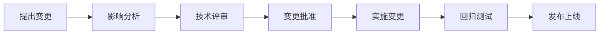

# 日志系统事件驱动重构 - 目标与评审标准

## 一、项目背景

### 1.1 当前问题

**现状分析**：
```go
// 当前实现：同步阻塞式日志记录
func (s *authenticationService) Login(ctx context.Context, cmd LoginCommand) (*Token, error) {
    // 1. 验证密码
    if !user.VerifyPassword(cmd.Password) {
        return nil, ErrInvalidCredentials
    }
    
    token := GenerateToken(user.ID)
    
    // ❌ 问题：同步写入日志，阻塞主流程
    s.activityLogService.Record(ctx, &ActivityLog{
        UserID: user.ID,
        Action: "AUTH.LOGIN.SUCCESS",
        Data:   map[string]interface{}{"ip": cmd.IP},
    })
    
    // ❌ 问题：业务代码依赖日志服务，耦合严重
    return token, nil
}
```

**核心痛点**：
1. **性能瓶颈**：登录接口 P99 = 200ms（包含数据库写入）
2. **职责混乱**：业务代码包含日志记录逻辑
3. **紧耦合**：难以测试和维护
4. **扩展困难**：无法灵活添加新的日志处理器

---

### 1.2 重构动机

**为什么要做这次重构？**

| 维度 | 当前状态 | 期望状态 | 改进 |
|------|---------|---------|------|
| **性能** | P99 200ms | P99 < 50ms | ⬆️ 75% |
| **解耦** | 紧耦合 | 完全解耦 | 可维护性↑ |
| **扩展性** | 垂直扩展 | 水平扩展 | 并发能力↑ |
| **可测试性** | 需要 Mock 多个依赖 | 独立测试 | 测试效率↑ |

---

## 二、重构目标

### 2.0 理想目录结构

```
backend/
├── cmd/
│   ├── api/                     # API 服务入口
│   │   └── main.go              # 初始化 EventBus + Listener
│   ├── worker/                  # Worker 服务入口
│   │   └── main.go              # 初始化 Worker Server + Handler
│   └── cli/                     # CLI 工具
│       └── main.go
│
├── internal/
│   ├── domain/                  # 领域层（纯业务逻辑）
│   │   ├── user/                # 用户核心域
│   │   │   ├── entity.go        # User 聚合根
│   │   │   │                    # • ID, Email, Password
│   │   │   │                    # • Locked, FailedAttempts
│   │   │   ├── value_objects.go # Email, Password 值对象
│   │   │   ├── repository.go    # UserRepository 接口
│   │   │   └── events.go        # 领域事件定义
│   │   │                        #   - UserLoggedIn
│   │   │                        #   - UserLoggedOut
│   │   │                        #   - LoginFailed
│   │   │
│   │   └── shared/              # 共享领域概念
│   │       ├── id.go            # ID 生成器（ULID）
│   │       ├── base_event.go    # 领域事件基类
│   │       └── errors.go        # 通用错误类型
│   │
│   ├── app/                     # 应用层（用例编排）
│   │   ├── user/                # 用户应用服务
│   │   │   ├── service.go       # UserService
│   │   │   ├── dto.go           # DTO 定义
│   │   │   └── mapper.go        # Entity ↔ DTO 转换
│   │   │
│   │   └── authentication/      # 认证应用服务
│   │       ├── service.go       # AuthService
│   │       │                    # • Login(), Logout()
│   │       │                    # • RefreshToken()
│   │       ├── dto.go
│   │       └── mapper.go
│   │
│   ├── listener/                # 🆕 事件监听器层
│   │   ├── audit_log_listener.go # 审计日志监听器
│   │   │                         # • 订阅 AUTH.*, SECURITY.* 事件
│   │   │                         # • 转换为审计日志任务
│   │   │                         # • 发布到 Worker 队列（critical）
│   │   │
│   │   └── activity_log_listener.go # 活动日志监听器
│   │                                # • 订阅 USER.*, FEATURE.* 事件
│   │                                # • 转换为活动日志任务
│   │                                # • 发布到 Worker 队列（default）
│   │
│   ├── transport/               # 传输层
│   │   ├── http/
│   │   │   ├── router.go        # Gin/Echo 路由配置
│   │   │   ├── middleware.go    # 中间件（Auth, CORS, RateLimit）
│   │   │   └── handlers/
│   │   │       ├── auth.go      # AuthHandler
│   │   │       ├── user.go      # UserHandler
│   │   │       └── audit_log.go # AuditLogHandler（查询）
│   │   │
│   │   └── worker/              # Worker 服务
│   │       └── handlers/
│   │           ├── audit_log_handler.go    # 审计日志处理器
│   │           └── activity_log_handler.go # 活动日志处理器
│   │
│   └── infra/                   # 基础设施层
│       ├── persistence/
│       │   ├── db.go            # GORM 数据库连接
│       │   └── redis.go         # Redis 连接
│       │
│       ├── repository/          # 仓储实现
│       │   ├── user.go          # UserRepository GORM
│       │   ├── audit_log.go     # AuditLogRepository GORM
│       │   └── activity_log.go  # ActivityLogPersistence
│       │
│       ├── messaging/           # 消息队列
│       │   └── event_bus.go     # ✅ EventBus 接口 + 工厂
│       │                        # • type EventBus interface { ... }
│       │                        # • func NewEventBus(...) EventBus
│       │                        # • asynqEventBus 实现
│       │
│       └── redis/               # Redis 存储
│           ├── token_store.go   # Token 存储（Redis）
│           │                    # • Key: auth:token:{refresh_token}
│           │                    # • TTL: 7 days
│           └── device_store.go  # Device 存储（Redis）
│                                # • Key: auth:devices:{user_id}
│                                # • TTL: 30 days
│
├── pkg/
│   ├── event/
│   │   ├── event.go             # Event 基础接口
│   │   └── asynq_event_bus.go   # （已废弃，迁移到 infra/messaging）
│   │
│   ├── logger/                  # 结构化日志（zap/logrus）
│   ├── metrics/                 # Prometheus Metrics
│   └── utils/ulid/              # ULID 工具
│
├── migrations/                  # SQL 迁移文件
│   ├── 001_create_users_table.up.sql
│   ├── 001_create_users_table.down.sql
│   ├── 005_create_audit_logs_table.up.sql
│   ├── 005_create_audit_logs_table.down.sql
│   ├── 006_create_activity_logs_table.up.sql
│   └── 006_create_activity_logs_table.down.sql
│
├── configs/
│   ├── .env.example             # 环境变量模板
│   ├── development.yaml         # 开发环境配置
│   └── production.yaml          # 生产环境配置
│
├── test/
│   ├── unit/                    # 单元测试
│   │   ├── domain/
│   │   ├── app/
│   │   └── infra/
│   │
│   └── integration/             # 集成测试
│       ├── auth_flow_test.go    # 认证流程测试
│       └── event_bus_test.go    # EventBus 测试
│
├── docs/                        # 文档
│   ├── GOALS_AND_ACCEPTANCE_CRITERIA.md  # 本文档
│   ├── ARCHITECTURE_REFACTORING_SPEC_V2.md # 架构规范
│   ├── DATABASE_SCHEMA_DESIGN.md         # 数据库设计
│   └── LOGGING_MIGRATION_PLAN.md         # 迁移计划
│
├── go.mod
├── go.sum
├── Makefile
└── Dockerfile
```

**目录命名规范**：
- ✅ **按技术层划分**：domain/app/listener/transport/infra
- ✅ **业务域垂直切片**：user/authentication
- ✅ **职责单一**：每个目录有明确的职责边界
- ✅ **依赖方向**：Domain ← App ← Listener ← Transport ← Infra

---

### 2.1 功能目标

#### ✅ T1: 事件驱动架构
- [ ] 引入 EventBus 作为统一通信机制
- [ ] 所有跨域通信通过事件异步进行
- [ ] 支持事件的发布/订阅模式

#### ✅ T2: 异步日志记录
- [ ] 业务代码只发布事件，不直接写日志
- [ ] Listener 负责监听并转换为日志任务
- [ ] Worker 异步消费队列并写入数据库

#### ✅ T3: Redis 存储优化
- [ ] Token 使用 Redis 存储（替代数据库表）
- [ ] Device 信息使用 Redis 存储
- [ ] 支持自动过期和黑名单机制

---

### 2.2 非功能目标

#### 📊 N1: 性能指标

| 指标 | 当前值 | 目标值 | 测量方法 |
|------|-------|-------|---------|
| **登录接口 P50** | 150ms | < 30ms | wrk 压测 |
| **登录接口 P99** | 200ms | < 50ms | wrk 压测 |
| **登录接口吞吐量** | 500 QPS | > 1000 QPS | wrk -t12 -c400 |
| **Worker 消费延迟** | - | < 1 秒 | 监控指标 |
| **Redis 查询耗时** | - | < 5ms | Redis INFO |

**压测命令**：
```bash
# 安装 wrk
brew install wrk

# 压测登录接口
wrk -t12 -c400 -d30s http://localhost:8080/api/v1/auth/login \
  -H 'Content-Type: application/json' \
  -d '{"email":"test@example.com","password":"password123"}'
```

---

#### 🏗️ N2: 架构质量

| 指标 | 目标值 | 验证方法 |
|------|-------|---------|
| **循环依赖** | 0 | golangci-lint |
| **测试覆盖率** | > 70% | go test -cover |
| **代码重复率** | < 5% | gocyclo |
| **平均圈复杂度** | < 10 | gocyclo |
| **依赖注入比例** | 100% | 代码审查 |

---

#### 🔒 N3: 可靠性

| 指标 | 目标值 | 验证方法 |
|------|-------|---------|
| **事件丢失率** | 0% | 压力测试 + 日志审计 |
| **消息重复消费** | 幂等处理 | 集成测试 |
| **Worker 故障恢复** | < 10 秒 | 手动 Kill 测试 |
| **Redis 故障转移** | < 30 秒 | Redis Sentinel 测试 |

---

### 2.3 开发体验目标

#### 👨‍💻 D1: 代码可读性

- [ ] 目录结构清晰，新人 1 小时内理解
- [ ] 每个文件职责单一（< 300 行）
- [ ] 函数长度 < 50 行
- [ ] 注释覆盖关键逻辑

#### 📚 D2: 文档完整性

- [ ] README 包含架构图
- [ ] 每个模块有 design.md 说明
- [ ] API 文档自动生成（Swagger）
- [ ] 运维手册完整

---

## 三、技术约束

### 3.1 必须遵守的原则

#### ✅ C1: DDD 原则
- **领域优先**：Domain 层不包含技术细节
- **边界清晰**：每个 Bounded Context 职责单一
- **聚合根完整**：业务规则在聚合根内实现
- **值对象不可变**：创建后不允许修改

#### ✅ C2: 整洁架构
- **依赖倒置**：高层不依赖低层实现
- **单向依赖**：Domain ← App ← Transport ← Infra
- **接口隔离**：小接口优于大接口
- **依赖注入**：所有外部依赖通过构造函数注入

#### ✅ C3: 事件驱动
- **最终一致性**：接受短暂的数据不一致
- **事件命名规范**：`{DOMAIN}.{CATEGORY}.{ACTION}`
- **事件版本化**：支持向后兼容
- **幂等处理**：消费者必须支持重复消费

---

### 3.2 技术选型

| 组件 | 选型 | 理由 | 备选 |
|------|------|------|------|
| **消息队列** | Asynq | 基于 Redis，轻量级 | Kafka, RabbitMQ |
| **缓存** | Redis 7.x | 高性能，支持多种数据结构 | Memcached |
| **数据库** | PostgreSQL 15 | JSONB 支持，性能优秀 | MySQL 8 |
| **ORM** | GORM v2 | 生态完善，易于使用 | sqlx, ent |
| **测试框架** | testify | 断言丰富，支持 Mock | gomock |

---

## 四、评审标准

### 4.1 设计评审（Design Review）

#### 📋 DR1: 架构设计

**评审清单**：
- [ ] **分层清晰**：Domain/App/Listener/Transport/Infra 职责明确
- [ ] **依赖方向**：所有依赖指向 Domain 层
- [ ] **事件定义**：事件命名符合规范，Payload 结构清晰
- [ ] **错误处理**：定义了统一的错误类型和处理策略
- [ ] **扩展性**：新增日志类型不需要修改现有代码

**通过标准**：
- ✅ 所有 Checklist 项为"是"
- ✅ 至少 2 名高级工程师评审通过
- ✅ 架构决策记录（ADR）完整

---

#### 📋 DR2: 数据库设计

**评审清单**：
- [ ] **表结构合理**：无冗余字段，符合 3NF
- [ ] **索引优化**：查询字段有合适索引
- [ ] **分区策略**：audit_logs 按时间分区（可选）
- [ ] **数据迁移**：提供 up/down 迁移脚本
- [ ] **兼容性**：不影响现有功能

**通过标准**：
- ✅ EXPLAIN 分析显示索引有效
- ✅ 迁移脚本可回滚
- ✅ DBA 评审通过

---

#### 📋 DR3: Redis 设计

**评审清单**：
- [ ] **Key 命名规范**：`app:module:type:id`
- [ ] **TTL 设置**：所有 Key 有过期时间
- [ ] **内存优化**：使用 Hash/ZSet 等合适结构
- [ ] **持久化**：RDB+AOF 双持久化
- [ ] **监控告警**：内存使用率 > 80% 告警

**通过标准**：
- ✅ Redis Key 设计文档完整
- ✅ 内存占用评估合理
- ✅ 运维团队评审通过

---

### 4.2 代码评审（Code Review）

#### 📋 CR1: 代码规范

**评审清单**：
- [ ] **命名规范**：变量/函数/包名符合 Go 规范
- [ ] **错误处理**：所有 error 都被正确处理
- [ ] **资源释放**：defer Close/Rollback 正确使用
- [ ] **并发安全**：goroutine 无竞态条件
- [ ] **日志规范**：使用结构化日志（zap/logrus）

**检查工具**：
```bash
# 静态检查
golangci-lint run

# 竞态检测
go test -race ./...

# 代码复杂度
gocyclo -over 10 .
```

**通过标准**：
- ✅ golangci-lint 无警告
- ✅ go test -race 无竞态
- ✅ 平均圈复杂度 < 10

---

#### 📋 CR2: 测试质量

**评审清单**：
- [ ] **单元测试**：覆盖核心业务逻辑
- [ ] **集成测试**：覆盖完整业务流程
- [ ] **边界测试**：测试异常情况和边界值
- [ ] **性能测试**：压测报告达标
- [ ] **Mock 合理**：外部依赖全部 Mock

**通过标准**：
- ✅ 测试覆盖率 > 70%
- ✅ 所有测试通过（包括 race）
- ✅ 压测报告达到性能目标

---

#### 📋 CR3: 安全性

**评审清单**：
- [ ] **SQL 注入**：使用参数化查询
- [ ] **XSS 防护**：输出转义
- [ ] **密码加密**：bcrypt/argon2
- [ ] **Token 安全**：JWT 签名 + 加密
- [ ] **限流熔断**：防止 DDoS

**检查工具**：
```bash
# 安全扫描
gosec ./...

# 依赖漏洞检查
govulncheck ./...
```

**通过标准**：
- ✅ gosec 无高危警告
- ✅ govulncheck 无已知漏洞
- ✅ 渗透测试通过

---

### 4.3 验收评审（Acceptance Review）

#### 📋 AR1: 功能验收

**测试用例**：

| 用例 ID | 场景 | 预期结果 | 状态 |
|--------|------|---------|------|
| F1 | 用户登录成功 | 返回 Token，audit_logs 有记录 | ⬜ |
| F2 | 用户登录失败 | 返回错误，audit_logs 有 FAILED 记录 | ⬜ |
| F3 | 账户被锁定 | 拒绝登录，security_logs 有记录 | ⬜ |
| F4 | Token 刷新 | 返回新 Token，Redis 更新 | ⬜ |
| F5 | 用户登出 | Redis Token 删除 | ⬜ |
| F6 | 查询审计日志 | 返回分页列表 | ⬜ |
| F7 | 设备管理 | Redis 设备列表正确 | ⬜ |

**通过标准**：
- ✅ 所有测试用例通过
- ✅ 无 P0/P1 级别 Bug
- ✅ 产品经理签字确认

---

#### 📋 AR2: 性能验收

**压测场景**：

| 场景 | 并发数 | 持续时间 | P99 目标 | 吞吐量目标 |
|------|-------|---------|---------|-----------|
| 登录接口 | 400 | 30s | < 50ms | > 1000 QPS |
| Token 刷新 | 400 | 30s | < 30ms | > 1500 QPS |
| 查询日志 | 200 | 30s | < 100ms | > 500 QPS |

**压测报告模板**：
```markdown
## 压测结果

### 环境
- CPU: 8 Core
- Memory: 16GB
- Redis: 7.0 (Standalone)
- PostgreSQL: 15

### 登录接口（wrk -t12 -c400 -d30s）
Latency:
  Min: 12ms
  Max: 89ms
  Avg: 28ms
  P99: 45ms ✅

Req/Sec: 1234 [1000 req/sec] ✅

Status Codes:
  200: 37020
  500: 0
```

**通过标准**：
- ✅ 所有指标达到目标值
- ✅ 无内存泄漏
- ✅ 错误率 < 0.1%

---

#### 📋 AR3: 运维验收

**评审清单**：
- [ ] **监控完善**：Prometheus Metrics 完整
- [ ] **日志规范**：Structured Logging 落地
- [ ] **告警配置**：关键指标有告警
- [ ] **健康检查**：/healthz 端点正常
- [ ] **优雅关闭**：SIGTERM 处理正确
- [ ] **配置管理**：支持多环境配置
- [ ] **容器化**：Docker 镜像构建成功

**监控指标**：
```promql
# 业务指标
http_requests_total{endpoint="/api/v1/auth/login"}
http_request_duration_seconds{quantile="0.99"}

# 队列指标
asynq_jobs_processed_total
asynq_queue_size{queue="critical"}

# Redis 指标
redis_memory_used_bytes
redis_connected_clients

# 数据库指标
postgres_connections_active
postgres_query_duration_seconds
```

**通过标准**：
- ✅ Grafana 仪表盘完整
- ✅ 告警规则配置正确
- ✅ 运维团队验收通过

---

## 五、交付物清单

### 5.1 代码交付

- [ ] `backend/internal/domain/user/` - 领域层
- [ ] `backend/internal/app/authentication/` - 应用层
- [ ] `backend/internal/listener/` - 监听器层
- [ ] `backend/internal/infra/messaging/` - EventBus
- [ ] `backend/internal/infra/redis/` - Redis Store
- [ ] `backend/internal/transport/worker/handlers/` - Worker Handler
- [ ] `backend/migrations/005_create_audit_logs_table.sql`
- [ ] `backend/migrations/006_create_activity_logs_table.sql`

---

### 5.2 文档交付

- [ ] `docs/ARCHITECTURE_REFACTORING_SPEC_V2.md` - 架构规范
- [ ] `docs/DATABASE_SCHEMA_DESIGN.md` - 数据库设计
- [ ] `docs/LOGGING_MIGRATION_PLAN.md` - 迁移计划
- [ ] `docs/GOALS_AND_ACCEPTANCE_CRITERIA.md` - 本文档
- [ ] `backend/README.md` - 更新后的开发指南
- [ ] `backend/docs/API.md` - Swagger 文档

---

### 5.3 测试交付

- [ ] 单元测试覆盖率报告
- [ ] 集成测试报告
- [ ] 性能压测报告
- [ ] 安全扫描报告

---

## 六、风险评估与缓解

### 6.1 技术风险

| 风险 | 影响 | 概率 | 缓解措施 | 负责人 |
|------|------|------|---------|--------|
| **事件丢失** | 高 | 低 | Asynq 持久化 + 重试 | 后端组 |
| **Redis 单点故障** | 高 | 中 | Redis Sentinel | 运维组 |
| **消息重复消费** | 中 | 中 | 幂等性设计 | 后端组 |
| **性能不达标** | 中 | 低 | 提前压测 + 优化 | 后端组 |

---

### 6.2 进度风险

| 风险 | 影响 | 概率 | 缓解措施 | 负责人 |
|------|------|------|---------|--------|
| **需求变更** | 高 | 中 | 冻结需求范围 | PM |
| **人员不足** | 中 | 中 | 调整优先级 | Tech Lead |
| **技术难点** | 中 | 低 | 提前 PoC 验证 | 架构师 |

---

## 七、变更管理

### 7.1 变更流程



### 7.2 变更控制委员会

- **主席**：架构师
- **成员**：Tech Lead、产品负责人、运维负责人
- **审批权限**：
  - 小型变更（不影响架构）：Tech Lead 批准
  - 中型变更（影响局部）：架构师批准
  - 大型变更（影响整体）：CCB 会议批准

---

## 八、签署页

### 8.1 评审委员会签署

| 角色 | 姓名 | 日期 | 签名 |
|------|------|------|------|
| **产品负责人** | _________ | ____-__-__ | _________ |
| **架构师** | _________ | ____-__-__ | _________ |
| **Tech Lead** | _________ | ____-__-__ | _________ |
| **运维负责人** | _________ | ____-__-__ | _________ |

---

### 8.2 里程碑

| 阶段 | 完成日期 | 验收结果 | 签署人 |
|------|---------|---------|--------|
| **设计评审** | ____-__-__ | ⬜ 通过 / ⬜ 不通过 | _________ |
| **代码评审** | ____-__-__ | ⬜ 通过 / ⬜ 不通过 | _________ |
| **性能验收** | ____-__-__ | ⬜ 通过 / ⬜ 不通过 | _________ |
| **运维验收** | ____-__-__ | ⬜ 通过 / ⬜ 不通过 | _________ |
| **正式发布** | ____-__-__ | ⬜ 通过 / ⬜ 不通过 | _________ |

---

**文档版本**：v1.0  
**创建日期**：2026-04-03  
**状态**：待评审  
**下次评审日期**：2026-04-10
