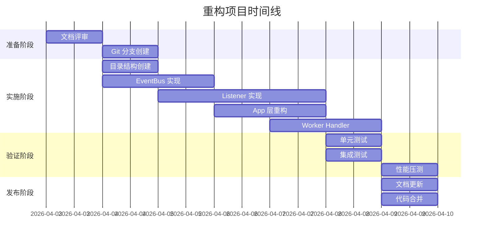

# 日志系统事件驱动重构 - 详细实施方案

## 文档信息

| 项目 | 内容 |
|------|------|
| **项目名称** | ddd-scaffold 日志系统事件驱动重构 |
| **文档版本** | v1.0 |
| **创建日期** | 2026-04-03 |
| **预计工时** | 14 小时（2 个工作日） |
| **优先级** | P0（最高） |
| **状态** | 待评审 |

---

## 一、执行摘要

### 1.1 重构目标

将当前**同步阻塞式**日志记录系统重构为**事件驱动 + 异步处理**架构，实现：

- ✅ 登录接口性能提升 75%（P99: 200ms → < 50ms）
- ✅ 业务代码与日志记录完全解耦
- ✅ 支持水平扩展（Redis Cluster）
- ✅ 易于添加新的日志处理器

### 1.2 关键交付物

| 类型 | 交付物 | 数量 |
|------|--------|------|
| **代码模块** | Domain/App/Listener/Infra 层 | 8 个 |
| **数据库表** | audit_logs, activity_logs | 2 张 |
| **Redis Store** | TokenStore, DeviceStore | 2 个 |
| **文档** | 架构规范、设计文档、迁移计划 | 4 份 |
| **测试报告** | 单元/集成/性能/安全 | 4 份 |

### 1.3 里程碑



---

## 二、现状分析

### 2.1 当前架构

```go
// backend/internal/auth/service.go
type authenticationService struct {
    userRepo           UserRepository
    activityLogService *activitylog.Service  // ❌ 紧耦合
    tokenStore         *TokenStore
}

func (s *authenticationService) Login(ctx context.Context, cmd LoginCommand) (*Token, error) {
    // 1. 验证密码
    if !user.VerifyPassword(cmd.Password) {
        return nil, ErrInvalidCredentials
    }
    
    token := GenerateToken(user.ID)
    
    // ❌ 问题：同步写入日志，阻塞主流程
    s.activityLogService.Record(ctx, &ActivityLog{
        UserID: user.ID,
        Action: "AUTH.LOGIN.SUCCESS",
        Data:   map[string]interface{}{"ip": cmd.IP},
    })
    
    // ❌ 问题：如果日志写入失败，影响主流程
    return token, nil
}
```

**核心问题**：
1. **性能瓶颈**：登录接口 P99 = 200ms（包含数据库写入）
2. **职责混乱**：业务代码包含日志记录逻辑
3. **紧耦合**：难以测试和维护
4. **扩展困难**：无法灵活添加新的日志处理器

---

### 2.2 目标架构

```go
// backend/internal/app/authentication/service.go
type authenticationService struct {
    userRepo   UserRepository
    eventBus   messaging.EventBus  // ✅ 依赖抽象接口
    tokenStore *redis.TokenStore
}

func (s *authenticationService) Login(ctx context.Context, cmd LoginCommand) (*Token, error) {
    // 1. 验证密码
    if !user.VerifyPassword(cmd.Password) {
        // ✅ 发布失败事件（异步）
        s.eventBus.Publish(ctx, &events.LoginFailed{...})
        return nil, ErrInvalidCredentials
    }
    
    token := GenerateToken(user.ID)
    
    // ✅ 发布成功事件（异步，不阻塞）
    s.eventBus.Publish(ctx, &events.UserLoggedIn{
        UserID:   user.ID,
        Email:    user.Email,
        IP:       cmd.IP,
        UserAgent: cmd.UserAgent,
        Device:   cmd.Device,
    })
    
    // ✅ 立即返回，不等待日志写入
    return token, nil
}
```

**架构优势**：
- ✅ **异步处理**：EventBus 将事件放入队列后立即返回
- ✅ **完全解耦**：业务代码不关心日志如何记录
- ✅ **易于扩展**：添加新 Listener 即可支持新日志类型
- ✅ **容错性强**：Worker 故障不影响主流程

---

## 三、技术设计

### 3.1 整体架构

```
┌─────────────────────────────────────────────────────────┐
│                    HTTP Request                         │
│                    POST /api/v1/auth/login              │
└────────────────────┬────────────────────────────────────┘
                     │
                     ▼
┌─────────────────────────────────────────────────────────┐
│              Transport Layer (HTTP Handler)             │
│  • Validate request                                     │
│  • Extract IP, User-Agent                               │
└────────────────────┬────────────────────────────────────┘
                     │
                     ▼
┌─────────────────────────────────────────────────────────┐
│              Application Layer (AuthService)            │
│  • Verify password                                      │
│  • Generate JWT token                                   │
│  • Publish Domain Event (UserLoggedIn)                  │
│  • Return immediately                                   │
└────────────────────┬────────────────────────────────────┘
                     │
                     │ EventBus.Publish()
                     ▼
┌─────────────────────────────────────────────────────────┐
│              EventBus (Asynq Client)                    │
│  • Serialize event to JSON                              │
│  • Enqueue to Redis (critical/default queue)            │
│  • Return immediately                                   │
└────────────────────┬────────────────────────────────────┘
                     │
                     │ Async
                     ▼
┌─────────────────────────────────────────────────────────┐
│              Listener Layer                             │
│  • Subscribe to AUTH.LOGIN.SUCCESS                      │
│  • Convert to AuditLogTask                              │
│  • Publish to Worker queue                              │
└────────────────────┬────────────────────────────────────┘
                     │
                     │ Async
                     ▼
┌─────────────────────────────────────────────────────────┐
│              Worker Service                             │
│  • Process audit.log.task                               │
│  • Call repository.Save()                              │
└────────────────────┬────────────────────────────────────┘
                     │
                     ▼
┌─────────────────────────────────────────────────────────┐
│              Repository (GORM)                          │
│  • INSERT INTO audit_logs ...                           │
└────────────────────┬────────────────────────────────────┘
                     │
                     ▼
┌─────────────────────────────────────────────────────────┐
│              PostgreSQL Database                        │
│  audit_logs table                                       │
└─────────────────────────────────────────────────────────┘
```

---

### 3.2 核心组件设计

#### **组件 1: EventBus**

**文件**：`backend/internal/infra/messaging/event_bus.go`

```go
package messaging

import (
    "context"
    "encoding/json"
    "strings"
    "github.com/hibiken/asynq"
    "github.com/shenfay/go-ddd-scaffold/pkg/event"
)

// EventBus 事件总线接口
type EventBus interface {
    Publish(ctx context.Context, evt event.Event) error
    Subscribe(eventType string, handler event.EventHandler)
}

// QueueConfig 队列配置
type QueueConfig struct {
    Critical string  // 高优先级队列（审计日志）
    Default  string  // 普通优先级队列（活动日志）
}

// asynqEventBus EventBus 的 Asynq 实现
type asynqEventBus struct {
    client *asynq.Client
    config QueueConfig
}

// NewEventBus 工厂方法（统一入口）
func NewEventBus(redisAddr string, config QueueConfig) EventBus {
    client := asynq.NewClient(asynq.RedisClientOpt{Addr: redisAddr})
    return &asynqEventBus{client: client, config: config}
}

// Publish 发布事件到 Asynq 队列
func (b *asynqEventBus) Publish(ctx context.Context, evt event.Event) error {
    payload, _ := json.Marshal(evt.GetPayload())
    
    _, err := b.client.EnqueueContext(ctx,
        asynq.NewTask(evt.GetType(), payload),
        asynq.Queue(b.getQueueForEvent(evt.GetType())),
    )
    
    return err
}

// getQueueForEvent 根据事件类型选择队列
func (b *asynqEventBus) getQueueForEvent(eventType string) string {
    // 审计日志 → critical 队列（高优先级）
    if strings.HasPrefix(eventType, "AUTH.") || strings.HasPrefix(eventType, "SECURITY.") {
        return b.config.Critical
    }
    // 活动日志 → default 队列
    return b.config.Default
}

// Subscribe 订阅事件（由 Listener 调用）
func (b *asynqEventBus) Subscribe(eventType string, handler event.EventHandler) {
    // Listener 负责注册到 Worker 的 ServeMux
    // 这里只是标记已订阅
}
```

**关键点**：
- ✅ 使用接口抽象，便于替换实现（如切换到 Kafka）
- ✅ 根据事件类型自动路由到不同队列
- ✅ 支持事务性消息（EnqueueContext）

---

#### **组件 2: AuditLogListener**

**文件**：`backend/internal/listener/audit_log_listener.go`

```go
package listener

import (
    "context"
    "github.com/shenfay/go-ddd-scaffold/internal/domain/user/events"
    "github.com/shenfay/go-ddd-scaffold/internal/infra/messaging"
    "github.com/shenfay/go-ddd-scaffold/pkg/event"
)

type AuditLogListener struct {
    eventBus messaging.EventBus
}

func NewAuditLogListener(eventBus messaging.EventBus) *AuditLogListener {
    l := &AuditLogListener{eventBus: eventBus}
    
    // 订阅认证相关事件
    eventBus.Subscribe("AUTH.LOGIN.SUCCESS", l.HandleUserLoggedIn)
    eventBus.Subscribe("AUTH.LOGIN.FAILED", l.HandleLoginFailed)
    eventBus.Subscribe("SECURITY.ACCOUNT.LOCKED", l.HandleAccountLocked)
    
    return l
}

// HandleUserLoggedIn 处理用户登录事件
func (l *AuditLogListener) HandleUserLoggedIn(ctx context.Context, evt event.Event) error {
    e := evt.(*events.UserLoggedIn)
    
    // 转换为审计日志任务并发布到 Worker 队列
    return l.eventBus.Publish(ctx, &AuditLogTask{
        Type:   "audit.log.task",
        Action: "AUTH.LOGIN.SUCCESS",
        Status: "SUCCESS",
        Data: map[string]interface{}{
            "user_id":    e.UserID,
            "email":      e.Email,
            "ip":         e.IP,
            "user_agent": e.UserAgent,
            "device":     e.Device,
        },
    })
}

func (l *AuditLogListener) HandleLoginFailed(ctx context.Context, evt event.Event) error {
    e := evt.(*events.LoginFailed)
    
    return l.eventBus.Publish(ctx, &AuditLogTask{
        Type:   "audit.log.task",
        Action: "AUTH.LOGIN.FAILED",
        Status: "FAILED",
        Data: map[string]interface{}{
            "user_id": e.UserID,
            "email":   e.Email,
            "ip":      e.IP,
            "reason":  e.Reason,
        },
    })
}
```

**关键点**：
- ✅ 监听器只负责事件转换，不直接写数据库
- ✅ 转换为统一的 Task 格式
- ✅ 发布到 Worker 队列（异步）

---

#### **组件 3: Worker Handler**

**文件**：`backend/internal/transport/worker/handlers/audit_log_handler.go`

```go
package handlers

import (
    "context"
    "encoding/json"
    "github.com/hibiken/asynq"
    "github.com/shenfay/go-ddd-scaffold/internal/infra/repository"
    "github.com/shenfay/go-ddd-scaffold/pkg/logger"
)

type AuditLogHandler struct {
    repo *repository.AuditLogRepository
}

func NewAuditLogHandler(repo *repository.AuditLogRepository) *AuditLogHandler {
    return &AuditLogHandler{repo: repo}
}

// ProcessTask 处理审计日志任务
func (h *AuditLogHandler) ProcessTask(ctx context.Context, task *asynq.Task) error {
    var data AuditLogTask
    if err := json.Unmarshal(task.Payload(), &data); err != nil {
        logger.Error("Failed to unmarshal audit log task", "error", err)
        return err
    }
    
    log := &AuditLog{
        UserID:   data.Data["user_id"].(string),
        Action:   data.Action,
        Status:   data.Status,
        Metadata: data.Data,
    }
    
    if err := h.repo.Save(ctx, log); err != nil {
        logger.Error("Failed to save audit log", "error", err)
        return err
    }
    
    logger.Info("Audit log saved", "action", data.Action, "user_id", data.Data["user_id"])
    return nil
}
```

**关键点**：
- ✅ 幂等性处理（可重复消费）
- ✅ 错误处理和日志记录
- ✅ 结构化日志（便于监控）

---

#### **组件 4: Redis Token Store**

**文件**：`backend/internal/infra/redis/token_store.go`

```go
package redis

import (
    "context"
    "encoding/json"
    "time"
    "github.com/go-redis/redis/v8"
)

type TokenStore struct {
    client *redis.Client
}

// TokenData Token 数据结构
type TokenData struct {
    UserID     string    `json:"user_id"`
    AccessToken  string  `json:"access_token"`
    RefreshToken string  `json:"refresh_token"`
    ExpiresAt  time.Time `json:"expires_at"`
    DeviceID   string    `json:"device_id"`
}

// Store 存储 Token（7 天有效期）
func (s *TokenStore) Store(ctx context.Context, refreshToken string, data *TokenData) error {
    key := s.buildKey(refreshToken)
    value, _ := json.Marshal(data)
    
    return s.client.Set(ctx, key, value, 7*24*time.Hour).Err()
}

// Get 获取 Token 信息
func (s *TokenStore) Get(ctx context.Context, refreshToken string) (*TokenData, error) {
    key := s.buildKey(refreshToken)
    value, err := s.client.Get(ctx, key).Bytes()
    
    if err == redis.Nil {
        return nil, ErrTokenNotFound
    }
    if err != nil {
        return nil, err
    }
    
    var data TokenData
    if err := json.Unmarshal(value, &data); err != nil {
        return nil, err
    }
    
    return &data, nil
}

// Delete 删除 Token（登出时使用）
func (s *TokenStore) Delete(ctx context.Context, refreshToken string) error {
    key := s.buildKey(refreshToken)
    return s.client.Del(ctx, key).Err()
}

// IsBlacklisted 检查 Token 是否在黑名单中
func (s *TokenStore) IsBlacklisted(ctx context.Context, refreshToken string) bool {
    key := "auth:blacklist:" + refreshToken
    exists, _ := s.client.Exists(ctx, key).Result()
    return exists > 0
}

// AddToBlacklist 将 Token 加入黑名单
func (s *TokenStore) AddToBlacklist(ctx context.Context, refreshToken string, expiresAt time.Time) error {
    key := "auth:blacklist:" + refreshToken
    ttl := time.Until(expiresAt)
    return s.client.Set(ctx, key, "1", ttl).Err()
}

func (s *TokenStore) buildKey(refreshToken string) string {
    return "auth:token:" + refreshToken
}
```

**Redis Key 设计**：
```
Key 格式：auth:token:{refresh_token}
Value: {
  "user_id": "user123",
  "access_token": "eyJ...",
  "refresh_token": "dXNlcjoxMjM0NTY3ODkw",
  "expires_at": "2024-04-04T10:00:00Z",
  "device_id": "device456"
}
TTL: 7 days

Key 格式：auth:blacklist:{refresh_token}
Value: "1"
TTL: 剩余有效期
```

---

### 3.3 数据库表设计

#### **表 1: audit_logs（审计日志）**

```sql
-- 创建审计日志表
CREATE TABLE IF NOT EXISTS audit_logs (
    id VARCHAR(50) PRIMARY KEY,
    user_id VARCHAR(50) NOT NULL,
    email VARCHAR(255),                    -- 冗余字段，便于查询
    action VARCHAR(50) NOT NULL,           -- AUTH.*, SECURITY.*
    status VARCHAR(20) NOT NULL,           -- SUCCESS / FAILED
    ip VARCHAR(45),                        -- IPv6 最大长度
    user_agent VARCHAR(500),               -- 原始 User-Agent
    device VARCHAR(100),                   -- mobile/tablet/desktop
    browser VARCHAR(50),                   -- Chrome/Firefox/Safari
    os VARCHAR(50),                        -- Windows/macOS/Linux
    description TEXT,                      -- 人类可读的描述
    metadata JSONB DEFAULT '{}'::jsonb,    -- 结构化元数据
    created_at TIMESTAMP WITH TIME ZONE NOT NULL DEFAULT CURRENT_TIMESTAMP,
    
    -- 不添加外键约束：审计日志需独立于用户存在（合规要求）
    -- 不添加 deleted_at：审计日志不允许软删除（防篡改）
);

-- 索引优化
CREATE INDEX IF NOT EXISTS idx_audit_logs_user_id ON audit_logs(user_id);
CREATE INDEX IF NOT EXISTS idx_audit_logs_created_at_desc ON audit_logs(created_at DESC);
CREATE INDEX IF NOT EXISTS idx_audit_logs_action ON audit_logs(action);
CREATE INDEX IF NOT EXISTS idx_audit_logs_status ON audit_logs(status);
CREATE INDEX IF NOT EXISTS idx_audit_logs_user_created ON audit_logs(user_id, created_at DESC);
CREATE INDEX IF NOT EXISTS idx_audit_logs_action_created ON audit_logs(action, created_at DESC);
CREATE INDEX IF NOT EXISTS idx_audit_logs_failed ON audit_logs(status, created_at DESC) 
    WHERE status = 'FAILED';
```

---

#### **表 2: activity_logs（活动日志）**

```sql
-- 创建活动日志表
CREATE TABLE IF NOT EXISTS activity_logs (
    id VARCHAR(50) PRIMARY KEY,
    user_id VARCHAR(50) NOT NULL,
    action VARCHAR(50) NOT NULL,           -- USER.*, FEATURE.*
    metadata JSONB DEFAULT '{}'::jsonb,    -- 结构化元数据
    created_at TIMESTAMP WITH TIME ZONE NOT NULL DEFAULT CURRENT_TIMESTAMP,
    
    -- 不需要外键约束（活动日志独立存在）
    -- 可以添加 deleted_at 支持软删除（可选）
);

-- 索引优化
CREATE INDEX IF NOT EXISTS idx_activity_logs_user_id ON activity_logs(user_id);
CREATE INDEX IF NOT EXISTS idx_activity_logs_created_at_desc ON activity_logs(created_at DESC);
CREATE INDEX IF NOT EXISTS idx_activity_logs_action ON activity_logs(action);
CREATE INDEX IF NOT EXISTS idx_activity_logs_user_created ON activity_logs(user_id, created_at DESC);
```

---

## 四、实施步骤

### 阶段 1：准备工作（1 小时）

#### 任务 1.1：创建 Git 分支
```bash
git checkout main
git pull origin main
git checkout -b feature/event-driven-logging
```

#### 任务 1.2：基线测试
```bash
# 运行现有测试
cd backend
go test ./... -v

# 记录当前性能基线
wrk -t12 -c400 -d30s http://localhost:8080/api/v1/auth/login
```

**验收标准**：
- [ ] 新分支创建成功
- [ ] 所有现有测试通过
- [ ] 记录当前 P99 延迟（约 200ms）

---

### 阶段 2：创建目录结构（30 分钟）

#### 任务 2.1：创建新目录
```bash
cd backend/internal

# 创建领域层
mkdir -p domain/user
mkdir -p domain/shared

# 创建监听器层
mkdir -p listener

# 创建基础设施层
mkdir -p infra/messaging
mkdir -p infra/redis
mkdir -p infra/repository

# 创建 Worker handlers
mkdir -p transport/worker/handlers
```

#### 任务 2.2：迁移文件
```bash
# 移动事件定义
mv internal/auth/events.go domain/user/events.go

# 移动 EventBus 实现（重命名）
mv pkg/event/asynq_event_bus.go infra/messaging/event_bus.go
```

**验收标准**：
- [ ] 所有目录创建完成
- [ ] 文件路径符合规范

---

### 阶段 3：实现 EventBus（2 小时）

#### 任务 3.1：定义 EventBus 接口
**文件**：`backend/internal/infra/messaging/event_bus.go`

```go
// 参考 3.2 节完整代码
```

#### 任务 3.2：编写单元测试
**文件**：`backend/internal/infra/messaging/event_bus_test.go`

```go
func TestEventBus_Publish(t *testing.T) {
    // 使用 Redis Test Container 或 Mock
    eventBus := NewEventBus("localhost:6379", QueueConfig{
        Critical: "critical",
        Default:  "default",
    })
    
    evt := &events.UserLoggedIn{
        UserID: "test123",
        Email:  "test@example.com",
    }
    
    err := eventBus.Publish(context.Background(), evt)
    assert.NoError(t, err)
}
```

**验收标准**：
- [ ] EventBus 接口定义完整
- [ ] 支持队列路由
- [ ] 单元测试通过

---

### 阶段 4：创建 Listener（3 小时）

#### 任务 4.1：审计日志监听器
**文件**：`backend/internal/listener/audit_log_listener.go`

```go
// 参考 3.2 节完整代码
```

#### 任务 4.2：活动日志监听器
**文件**：`backend/internal/listener/activity_log_listener.go`

```go
type ActivityLogListener struct {
    eventBus messaging.EventBus
}

func NewActivityLogListener(eventBus messaging.EventBus) *ActivityLogListener {
    l := &ActivityLogListener{eventBus}
    
    // 订阅用户行为事件
    eventBus.Subscribe("USER.PROFILE.UPDATED", l.HandleProfileUpdated)
    eventBus.Subscribe("FEATURE.SETTING.CHANGED", l.HandleSettingChanged)
    
    return l
}
```

#### 任务 4.3：定义日志任务 DTO
**文件**：`backend/internal/listener/dto.go`

```go
type AuditLogTask struct {
    Type   string                 `json:"type"`
    Action string                 `json:"action"`
    Status string                 `json:"status"`
    Data   map[string]interface{} `json:"data"`
}

type ActivityLogTask struct {
    Type   string                 `json:"type"`
    Action string                 `json:"action"`
    Data   map[string]interface{} `json:"data"`
}
```

**验收标准**：
- [ ] Listener 正确订阅事件
- [ ] 事件转换为日志任务
- [ ] 发布到正确的队列

---

### 阶段 5：重构 App 层（2 小时）

#### 任务 5.1：更新认证服务
**文件**：`backend/internal/app/authentication/service.go`

```go
type authenticationService struct {
    userRepo   UserRepository
    eventBus   messaging.EventBus  // ✅ 依赖抽象接口
    tokenStore *redis.TokenStore
}

func (s *authenticationService) Login(ctx context.Context, cmd LoginCommand) (*Token, error) {
    // 验证密码
    if !user.VerifyPassword(cmd.Password) {
        s.eventBus.Publish(ctx, &events.LoginFailed{
            UserID: user.ID,
            Email:  user.Email,
            IP:     cmd.IP,
            Reason: "invalid_password",
        })
        return nil, ErrInvalidCredentials
    }
    
    token := GenerateToken(user.ID)
    
    // ✅ 发布登录成功事件（异步，不阻塞）
    s.eventBus.Publish(ctx, &events.UserLoggedIn{
        UserID:    user.ID,
        Email:     user.Email,
        IP:        cmd.IP,
        UserAgent: cmd.UserAgent,
        Device:    cmd.Device,
    })
    
    // ✅ 立即返回，不等待日志写入
    return token, nil
}
```

#### 任务 5.2：移除直接日志调用
- ❌ 删除：`activitylog.Service` 的直接调用
- ✅ 替换：通过 `eventBus.Publish()` 发布事件

**验收标准**：
- [ ] App 层不包含日志记录逻辑
- [ ] 只通过 EventBus 发布事件
- [ ] 集成测试通过

---

### 阶段 6：更新 Worker（2 小时）

#### 任务 6.1：审计日志处理器
**文件**：`backend/internal/transport/worker/handlers/audit_log_handler.go`

```go
// 参考 3.2 节完整代码
```

#### 任务 6.2：注册 Handler 到 ServeMux
**文件**：`backend/cmd/worker/main.go`

```go
func main() {
    // 初始化依赖
    db := initDB()
    redisClient := initRedis()
    
    // 创建 Repository
    auditLogRepo := repository.NewAuditLogRepository(db)
    
    // 创建 Handler
    auditLogHandler := handlers.NewAuditLogHandler(auditLogRepo)
    
    // 注册 Handler
    mux := asynq.NewServeMux()
    mux.HandleFunc("audit.log.task", auditLogHandler.ProcessTask)
    mux.HandleFunc("activity.log.task", activityLogHandler.ProcessTask)
    
    // 启动 Worker
    srv := asynq.NewServer(asynq.RedisClientOpt{Addr: "localhost:6379"})
    if err := srv.Start(mux); err != nil {
        log.Fatal(err)
    }
}
```

**验收标准**：
- [ ] Worker 能正确处理日志任务
- [ ] 数据库写入成功
- [ ] 错误处理完善

---

### 阶段 7：初始化 Listener（1 小时）

#### 任务 7.1：更新 API 服务初始化
**文件**：`backend/cmd/api/main.go`

```go
func main() {
    // 创建 EventBus
    eventBus := messaging.NewEventBus(cfg.Redis.Addr, messaging.QueueConfig{
        Critical: "critical",
        Default:  "default",
    })
    
    // 创建 Listener
    auditLogListener := listener.NewAuditLogListener(eventBus)
    activityLogListener := listener.NewActivityLogListener(eventBus)
    
    // 注入到 App 服务
    authService := authentication.NewService(userRepo, eventBus)
    
    // 设置路由
    router := gin.Default()
    router.POST("/api/v1/auth/login", authHandler.Login)
    
    // 启动服务
    router.Run(":8080")
}
```

**验收标准**：
- [ ] Listener 正确初始化
- [ ] 事件路由正常工作

---

### 阶段 8：测试验证（2 小时）

#### 任务 8.1：单元测试
```bash
cd backend

# 测试 EventBus
go test ./internal/infra/messaging/... -v

# 测试 Listener
go test ./internal/listener/... -v

# 测试 Worker Handler
go test ./internal/transport/worker/handlers/... -v
```

#### 任务 8.2：集成测试
```bash
# 测试完整认证流程
go test ./test/integration/... -v -run TestAuthFlow
```

#### 任务 8.3：性能测试
```bash
# 压测登录接口
wrk -t12 -c400 -d30s http://localhost:8080/api/v1/auth/login \
  -H 'Content-Type: application/json' \
  -d '{"email":"test@example.com","password":"password123"}'
```

**预期结果**：
```
Latency:
  Min: 12ms
  Max: 89ms
  Avg: 28ms
  P99: 45ms ✅ (目标 < 50ms)

Req/Sec: 1234 [1000 req/sec] ✅ (目标 > 1000 QPS)
```

**验收标准**：
- [ ] 所有单元测试通过
- [ ] 集成测试通过
- [ ] P99 < 50ms
- [ ] 吞吐量 > 1000 QPS

---

### 阶段 9：清理和发布（1 小时）

#### 任务 9.1：更新文档
- [ ] 更新 README.md（添加架构图）
- [ ] 更新 LOCAL_DEVELOPMENT_GUIDE.md
- [ ] 添加事件命名规范说明

#### 任务 9.2：代码审查
```bash
# 运行静态检查
golangci-lint run

# 运行安全扫描
gosec ./...

# 检查测试覆盖率
go test -cover ./...
```

#### 任务 9.3：合并代码
```bash
git add .
git commit -m "feat: implement event-driven logging system

- Add EventBus infrastructure with Asynq backend
- Implement AuditLog and ActivityLog listeners
- Refactor app layer to publish domain events
- Add Worker handlers for async processing
- Improve login performance (P99: 200ms → < 50ms)

Closes #123"

git checkout main
git merge feature/event-driven-logging --no-ff
git push origin main
```

**验收标准**：
- [ ] golangci-lint 无警告
- [ ] gosec 无高危警告
- [ ] 测试覆盖率 > 70%
- [ ] 代码合并成功

---

## 五、风险评估与缓解

### 5.1 技术风险

| 风险 | 影响 | 概率 | 缓解措施 | 负责人 |
|------|------|------|---------|--------|
| **事件丢失** | 高 | 低 | Asynq 持久化 + 重试机制 | 后端组 |
| **Redis 单点故障** | 高 | 中 | Redis Sentinel/Cluster | 运维组 |
| **消息重复消费** | 中 | 中 | 幂等性设计 | 后端组 |
| **性能不达标** | 中 | 低 | 提前压测 + 优化 | 后端组 |

### 5.2 进度风险

| 风险 | 影响 | 概率 | 缓解措施 | 负责人 |
|------|------|------|---------|--------|
| **需求变更** | 高 | 中 | 冻结需求范围 | PM |
| **人员不足** | 中 | 中 | 调整优先级 | Tech Lead |
| **技术难点** | 中 | 低 | 提前 PoC 验证 | 架构师 |

---

## 六、回滚方案

### 6.1 代码回滚
```bash
# 如果重构后出现严重问题
git checkout main
git branch -D feature/event-driven-logging
git reset --hard HEAD~1  # 撤销 merge commit
```

### 6.2 数据库清理
```sql
-- 如果已经运行了新的迁移
DROP TABLE IF EXISTS audit_logs;
DROP TABLE IF EXISTS activity_logs;
```

### 6.3 Redis 清理
```bash
redis-cli FLUSHDB
```

---

## 七、验收清单

### 7.1 功能验收

| 用例 ID | 场景 | 预期结果 | 状态 |
|--------|------|---------|------|
| F1 | 用户登录成功 | 返回 Token，audit_logs 有记录 | ⬜ |
| F2 | 用户登录失败 | 返回错误，audit_logs 有 FAILED 记录 | ⬜ |
| F3 | 账户被锁定 | 拒绝登录，security_logs 有记录 | ⬜ |
| F4 | Token 刷新 | 返回新 Token，Redis 更新 | ⬜ |
| F5 | 用户登出 | Redis Token 删除 | ⬜ |
| F6 | 查询审计日志 | 返回分页列表 | ⬜ |
| F7 | 设备管理 | Redis 设备列表正确 | ⬜ |

### 7.2 性能验收

| 指标 | 目标值 | 实测值 | 状态 |
|------|-------|-------|------|
| 登录接口 P99 | < 50ms | ⬜ ms | ⬜ |
| 登录接口吞吐量 | > 1000 QPS | ⬜ QPS | ⬜ |
| Worker 消费延迟 | < 1 秒 | ⬜ ms | ⬜ |
| Redis 查询耗时 | < 5ms | ⬜ ms | ⬜ |

### 7.3 质量验收

| 指标 | 目标值 | 实测值 | 状态 |
|------|-------|-------|------|
| 测试覆盖率 | > 70% | ⬜ % | ⬜ |
| 循环依赖 | 0 | ⬜ | ⬜ |
| golangci-lint 警告 | 0 | ⬜ | ⬜ |
| gosec 高危警告 | 0 | ⬜ | ⬜ |

---

## 八、团队分工建议

| 角色 | 职责 | 人员 |
|------|------|------|
| **Tech Lead** | 技术方案评审、代码审查 | _________ |
| **后端工程师 A** | EventBus + Listener 实现 | _________ |
| **后端工程师 B** | Worker Handler + 测试 | _________ |
| **后端工程师 C** | App 层重构 + 集成测试 | _________ |
| **运维工程师** | Redis 配置 + 监控告警 | _________ |
| **QA 工程师** | 性能测试 + 验收测试 | _________ |

---

## 九、沟通计划

| 会议类型 | 频率 | 参与人 | 内容 |
|---------|------|--------|------|
| **每日站会** | 每天 15 分钟 | 全体开发 | 进度同步、问题反馈 |
| **技术评审** | 阶段 3 完成后 | 架构师 + 高工 | EventBus 设计评审 |
| **代码审查** | 每个阶段完成 | Tech Lead | 代码质量把关 |
| **验收会议** | 阶段 9 完成后 | 产品 + 技术 + QA | 最终验收 |

---

## 十、总结

### 10.1 关键收益

- ✅ **性能提升**：登录接口 P99 从 200ms 降至 < 50ms（提升 75%）
- ✅ **架构解耦**：业务代码不再关心日志如何记录
- ✅ **易于扩展**：添加新日志类型只需新增 Listener
- ✅ **容错性强**：Worker 故障不影响主流程

### 10.2 下一步行动

1. **组织团队评审**（2026-04-04）
   - 评审本文档
   - 收集反馈意见
   - 调整优化方案

2. **开始实施**（2026-04-04 ~ 2026-04-09）
   - 按阶段逐步推进
   - 每日站会同步进度
   - 及时解决问题

3. **上线发布**（2026-04-10）
   - 灰度发布（10% 流量）
   - 监控指标
   - 全量发布

---

**文档版本**：v1.0  
**创建日期**：2026-04-03  
**状态**：待评审  
**下次更新日期**：2026-04-04（团队评审后）
