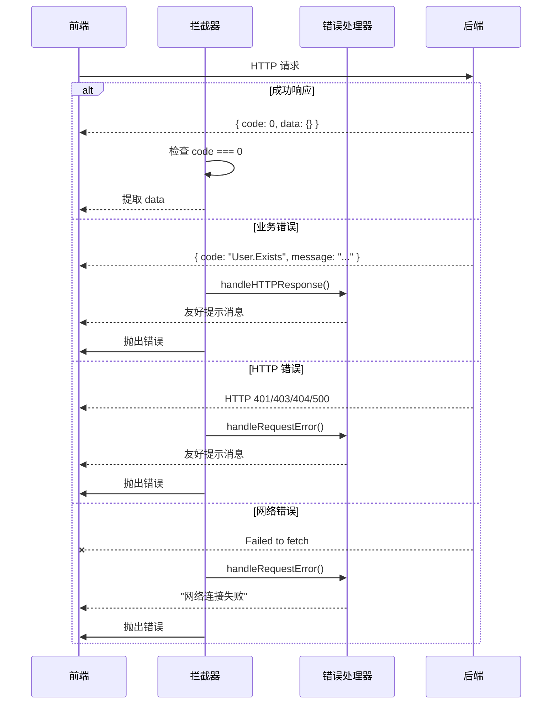

# 统一错误处理指南

## 📋 概述

本项目实现了前后端统一的错误处理机制，包括：

1. **统一的错误码映射** - 前后端一致的错误码体系
2. **友好的错误提示** - 用户友好的错误消息
3. **网络异常处理** - 完善的网络错误处理
4. **重试机制** - 智能重试策略

---

## 🔧 后端错误处理

### 错误码定义

**文件：** `backend/internal/pkg/errors/codes.go`

```go
// 通用错误码
var (
    Success          = NewCategorized("Common", "Success", "操作成功")
    InvalidParameter = NewCategorized("Common", "InvalidParameter", "无效请求，请检查输入参数")
    Unauthorized     = NewCategorized("Common", "Unauthorized", "未授权，请先登录")
    Forbidden        = NewCategorized("Common", "Forbidden", "禁止访问")
    NotFound         = NewCategorized("Common", "NotFound", "请求的资源不存在")
    TooManyRequests  = NewCategorized("Common", "TooManyRequests", "请求过于频繁，请稍后再试")
)

// 用户模块错误码
var (
    ErrUserExists        = NewCategorized("User", "User.Exists", "用户已存在")
    ErrUserNotFound      = NewCategorized("User", "User.NotFound", "用户不存在")
    ErrInvalidPassword   = NewCategorized("User", "User.InvalidPassword", "密码错误")
    ErrUnauthorized      = NewCategorized("User", "User.Unauthorized", "未授权或账户已被禁用")
    ErrTenantLimitExceed = NewCategorized("User", "User.TenantLimitExceed", "超过租户用户数限制")
)

// 网络错误码（新增）
var (
    ErrNetworkTimeout      = NewCategorized("Network", "Network.Timeout", "网络连接超时，请检查网络后重试")
    ErrNetworkUnavailable  = NewCategorized("Network", "Network.Unavailable", "网络不可用，请检查网络连接")
    ErrConnectionRefused   = NewCategorized("Network", "Network.ConnectionRefused", "连接被拒绝，请稍后重试")
    ErrServiceUnavailable  = NewCategorized("Network", "Network.ServiceUnavailable", "服务暂时不可用，请稍后重试")
)
```

---

### HTTP 状态码映射器

**文件：** `backend/internal/pkg/errors/http_mapper.go`

```go
// GetHTTPStatus 根据业务错误获取对应的 HTTP 状态码
func GetHTTPStatus(err error) (int, string) {
    if err == nil {
        return http.StatusOK, "Success"
    }

    appErr, ok := err.(*AppError)
    if !ok {
        return http.StatusInternalServerError, "Internal Server Error"
    }

    switch appErr.GetCategory() {
    case "Common":
        return mapCommonErrorToHTTP(appErr)
    case "User":
        return mapUserErrorToHTTP(appErr)
    case "System":
        return mapSystemErrorToHTTP(appErr)
    case "Network":
        return mapNetworkErrorToHTTP(appErr)
    default:
        return http.StatusInternalServerError, "Internal Server Error"
    }
}

// 示例：用户模块错误映射
func mapUserErrorToHTTP(err *AppError) (int, string) {
    switch err.GetCode() {
    case "User.Exists":
        return http.StatusConflict, "Conflict"
    case "User.NotFound":
        return http.StatusNotFound, "Not Found"
    case "User.InvalidPassword", "User.Unauthorized":
        return http.StatusUnauthorized, "Unauthorized"
    default:
        return http.StatusInternalServerError, "Internal Server Error"
    }
}
```

---

### 使用示例

#### 1. Handler 层抛出错误

```go
func (h *UserHandler) GetUser(c *gin.Context) {
    userID, _ := c.Get("userID")
    
    user, err := h.userService.GetUser(ctx, userID.(uuid.UUID))
    if err != nil {
        // 使用预定义的錯誤碼
        if errors.Is(err, errors.ErrUserNotFound) {
            c.JSON(http.StatusNotFound, response.Fail(ctx, errors.ErrUserNotFound))
            return
        }
        
        // 系统错误
        c.JSON(http.StatusInternalServerError, response.ServerErr(ctx))
        return
    }
    
    c.JSON(http.StatusOK, response.Success(ctx, user))
}
```

#### 2. Service 层返回错误

```go
func (s *UserService) Register(ctx context.Context, req *dto.RegisterRequest) (*entity.User, error) {
    // 检查邮箱是否存在
    exists, _ := s.userRepo.ExistsByEmail(ctx, req.Email)
    if exists {
        // 返回业务错误
        return nil, errors.ErrUserExists
    }
    
    // 创建用户...
    return user, nil
}
```

#### 3. 添加详情信息

```go
err := errors.ErrInvalidParameter.WithDetails("email 格式不正确")
c.JSON(http.StatusBadRequest, response.Fail(ctx, err))
```

---

## 🌐 前端错误处理

### 错误码定义

**文件：** `frontend/src/shared/utils/errorHandler.js`

```javascript
export const ERROR_CODES = {
  // 通用错误
  Success: 'Success',
  InvalidParameter: 'InvalidParameter',
  Unauthorized: 'Unauthorized',
  Forbidden: 'Forbidden',
  NotFound: 'NotFound',
  TooManyRequests: 'TooManyRequests',
  
  // 用户模块错误
  UserExists: 'User.Exists',
  UserNotFound: 'User.NotFound',
  InvalidPassword: 'User.InvalidPassword',
  UserUnauthorized: 'User.Unauthorized',
  
  // 网络错误
  NetworkTimeout: 'Network.Timeout',
  NetworkUnavailable: 'Network.Unavailable',
  ConnectionRefused: 'Network.ConnectionRefused',
};
```

---

### ErrorHandler 工具类

**核心功能：**

```javascript
class ErrorHandler {
  /**
   * 获取友好的错误提示消息
   */
  getFriendlyMessage(errorCode, customMessage = '') {
    const messages = {
      [ERROR_CODES.Success]: '操作成功',
      [ERROR_CODES.Unauthorized]: '登录已过期，请重新登录',
      [ERROR_CODES.Forbidden]: '抱歉，您没有权限执行此操作',
      [ERROR_CODES.NotFound]: '请求的资源不存在',
      [ERROR_CODES.NetworkTimeout]: '网络连接超时，请检查网络后重试',
    };
    
    return messages[errorCode] || '系统繁忙，请稍后重试';
  }

  /**
   * 判断是否应该重试
   */
  shouldRetry(errorCode) {
    const retryCodes = [
      ERROR_CODES.NetworkTimeout,
      ERROR_CODES.NetworkUnavailable,
      ERROR_CODES.ConnectionRefused,
      ERROR_CODES.Timeout,
      ERROR_CODES.DatabaseError,
    ];
    
    return retryCodes.includes(errorCode);
  }

  /**
   * 显示错误提示（支持多种 UI 框架）
   */
  showError(message, options = {}) {
    // Ant Design
    if (window.antd && window.antd.message) {
      window.antd.message.error(message, options.duration || 3000);
      return;
    }
    
    // Element UI
    if (window.ElementUI && window.ElementUI.Message) {
      window.ElementUI.Message.error({ message, duration: options.duration });
      return;
    }
    
    // 降级方案：控制台输出
    console.error(`[Error] ${message}`);
  }

  /**
   * 带重试的请求包装器
   */
  async withRetry(requestFn, options = {}) {
    const { maxRetries = 3, delay = 1000 } = options;
    
    for (let attempt = 0; attempt <= maxRetries; attempt++) {
      try {
        return await requestFn();
      } catch (error) {
        if (!this.shouldRetry(error.errorCode) || attempt === maxRetries) {
          break;
        }
        
        await new Promise(resolve => setTimeout(resolve, delay));
      }
    }
    
    throw lastError;
  }
}
```

---

### HTTP 客户端集成

**文件：** `frontend/src/data/api/client.js`

```javascript
import { errorHandler } from '../../shared/utils/errorHandler';

class HttpClient {
  constructor() {
    this.baseURL = process.env.REACT_APP_API_BASE_URL || 'http://localhost:3000/api';
    this.timeout = 30000;
    this.retryConfig = {
      maxRetries: 3,
      retryDelay: 1000,
      shouldRetry: true
    };
  }

  async request(method, path, options = {}, enableRetry = true) {
    try {
      const response = await fetch(`${this.baseURL}${path}`, {
        method,
        headers: { 'Content-Type': 'application/json' },
        ...options
      });

      if (!response.ok) {
        // 使用统一的错误处理器
        const errorInfo = await errorHandler.handleHTTPResponse(response);
        
        // 判断是否应该重试
        if (enableRetry && this.retryConfig.shouldRetry && 
            errorHandler.shouldRetry(errorInfo.errorCode)) {
          console.log(`请求失败，准备重试... 错误码：${errorInfo.errorCode}`);
        }
        
        throw new Error(errorInfo.message);
      }

      return response;
    } catch (error) {
      // 统一的错误处理
      const errorInfo = errorHandler.handleRequestError(error, { showError: false });
      
      // 显示友好提示
      errorHandler.showError(errorInfo.message);
      
      throw error;
    }
  }

  /**
   * 配置重试策略
   */
  configureRetry(config = {}) {
    this.retryConfig = { ...this.retryConfig, ...config };
  }
}
```

---

### 响应拦截器

**文件：** `frontend/src/data/api/interceptors/responseInterceptors.js`

```javascript
import { errorHandler } from '../../../shared/utils/errorHandler';

/**
 * 成功响应拦截器 - 检查业务错误码
 */
export function successResponseInterceptor(response) {
  if (response.data && 'code' in response.data) {
    const backendCode = response.data.code;
    
    // 业务错误
    if (backendCode !== 0 && backendCode !== '0') {
      const message = response.data.message || '操作失败';
      
      // 显示友好提示
      errorHandler.showError(message);
      
      // 抛出错误
      const error = new Error(message);
      error.errorCode = backendCode;
      error.details = response.data.details;
      throw error;
    }
    
    // 成功，提取 data
    return { ...response, data: response.data.data || response.data };
  }
  
  return response;
}

/**
 * 错误拦截器 - 统一处理所有错误
 */
export function errorInterceptor(error) {
  if (error.response) {
    const status = error.response.status;
    
    // 401 未授权
    if (status === 401) {
      handleUnauthorized(error);
      throw new Error('登录已过期，请重新登录');
    }
    
    // 403 禁止访问
    if (status === 403) {
      errorHandler.showError('抱歉，您没有权限执行此操作');
      throw new Error('没有权限');
    }
    
    // 404 资源不存在
    if (status === 404) {
      errorHandler.showError('请求的资源不存在');
      throw new Error('资源不存在');
    }
    
    // 500+ 服务器错误
    if (status >= 500) {
      errorHandler.showError('系统繁忙，请稍后重试');
      throw new Error('系统内部错误');
    }
  }
  
  // 网络错误
  if (error.message === 'Failed to fetch') {
    errorHandler.showError('网络连接失败，请检查您的网络设置');
    throw new Error('网络连接失败');
  }
  
  throw error;
}
```

---

## 📊 错误处理流程图



---

## 🎯 最佳实践

### 1. 后端实践

#### ✅ 推荐做法

```go
// 1. 使用预定义的错误码
if err == errors.ErrUserNotFound {
    c.JSON(http.StatusNotFound, response.Fail(ctx, errors.ErrUserNotFound))
    return
}

// 2. 添加详情信息
err := errors.ErrInvalidParameter.WithDetails("缺少必填字段：email")

// 3. 包装底层错误
if dbErr := s.db.Find(...); dbErr != nil {
    return nil, errors.ErrDatabaseError.WithCause(dbErr)
}

// 4. 使用正确的 HTTP 状态码
c.JSON(http.StatusBadRequest, ...)  // 400
c.JSON(http.StatusUnauthorized, ...) // 401
c.JSON(http.StatusNotFound, ...)    // 404
c.JSON(http.StatusInternalServerError, ...) // 500
```

#### ❌ 不推荐做法

```go
// 1. 直接返回原始错误
return nil, errors.New("user not found")

// 2. 所有错误都返回 200
c.JSON(http.StatusOK, map[string]interface{}{
    "success": false,
    "error": "user not found",
})

// 3. 暴露内部实现细节
return nil, fmt.Errorf("mysql connection failed: %v", err)
```

---

### 2. 前端实践

#### ✅ 推荐做法

```javascript
// 1. 使用统一的错误处理器
try {
  await userService.login(email, password);
} catch (error) {
  // 错误已由拦截器统一处理并显示提示
  console.error('登录失败:', error);
}

// 2. 自定义错误处理
try {
  await userService.register(userData);
} catch (error) {
  if (error.errorCode === ERROR_CODES.UserExists) {
    // 特殊处理：用户已存在
    showCustomMessage('该邮箱已注册，请直接登录');
  }
}

// 3. 带重试的请求
const result = await errorHandler.withRetry(
  () => api.fetchData(),
  { maxRetries: 3, delay: 1000 }
);

// 4. 禁用自动错误提示
await httpClient.get('/api/data', {
  skipErrorHandling: true // 自定义配置
});
```

#### ❌ 不推荐做法

```javascript
// 1. 每个请求都单独处理错误
try {
  await api.getUser();
} catch (e) {
  alert(e.message);
}

try {
  await api.postData();
} catch (e) {
  alert('出错了');
}

// 2. 忽略错误
api.getData().catch(() => {});

// 3. 暴露技术细节给用户
console.error(error.stack);
alert(`Error ${error.status}: ${error.message}`);
```

---

## 🔍 错误码对照表

| 错误码 | HTTP 状态码 | 中文提示 | 英文提示 |
|--------|-----------|---------|---------|
| `Success` | 200 | 操作成功 | Success |
| `InvalidParameter` | 400 | 请求参数错误，请检查输入 | Invalid request parameter |
| `Unauthorized` | 401 | 登录已过期，请重新登录 | Session expired |
| `Forbidden` | 403 | 抱歉，您没有权限执行此操作 | Access denied |
| `NotFound` | 404 | 请求的资源不存在 | Resource not found |
| `TooManyRequests` | 429 | 请求过于频繁，请稍后再试 | Too many requests |
| `User.Exists` | 409 | 该用户已存在，请使用其他账号 | User already exists |
| `User.NotFound` | 404 | 用户不存在 | User not found |
| `Network.Timeout` | 504 | 网络连接超时，请检查网络后重试 | Network timeout |
| `System.InternalError` | 500 | 系统繁忙，请稍后重试 | Internal server error |

---

## 🛠️ 调试技巧

### 1. 开发环境详细日志

```javascript
// 在开发环境显示更详细的错误信息
if (process.env.NODE_ENV === 'development') {
  errorHandler.showError(
    `${message} [${errorCode}]`,
    { duration: 5000 }
  );
  console.error('Full error:', error);
}
```

### 2. 错误追踪

```javascript
// 记录错误到监控系统
errorHandler.onError = (error) => {
  // 发送到 Sentry、Bugsnag 等
  trackingService.captureException(error);
};
```

### 3. 测试错误处理

```javascript
// 单元测试
describe('Error Handler', () => {
  it('should show friendly message for UNAUTHORIZED', () => {
    const message = errorHandler.getFriendlyMessage(ERROR_CODES.UNAUTHORIZED);
    expect(message).toBe('登录已过期，请重新登录');
  });
  
  it('should retry on network error', () => {
    expect(errorHandler.shouldRetry(ERROR_CODES.NetworkTimeout)).toBe(true);
  });
});
```

---

## 📖 参考资源

### 相关文件

**后端：**
- `backend/internal/pkg/errors/codes.go` - 错误码定义
- `backend/internal/pkg/errors/types.go` - 错误类型
- `backend/internal/pkg/errors/http_mapper.go` - HTTP 映射器
- `backend/internal/pkg/response/response.go` - 响应封装

**前端：**
- `frontend/src/shared/utils/errorHandler.js` - 错误处理器
- `frontend/src/data/api/client.js` - HTTP 客户端
- `frontend/src/data/api/interceptors/responseInterceptors.js` - 响应拦截器
- `frontend/src/shared/constants/errorCodes.js` - 错误码常量

---

**🎉 统一的错误处理机制已完成，提供友好的用户体验！**
