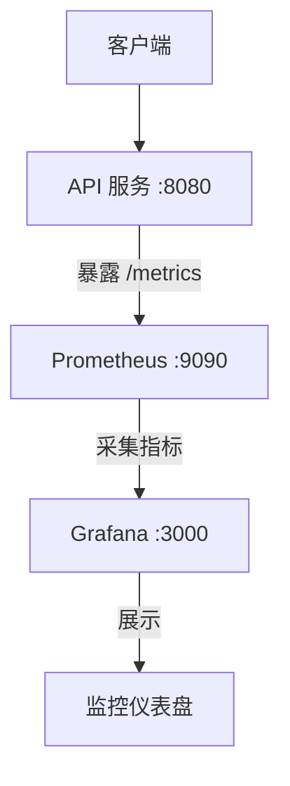

# 监控配置指南

本文档详细说明如何配置和使用 Prometheus + Grafana 监控栈。

## 📋 目录

- [监控架构](#监控架构)
- [安装 Prometheus](#安装-prometheus)
- [安装 Grafana](#安装-grafana)
- [配置 Prometheus](#配置-prometheus)
- [配置 Grafana](#配置-grafana)
- [导入仪表盘](#导入仪表盘)
- [监控指标说明](#监控指标说明)
- [告警配置](#告警配置)
- [常见问题](#常见问题)

## 监控架构



**服务清单**：
| 服务 | 端口 | 说明 |
|------|------|------|
| **API** | 8080 | 应用服务，暴露 `/metrics` 端点 |
| **Prometheus** | 9090 | 指标采集和存储 |
| **Grafana** | 3000 | 可视化仪表板 |

## 安装 Prometheus

### macOS (Homebrew)

```bash
# 安装
brew install prometheus

# 验证
prometheus --version

# 预期输出：
# prometheus, version 2.x.x
```

### Linux

```bash
# 下载最新版本
wget https://github.com/prometheus/prometheus/releases/latest/download/prometheus-*.linux-amd64.tar.gz

# 解压
tar xvfz prometheus-*.linux-amd64.tar.gz
cd prometheus-*.linux-amd64

# 移动到系统路径
sudo mv prometheus promtool /usr/local/bin/
```

### 验证安装

```bash
prometheus --version
```

## 安装 Grafana

### macOS (Homebrew)

```bash
# 安装
brew install grafana

# 启动服务
brew services start grafana

# 验证
curl -s -o /dev/null -w "%{http_code}" http://localhost:3000/login
# 预期输出：200
```

### Linux

```bash
# Ubuntu/Debian
sudo apt-get install -y apt-transport-https
sudo apt-get install -y software-properties-common wget
wget -q -O - https://packages.grafana.com/gpg.key | sudo apt-key add -
echo "deb https://packages.grafana.com/oss/deb stable main" | sudo tee /etc/apt/sources.list.d/grafana.list
sudo apt-get update
sudo apt-get install grafana

# 启动服务
sudo systemctl start grafana-server
sudo systemctl enable grafana-server
```

### 默认账号

- 用户名：`admin`
- 密码：`admin`

## 配置 Prometheus

### 1. 创建配置文件

项目已提供配置文件：`backend/configs/prometheus.yml`

```yaml
global:
  scrape_interval: 15s
  evaluation_interval: 15s

scrape_configs:
  # Prometheus 自身
  - job_name: 'prometheus'
    static_configs:
      - targets: ['localhost:9090']

  # DDD-Scaffold API 服务
  - job_name: 'ddd-scaffold-api'
    scrape_interval: 5s
    metrics_path: '/metrics'
    static_configs:
      - targets: ['localhost:8080']
        labels:
          service: 'api'
          environment: 'development'
```

### 2. 启动 Prometheus

```bash
# 方式 1：使用默认配置
prometheus

# 方式 2：指定配置文件（推荐）
prometheus --config.file=backend/configs/prometheus.yml

# 方式 3：后台运行并指定数据存储路径
prometheus --config.file=backend/configs/prometheus.yml \
  --storage.tsdb.path=/tmp/prometheus-data \
  --web.enable-lifecycle > /tmp/prometheus.log 2>&1 &
```

### 3. 验证 Prometheus

```bash
# 检查健康状态
curl http://localhost:9090/-/healthy
# 预期输出：Prometheus Server is Healthy.

# 访问 Web UI
open http://localhost:9090
```

### 4. 验证指标采集

访问：http://localhost:9090/targets

应该看到：
- ✅ `prometheus` - UP
- ✅ `ddd-scaffold-api` - UP

## 配置 Grafana

### 1. 启动 Grafana

```bash
# macOS
brew services start grafana

# Linux
sudo systemctl start grafana-server

# 验证
curl -s -o /dev/null -w "%{http_code}" http://localhost:3000/login
# 预期输出：200
```

### 2. 登录 Grafana

访问：http://localhost:3000

- 用户名：`admin`
- 密码：`admin`
- 首次登录会要求修改密码

### 3. 添加 Prometheus 数据源

#### 方式 1：通过 UI 添加

1. 左侧菜单：**Connections** → **Data Sources**
2. 点击 **Add data source**
3. 选择 **Prometheus**
4. 配置：
   - **Name**: `prometheus`
   - **URL**: `http://localhost:9090`
   - 其他保持默认
5. 点击 **Save & test**
6. 确认显示 "Data source is working"

#### 方式 2：通过 API 添加

```bash
curl -X POST http://localhost:3000/api/datasources \
  -u admin:admin \
  -H "Content-Type: application/json" \
  -d '{
    "name": "prometheus",
    "type": "prometheus",
    "url": "http://localhost:9090",
    "access": "proxy",
    "isDefault": true
  }'
```

### 4. 验证数据源

```bash
curl -u admin:admin http://localhost:3000/api/datasources | python3 -m json.tool
```

## 导入仪表盘

### 1. 准备仪表盘文件

项目已提供优化后的仪表盘配置：`grafana-dashboard.json`

### 2. 导入步骤

1. 登录 Grafana
2. 左侧菜单：**Dashboards** → **Import**
3. 点击 **Upload JSON file**
4. 选择 `grafana-dashboard.json`
5. **关键步骤**：
   - 在 "Prometheus" 下拉框中选择刚创建的数据源
   - 确保 UID 匹配
6. 点击 **Import**

### 3. 验证仪表盘

导入后应该看到 6 个分组，25 个面板：

| 分组 | 面板数 | 说明 |
|------|--------|------|
| 📊 API Overview | 5 | QPS、错误率、延迟 |
| 🌐 HTTP Metrics | 4 | 状态码、QPS 趋势 |
| 🔐 Authentication | 4 | 认证成功率、失败原因 |
| 🗄️ Database | 3 | 连接池使用率 |
| 📈 Business Metrics | 1 | 用户注册数 |
| 📍 Endpoints | 2 | 按路径分解的指标 |

## 监控指标说明

### HTTP 层指标

| 指标名 | 类型 | 标签 | 说明 |
|--------|------|------|------|
| `http_requests_total` | Counter | status | 请求总数（按状态码） |
| `http_request_duration_seconds` | Histogram | method, path, status | 请求延迟分布 |
| `http_requests_in_flight` | Gauge | - | 正在处理的请求数 |

**常用查询**：
```promql
# QPS
sum(rate(http_requests_total[5m]))

# 错误率
sum(rate(http_requests_total{status=~"5.."}[5m])) / sum(rate(http_requests_total[5m])) * 100

# P99 延迟
histogram_quantile(0.99, rate(http_request_duration_seconds_bucket[5m]))
```

### 认证指标

| 指标名 | 类型 | 标签 | 说明 |
|--------|------|------|------|
| `auth_success_total` | Counter | type | 认证成功数 |
| `auth_failure_total` | Counter | type, reason | 认证失败数 |

**常用查询**：
```promql
# 认证成功率
sum(rate(auth_success_total[5m])) / (sum(rate(auth_success_total[5m])) + sum(rate(auth_failure_total[5m]))) * 100

# 失败原因分布
sum by (reason) (increase(auth_failure_total[5m]))
```

### 数据库指标

| 指标名 | 类型 | 说明 |
|--------|------|------|
| `db_connections_open` | Gauge | 当前打开连接数 |
| `db_connections_max` | Gauge | 最大连接数 |

**常用查询**：
```promql
# 连接池使用率
db_connections_open / db_connections_max * 100
```

### 业务指标

| 指标名 | 类型 | 说明 |
|--------|------|------|
| `user_registrations_total` | Counter | 用户注册总数 |

## 告警配置

### Prometheus 告警规则

创建 `alert_rules.yml`：

```yaml
groups:
  - name: api_alerts
    rules:
      # API 错误率过高
      - alert: HighErrorRate
        expr: sum(rate(http_requests_total{status=~"5.."}[5m])) / sum(rate(http_requests_total[5m])) > 0.05
        for: 5m
        labels:
          severity: critical
        annotations:
          summary: "API 错误率超过 5%"
          description: "当前错误率：{{ $value | humanizePercentage }}"

      # API 响应慢
      - alert: HighLatency
        expr: histogram_quantile(0.99, rate(http_request_duration_seconds_bucket[5m])) > 1
        for: 5m
        labels:
          severity: warning
        annotations:
          summary: "API P99 延迟超过 1 秒"
          description: "当前 P99 延迟：{{ $value }}s"

      # 认证失败率过高
      - alert: HighAuthFailureRate
        expr: sum(rate(auth_failure_total[5m])) > 10
        for: 5m
        labels:
          severity: warning
        annotations:
          summary: "认证失败率过高"
          description: "5 分钟内失败 {{ $value }} 次"
```

启动时加载告警规则：

```bash
prometheus --config.file=backend/configs/prometheus.yml \
  --rule.file=alert_rules.yml
```

### Grafana 告警

1. 打开面板 → 编辑
2. 点击 **Alert** 标签
3. 创建告警规则
4. 配置通知渠道（Email/Slack/Webhook）

## 常见问题

### 1. Prometheus 无法采集指标

**症状**：http://localhost:9090/targets 显示 DOWN

**排查步骤**：
```bash
# 1. 检查 API 服务是否运行
curl http://localhost:8080/health

# 2. 检查 /metrics 端点
curl http://localhost:8080/metrics | head -20

# 3. 检查 Prometheus 配置
cat backend/configs/prometheus.yml | grep -A 5 "ddd-scaffold-api"

# 4. 重启 Prometheus
pkill prometheus
prometheus --config.file=backend/configs/prometheus.yml &
```

### 2. Grafana 显示 No Data

**原因**：
- 数据源未配置或配置错误
- 查询语句错误
- 时间范围设置不当

**解决方案**：
1. 检查数据源：Connections → Data Sources → 测试连接
2. 检查查询：编辑面板 → 查看 Query Inspector
3. 调整时间范围：右上角选择 "Last 1 hour"

### 3. 指标数据为 0

**原因**：
- API 服务重启后指标归零（正常，Counter 类型）
- 未触发相关业务操作

**解决方案**：
```bash
# 触发一些请求
curl http://localhost:8080/health
curl -X POST http://localhost:8080/api/v1/auth/register \
  -H "Content-Type: application/json" \
  -d '{"email":"test@example.com","password":"Test123456!"}'
```

### 4. Prometheus 数据丢失

**原因**：未配置持久化存储

**解决方案**：
```bash
# 指定数据存储路径
prometheus --config.file=backend/configs/prometheus.yml \
  --storage.tsdb.path=/var/lib/prometheus/data
```

### 5. Grafana 面板布局混乱

**解决方案**：
1. 删除旧仪表盘
2. 重新导入 `grafana-dashboard.json`
3. 确保选择正确的数据源

## 📚 延伸阅读

- [Prometheus 官方文档](https://prometheus.io/docs/)
- [Grafana 官方文档](https://grafana.com/docs/)
- [PromQL 查询语言](https://prometheus.io/docs/prometheus/latest/querying/basics/)
- [监控最佳实践 - RED 方法](https://www.weave.works/blog/the-red-method-key-metrics-for-microservices-architecture/)
