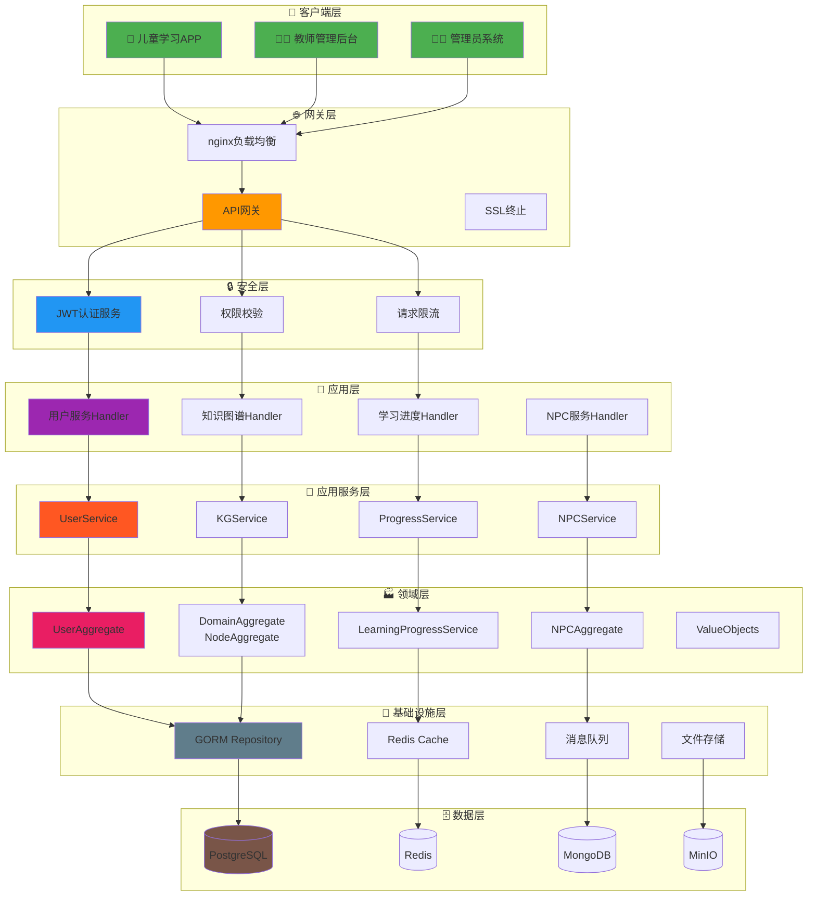
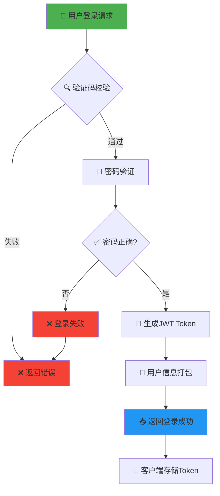
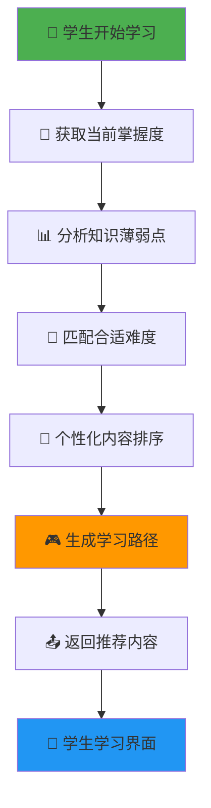
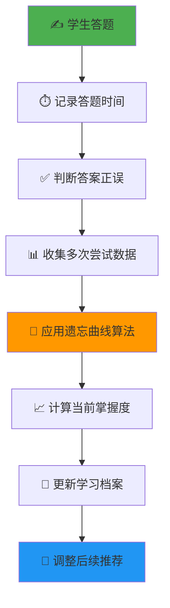
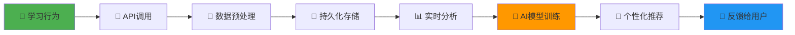
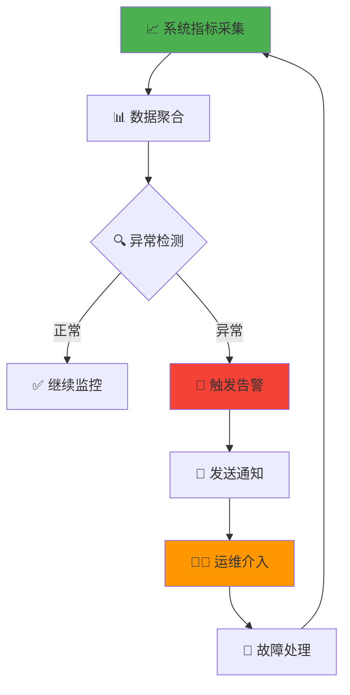
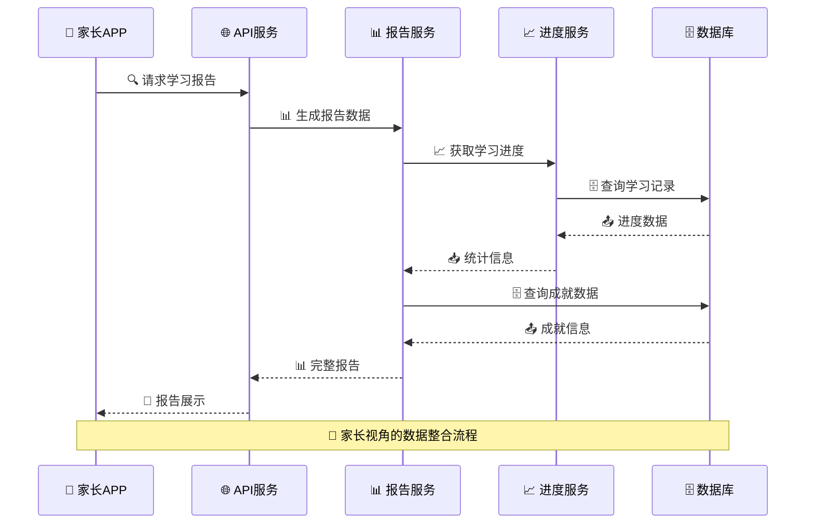
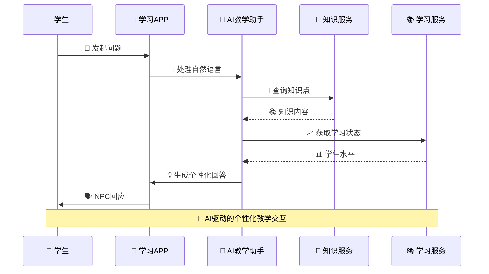
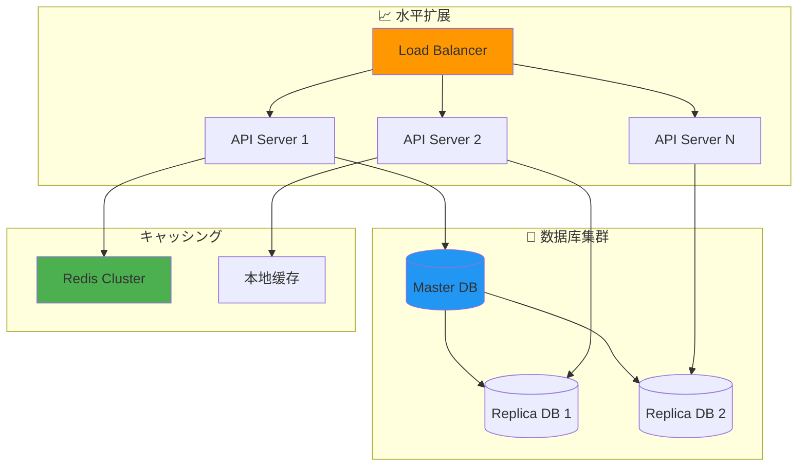

# MathFun 系统架构流程图

## 🏗️ 整体系统架构

## 🔄 核心业务流程

### 用户登录认证流程

### 学习内容推荐流程

### 知识点掌握度计算流程

## 📊 数据流向图

### 学习数据采集流程

### 系统监控告警流程

## 🎮 交互场景流程

### 家长查看学习报告流程

### NPC互动教学流程

## 📈 性能与扩展性

### 系统扩展架构

---
*架构文档版本: v1.0*  
*更新时间: 2026-02-05*