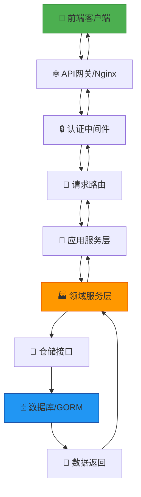
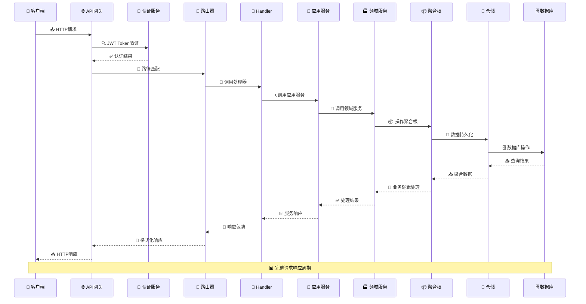
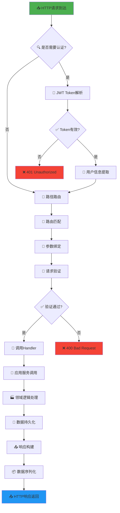
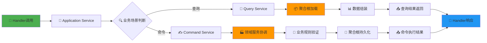
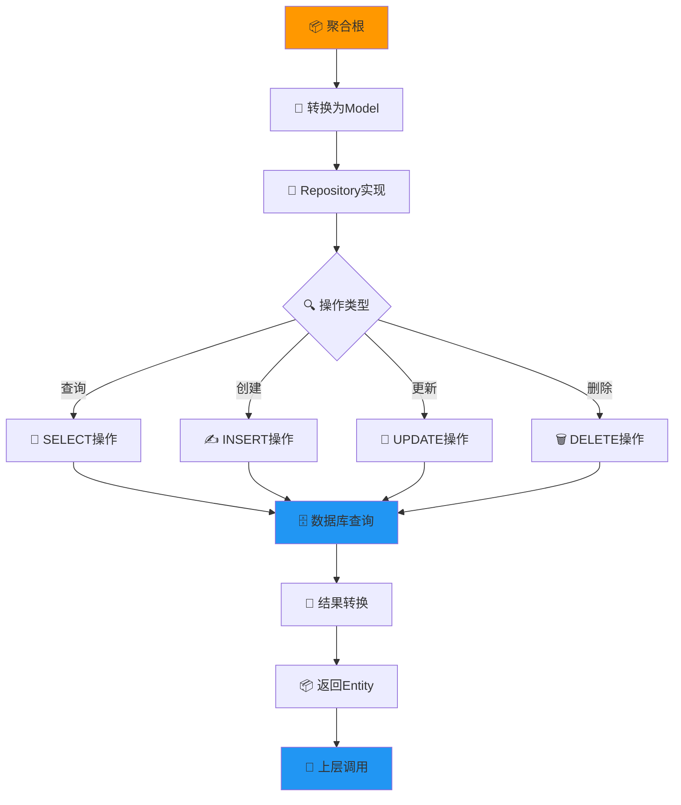
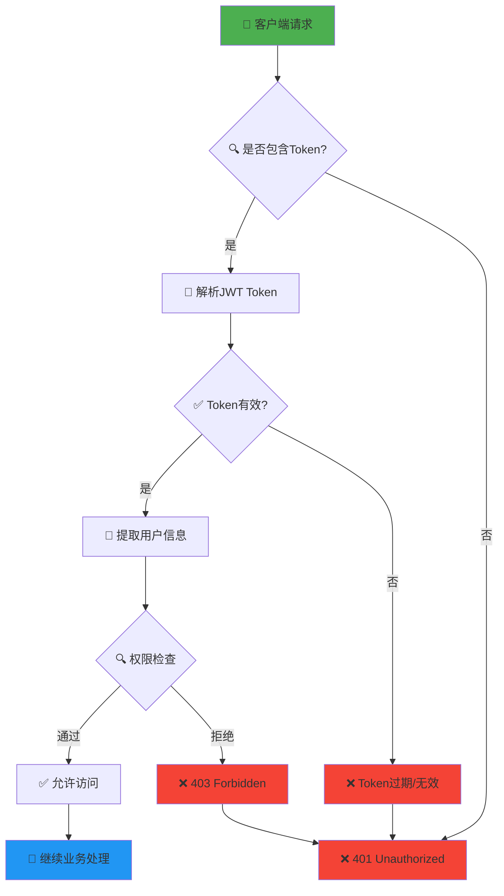
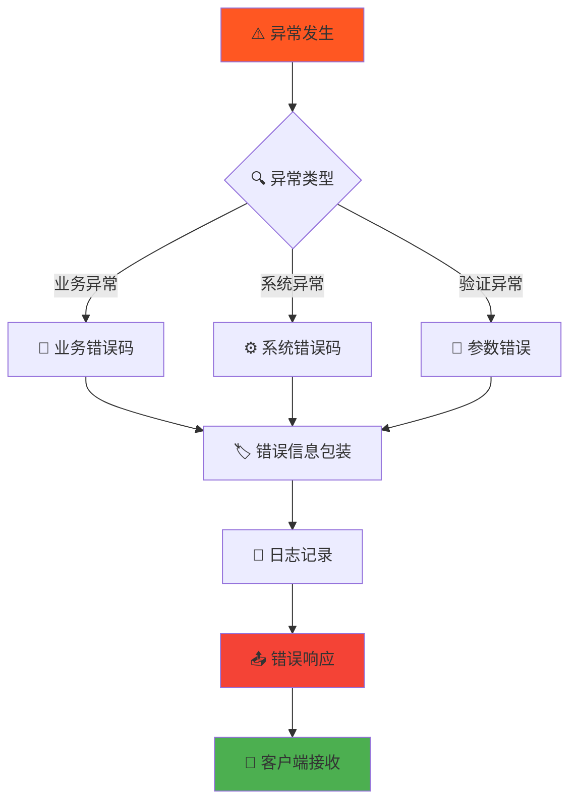
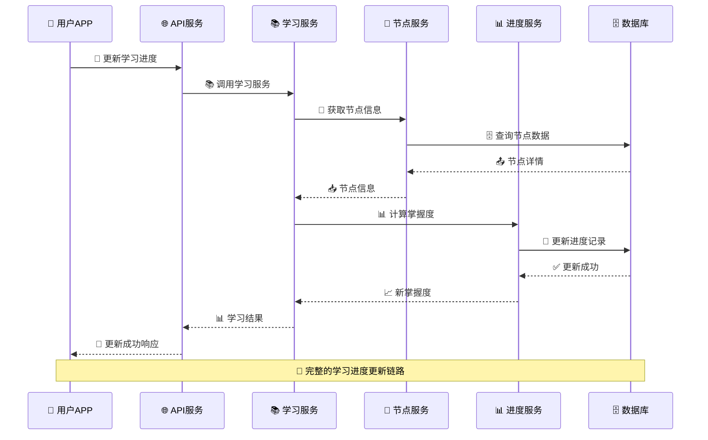
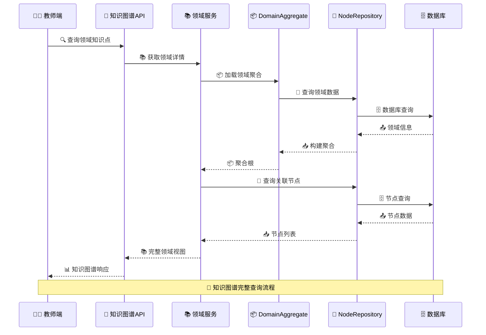
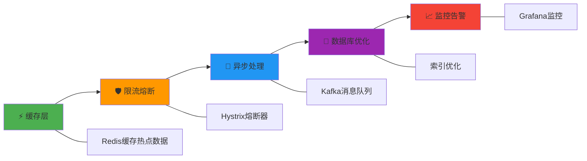

# MathFun 请求响应流程图

## 🎯 整体架构概览

## 📡 详细请求处理流程

## 🔧 API请求处理链路

## 🏭 领域层处理流程

## 💾 数据持久化流程

## 🔐 认证授权流程

## 📊 错误处理流程

## 🎮 具体业务场景示例

### 用户学习进度更新流程

### 知识图谱查询流程

## 📈 性能优化关键点

## 🎯 流程优化建议

### 当前优势
- ✅ **分层清晰**: 严格遵循Clean Architecture
- ✅ **解耦良好**: 各层职责分明
- ✅ **可测试性强**: 每层都易于单元测试
- ✅ **扩展性好**: 易于添加新功能

### 优化方向
1. **缓存策略**: 添加Redis缓存热点数据
2. **异步处理**: 耗时操作异步化
3. **监控完善**: 添加APM性能监控
4. **日志优化**: 结构化日志便于排查

---
*文档版本: v1.0*  
*最后更新: 2026-02-05*