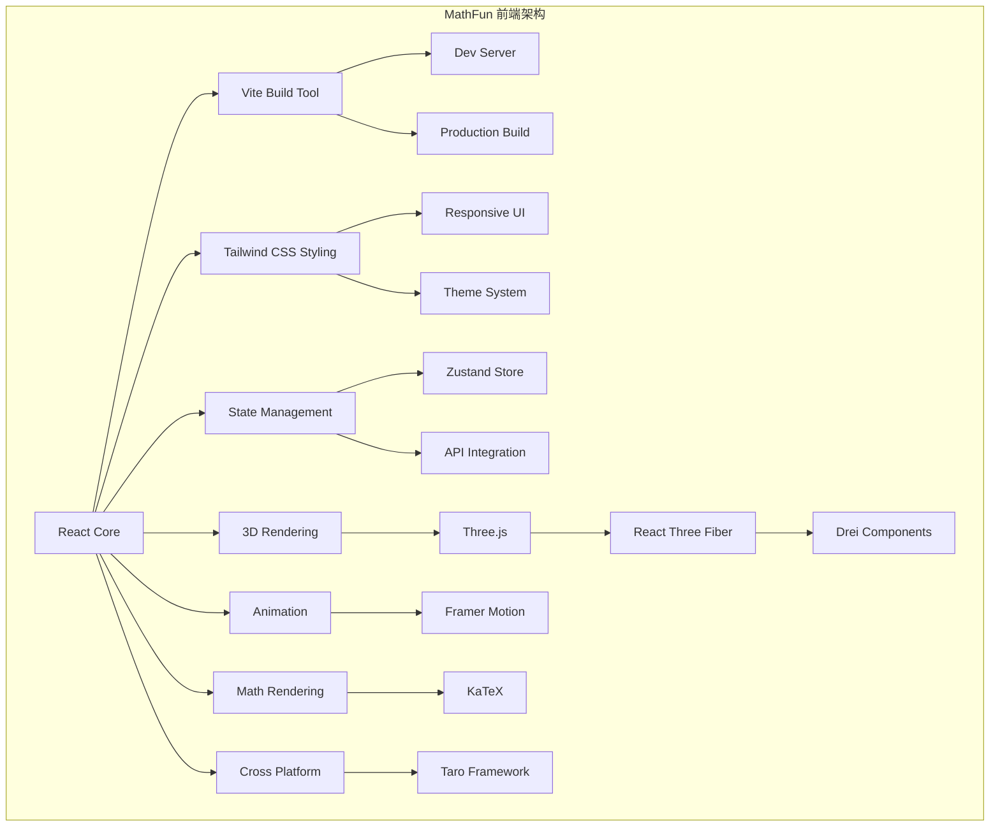
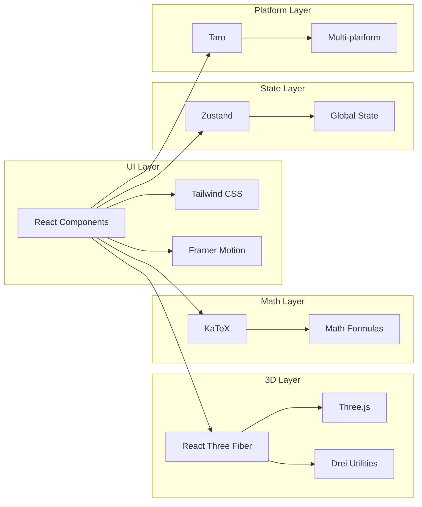

# MathFun 前端技术栈规范文档

## 1. 技术栈概述

MathFun 项目采用现代化的 React 生态系统，结合 3D 图形渲染和多端统一框架，旨在创建一个风格一致、功能丰富的数学教育平台。

## 2. 核心技术组件

### 2.1 React - 组件化开发核心
- **特点**：声明式UI，组件化架构，庞大的生态系统
- **版本**：`^18.2.0`
- **选择理由**：相比 Vue 和 Angular，React 在大型应用开发中有更好的可维护性，且拥有更丰富的第三方库支持

### 2.2 Vite - 构建工具
- **特点**：快速冷启动，热模块替换，原生ES模块支持
- **版本**：`^4.4.0`
- **选择理由**：相比 Webpack，Vite 提供更快的开发体验，特别是在大型项目中

### 2.3 Tailwind CSS - 样式框架
- **特点**：实用优先的CSS框架，原子化类名，高度可定制
- **版本**：`^3.3.0`
- **选择理由**：相比传统的 Bootstrap 或 Material UI，Tailwind CSS 提供更灵活的样式定制能力，更容易保持视觉一致性

### 2.4 Three.js - 3D图形渲染
- **特点**：强大的3D图形渲染能力，丰富的材质和光照系统
- **版本**：`^0.155.0`
- **选择理由**：相比 Babylon.js 或 A-Frame，Three.js 拥有更大的社区和更丰富的插件生态

### 2.5 React Three Fiber (R3F) - React与Three.js桥梁
- **特点**：声明式Three.js API，React生命周期集成
- **版本**：`^8.15.0`
- **选择理由**：相比直接使用 Three.js，R3F 让3D内容可以像普通React组件一样管理

### 2.6 Drei - Three.js实用组件库
- **特点**：预设组件，控制器，助手等实用工具
- **版本**：`^9.80.0`
- **选择理由**：提供了大量常用的Three.js组件，大大减少了样板代码

### 2.7 Taro - 多端统一框架
- **特点**：一套代码多端运行，React语法支持
- **版本**：`^3.6.0`
- **选择理由**：相比 React Native + Web，Taro 提供了更统一的小程序支持

### 2.8 Zustand - 状态管理
- **特点**：轻量级，无样板代码，React Hooks集成
- **版本**：`^4.4.0`
- **选择理由**：相比 Redux，Zustand 更简洁，更适合中小型项目

### 2.9 KaTeX - 数学公式渲染
- **特点**：快速渲染，LaTeX语法支持，体积小巧
- **版本**：`^0.16.0`
- **选择理由**：相比 MathJax，KaTeX 渲染速度更快，更适合实时渲染

### 2.10 Framer Motion - 动画库
- **特点**：声明式动画，性能优化，Spring物理引擎
- **版本**：`^10.16.0`
- **选择理由**：相比其他动画库，Framer Motion 提供了更简洁的API和更好的性能

## 3. 依赖版本锁定策略

根据项目规范，所有前端依赖必须使用明确的语义化版本号，通过 lock 文件锁定，禁止使用 `^` 或 `~` 等模糊版本范围。

### 3.1 package.json 示例配置
```json
{
  "dependencies": {
    "react": "18.2.0",
    "react-dom": "18.2.0",
    "three": "0.155.0",
    "@react-three/fiber": "8.15.0",
    "@react-three/drei": "9.80.0",
    "zustand": "4.4.0",
    "katex": "0.16.0",
    "react-katex": "3.0.1",
    "@tarojs/taro": "3.6.0",
    "framer-motion": "10.16.0",
    "tailwindcss": "3.3.0"
  },
  "devDependencies": {
    "vite": "4.4.0",
    "@vitejs/plugin-react": "4.0.0"
  }
}
```

## 4. 多端统一与风格一致性要求

- **约束**：前端技术栈必须支持APP、小程序、Web三端统一渲染
- **要求**：确保2D/3D交互体验与UI风格高度一致
- **禁止**：因平台差异导致视觉或行为不一致

## 5. 核心组件使用示例

### 5.1 基础组件示例
```jsx
// 使用React、Tailwind CSS和Framer Motion的动画组件
import { motion } from 'framer-motion';

function AnimatedBox() {
  return (
    <motion.div
      initial={{ opacity: 0, scale: 0.5 }}
      animate={{ opacity: 1, scale: 1 }}
      transition={{ duration: 0.5 }}
      className="bg-blue-500 w-20 h-20"
    />
  );
}
```

### 5.2 3D场景示例
```jsx
// 使用React Three Fiber和Drei的3D场景
import { Canvas } from '@react-three/fiber';
import { OrbitControls, Environment } from '@react-three/drei';

function Scene() {
  return (
    <Canvas>
      <ambientLight intensity={0.5} />
      <pointLight position={[10, 10, 10]} />
      <mesh>
        <boxGeometry args={[1, 1, 1]} />
        <meshStandardMaterial color="#4F46E5" />
      </mesh>
      <OrbitControls />
      <Environment preset="apartment" />
    </Canvas>
  );
}
```

### 5.3 数学公式渲染示例
```jsx
// 使用KaTeX渲染数学公式
import 'katex/dist/katex.min.css';
import { InlineMath, BlockMath } from 'react-katex';

function FormulaComponent() {
  return (
    <div>
      <InlineMath math="\sqrt{3x-1}+(1+x)^2" />
      <BlockMath math="\int_0^\infty e^{-x^2} dx=\frac{\sqrt\pi}2" />
    </div>
  );
}
```

## 6. 完整页面示例

```jsx
// 完整的数学学习页面示例
import { Canvas } from '@react-three/fiber';
import { OrbitControls, Environment } from '@react-three/drei';
import { motion } from 'framer-motion';
import { InlineMath } from 'react-katex';
import { useStore } from '../store/useStore';

function MathLearningScene() {
  const { currentProblem, solveProblem } = useStore();

  return (
    <div className="flex flex-col h-screen bg-gradient-to-br from-blue-50 to-indigo-100">
      {/* 顶部导航栏 */}
      <motion.header 
        initial={{ y: -50 }}
        animate={{ y: 0 }}
        className="bg-white shadow-md p-4"
      >
        <h1 className="text-2xl font-bold text-center">MathFun 数学探索</h1>
      </motion.header>

      <div className="flex flex-1 overflow-hidden">
        {/* 左侧问题面板 */}
        <motion.div 
          initial={{ x: -100 }}
          animate={{ x: 0 }}
          className="w-1/3 bg-white m-4 p-6 rounded-xl shadow-lg"
        >
          <h2 className="text-xl font-semibold mb-4">当前问题</h2>
          <p className="mb-4">{currentProblem.description}</p>
          
          <div className="mb-4">
            <InlineMath math={currentProblem.formula} />
          </div>
          
          <button 
            onClick={solveProblem}
            className="bg-blue-500 hover:bg-blue-600 text-white px-4 py-2 rounded-lg transition-colors"
          >
            解决问题
          </button>
        </motion.div>

        {/* 右侧3D可视化 */}
        <div className="flex-1 m-4 bg-white rounded-xl shadow-lg">
          <Canvas camera={{ position: [0, 0, 5], fov: 50 }}>
            <ambientLight intensity={0.5} />
            <pointLight position={[10, 10, 10]} />
            <mesh rotation={[Math.PI / 4, Math.PI / 4, 0]}>
              <boxGeometry args={[1, 1, 1]} />
              <meshStandardMaterial color="#4F46E5" />
            </mesh>
            <OrbitControls />
            <Environment preset="apartment" />
          </Canvas>
        </div>
      </div>
    </div>
  );
}
```

## 7. 技术架构图



## 8. 组件依赖关系图



## 9. 总结

这套技术栈能够完美支持 MathFun 项目的多端统一、风格一致和2D/3D场景处理需求，为学生提供沉浸式的数学学习体验。所有依赖均按规范进行了版本锁定，确保了项目的稳定性和可重现性。