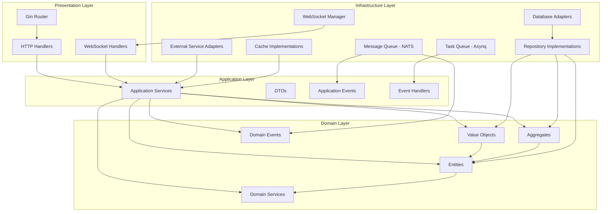

# MathFun 服务端技术栈规范文档（更新版）

## 1. 技术栈概述

MathFun 项目采用现代化的 Go 生态系统，结合 DDD Clean Architecture 架构，旨在创建一个可维护、可扩展的高性能后端服务。

## 2. 核心技术组件

### 2.1 Go - 核心开发语言
- **特点**：并发性能优异，编译速度快，内存占用低，适合高并发教育平台
- **版本**：`1.21+`
- **选择理由**：相比 Java，Go 具有更好的并发处理能力；相比 Node.js，Go 性能更高；相比 Python，Go 更适合构建高性能后端服务

### 2.2 Gin - Web 框架
- **特点**：轻量级，性能优异，中间件支持丰富
- **版本**：`v1.9+`
- **选择理由**：相比 Echo，Gin 社区更活跃；相比标准库，Gin 提供了更便捷的路由和中间件功能

### 2.3 数据库系统
- **PostgreSQL** - 主数据库
  - **特点**：功能强大，ACID 合规，支持复杂查询，JSON 支持
  - **版本**：`14+`
  - **选择理由**：相比 MySQL，PostgreSQL 支持更多数据类型和高级功能；相比 MongoDB，PostgreSQL 在事务处理方面更可靠

- **Redis** - 缓存与会话存储
  - **特点**：高性能键值存储，支持多种数据结构，持久化选项
  - **版本**：`7.0+`
  - **选择理由**：相比 Memcached，Redis 提供更多数据结构；相比其他缓存解决方案，Redis 社区支持更好

- **MongoDB** - 按需扩展存储
  - **特点**：文档数据库，灵活的模式，水平扩展能力强
  - **版本**：`6.0+`
  - **选择理由**：适合存储非结构化数据如用户行为日志、学习轨迹等

### 2.4 数据库工具与ORM
- **GORM** - Go ORM 框架
  - **特点**：功能全面，支持多种数据库，链式调用
  - **版本**：`v1.25+`
  - **选择理由**：相比其他 Go ORM，GORM 功能更全面，社区支持更好

- **golang-migrate** - 数据库迁移工具
  - **特点**：支持多种数据库，命令行工具，Go API
  - **版本**：`v4+`
  - **选择理由**：相比 GORM 自带迁移功能，golang-migrate 更专业且灵活

### 2.5 时间处理
- **Carbon** - 时间处理库
  - **特点**：简单易用的时间处理库，类似 PHP Carbon
  - **版本**：v2.6.9
  - **选择理由**：相比 Go 原生 time 包，Carbon 提供更简洁的 API 和更丰富的功能
  - **GitHub地址**：https://github.com/golang-module/carbon/v2

### 2.6 DDD Clean Architecture 组件
- **领域层**：包含实体、值对象、聚合根、领域服务、领域事件
- **应用层**：包含应用服务、DTO、应用事件
- **基础设施层**：包含仓储实现、外部服务适配器、数据库访问
- **接口层**：包含API控制器、消息监听器

### 2.7 多租户架构
- **PostgreSQL Schema** - 租户隔离
  - **特点**：基于数据库 Schema 的租户隔离，安全性高
  - **实现方式**：为每个租户分配独立 Schema，使用中间件动态切换

- **租户中间件** - 请求级租户识别
  - **特点**：基于请求头或子域名识别租户
  - **实现**：Gin 中间件，自动注入租户上下文

### 2.8 多语言与国际化
- **go-i18n** - Go 国际化包
  - **特点**：支持多种语言，模板化翻译
  - **版本**：`v2+`
  - **选择理由**：相比其他 Go 国际化方案，go-i18n 更成熟稳定

### 2.9 认证与授权
- **JWT** - 无状态认证
  - **特点**：无状态，可扩展，跨域友好
  - **实现**：使用 `github.com/golang-jwt/jwt/v4`

- **Casbin** - 访问控制
  - **特点**：支持多种访问控制模型，灵活配置
  - **版本**：`v2+`
  - **选择理由**：相比 RBAC 实现，Casbin 提供更灵活的权限控制

### 2.10 API 文档
- **Swagger** - API 文档生成
  - **特点**：OpenAPI 规范，自动生成文档，交互式界面
  - **实现**：使用 `swaggo/swag` 生成 Swagger 文档

### 2.11 日志系统
- **Zap** - 高性能日志库
  - **特点**：结构化日志，高性能，配置灵活
  - **版本**：`v1.24+`
  - **选择理由**：相比标准库 log，Zap 性能更高；相比其他日志库，Zap 功能更全面

### 2.12 监控与追踪
- **Prometheus** - 指标收集
  - **特点**：时间序列数据库，查询语言强大
  - **版本**：`v2.40+`

- **Grafana** - 监控仪表板
  - **特点**：可视化能力强，支持多种数据源

- **Jaeger** - 分布式追踪
  - **特点**：CNCF 项目，支持 OpenTracing 标准
  - **版本**：`v1.40+`

### 2.13 事件驱动与任务调度
- **NATS** - 轻量级消息系统（事件发布/订阅）
  - **特点**：高性能，低延迟，Go 原生支持，支持发布/订阅模式
  - **版本**：`v2.9+`
  - **选择理由**：相比 RabbitMQ，NATS 更轻量；相比 Kafka，NATS 部署更简单；支持事件驱动架构

- **Asynq** - 分布式任务队列（任务调度）
  - **特点**：基于 Redis，支持延迟任务、周期性任务、失败重试
  - **版本**：`v0.18+`
  - **选择理由**：相比 Cron，Asynq 支持分布式部署；相比其他 Go 任务队列，Asynq 功能更全面

### 2.14 实时通信
- **Gorilla WebSocket** - WebSocket 实现实时通信
  - **特点**：高性能，轻量级，Go 原生支持
  - **版本**：`v1.5+`
  - **选择理由**：相比 HTTP 请求，WebSocket 提供实时双向通信；相比其他 Go WebSocket 库，Gorilla 更成熟稳定

- **Socket.IO** - 通过 Go 实现（备选方案）
  - **特点**：支持多种传输方式，自动降级，房间和命名空间
  - **版本**：Go Socket.IO 实现
  - **选择理由**：提供更高级的实时通信功能

### 2.15 配置管理
- **Viper** - 配置管理库
  - **特点**：支持多种配置格式，环境变量支持，远程配置
  - **版本**：`v1.15+`
  - **选择理由**：Go 生态中最流行的配置管理库

### 2.16 测试框架
- **Go Testing** - 标准测试框架
  - **特点**：内置支持，简单易用，性能好

- **Testify** - 增强测试功能
  - **特点**：断言库，模拟对象，测试套件
  - **版本**：`v1.8+`

### 2.17 容器化与部署
- **Docker** - 容器化
  - **特点**：轻量级虚拟化，环境一致性

- **Docker Compose** - 多容器编排
  - **特点**：简化多服务部署

## 3. 事件驱动与任务调度策略

### 3.1 事件发布/订阅（Event Sourcing）
- **适用场景**：
  - 用户行为追踪（如学习进度更新、题目完成状态）
  - 领域事件通知（如用户注册成功、成绩更新）
  - 跨服务数据同步（如用户信息变更同步到多个服务）

- **实现方式**：使用 NATS 实现发布/订阅模式
  - 领域服务发布事件
  - 多个消费者订阅相关事件
  - 保证事件的顺序性和一致性

### 3.2 任务调度（Job Scheduling）
- **适用场景**：
  - 定期清理过期数据
  - 生成学习报告
  - 批量邮件发送
  - 数据备份任务
  - 课程到期提醒

- **实现方式**：使用 Asynq 实现任务队列
  - 应用服务创建任务
  - Worker 消费任务
  - 支持延迟执行和重试机制

### 3.3 选择策略
- **事件订阅**：适用于实时性要求高、需要多方响应的场景
- **任务调度**：适用于定时执行、批量处理、异步任务的场景
- **建议**：两者结合使用，事件驱动处理实时逻辑，任务调度处理定时任务

## 4. 实时通信策略

### 4.1 HTTP REST API
- **适用场景**：常规的 CRUD 操作、数据获取
- **特点**：请求-响应模式，状态无感知

### 4.2 WebSocket 实时通信
- **适用场景**：
  - 在线协作解题
  - 实时聊天功能
  - 学习进度实时同步
  - 竞赛倒计时
  - 实时通知推送

- **实现方式**：
  - 使用 Gorilla WebSocket 建立连接
  - 维护连接池管理用户连接
  - 支持房间概念（如班级、小组）
  - 实现心跳机制保持连接

### 4.3 Server-Sent Events (SSE)
- **适用场景**：服务器单向推送（如通知、进度更新）
- **特点**：轻量级，适合持续推送数据

### 4.4 通信选择策略
- **HTTP**：大部分 API 调用
- **WebSocket**：需要双向实时通信的场景
- **SSE**：服务器单向推送数据的场景

## 5. DDD Clean Architecture 架构图



## 6. 依赖版本锁定策略

根据项目规范，所有 Go 依赖必须使用 Go Modules 进行版本锁定，确保依赖的一致性和可重现性。

### 6.1 go.mod 示例配置
```go
module mathfun

go 1.25.6

require (
    github.com/gin-gonic/gin v1.9.1
    github.com/go-playground/validator/v10 v10.14.0
    github.com/jinzhu/gorm v1.9.16
    github.com/golang-jwt/jwt/v4 v4.5.0
    github.com/spf13/viper v1.16.0
    github.com/uber-go/zap v1.24.0
    github.com/prometheus/client_golang v1.15.2
    github.com/casbin/casbin/v2 v2.68.0
    github.com/nats-io/nats.go v1.28.0
    github.com/hibiken/asynq v0.18.0
    github.com/gorilla/websocket v1.5.0
    github.com/stretchr/testify v1.8.4
    github.com/swaggo/gin-swagger v1.6.0
    github.com/swaggo/files v1.0.2
    github.com/dromara/carbon latest
    golang.org/x/crypto v0.9.0
    golang.org/x/text v0.10.0
)

require (
    // 间接依赖
)
```

## 7. DDD Clean Architecture 实现示例

### 7.1 领域层示例
```go
// domain/entity/user.go
package entity

import "mathfun-backend/domain/valueobject"

type User struct {
    ID        string
    Name      string
    Email     string
    Role      valueobject.UserRole
    CreatedAt time.Time
    UpdatedAt time.Time
}

// domain/event/user_registered_event.go
package event

type UserRegisteredEvent struct {
    UserID string
    Email  string
    Name   string
}

// domain/repository/user_repository.go
package repository

import "mathfun-backend/domain/entity"

type UserRepository interface {
    Save(user *entity.User) error
    FindByID(id string) (*entity.User, error)
    FindByEmail(email string) (*entity.User, error)
    Update(user *entity.User) error
    Delete(id string) error
}
```

### 7.2 应用层示例
```go
// application/service/user_service.go
package service

import (
    "mathfun-backend/domain/entity"
    "mathfun-backend/domain/repository"
    "mathfun-backend/domain/event"
)

type UserService struct {
    userRepository repository.UserRepository
    eventPublisher EventPublisher
}

func NewUserService(userRepo repository.UserRepository, publisher EventPublisher) *UserService {
    return &UserService{
        userRepository: userRepo,
        eventPublisher: publisher,
    }
}

func (s *UserService) CreateUser(user *entity.User) error {
    // 保存用户
    err := s.userRepository.Save(user)
    if err != nil {
        return err
    }
    
    // 发布用户注册事件
    userRegisteredEvent := event.UserRegisteredEvent{
        UserID: user.ID,
        Email:  user.Email,
        Name:   user.Name,
    }
    s.eventPublisher.Publish(userRegisteredEvent)
    
    return nil
}

func (s *UserService) GetUserByID(id string) (*entity.User, error) {
    return s.userRepository.FindByID(id)
}
```

### 7.3 基础设施层示例
```go
// infrastructure/repository/user_repository_impl.go
package repository

import (
    "mathfun-backend/domain/entity"
    "mathfun-backend/domain/repository"
    "gorm.io/gorm"
)

type UserRepositoryImpl struct {
    db *gorm.DB
}

func NewUserRepository(db *gorm.DB) repository.UserRepository {
    return &UserRepositoryImpl{db: db}
}

func (r *UserRepositoryImpl) Save(user *entity.User) error {
    return r.db.Create(user).Error
}

func (r *UserRepositoryImpl) FindByID(id string) (*entity.User, error) {
    var user entity.User
    err := r.db.Where("id = ?", id).First(&user).Error
    return &user, err
}

// infrastructure/event/nats_publisher.go
package event

import (
    "encoding/json"
    "github.com/nats-io/nats.go"
)

type NatsEventPublisher struct {
    nc *nats.Conn
}

func NewNatsEventPublisher(nc *nats.Conn) *NatsEventPublisher {
    return &NatsEventPublisher{nc: nc}
}

func (p *NatsEventPublisher) Publish(event interface{}) error {
    eventData, err := json.Marshal(event)
    if err != nil {
        return err
    }
    
    subject := getSubjectForEvent(event)
    return p.nc.Publish(subject, eventData)
}
```

### 7.4 接口层示例
```go
// interfaces/handler/user_handler.go
package handler

import (
    "net/http"
    "mathfun-backend/application/service"
    "github.com/gin-gonic/gin"
)

type UserHandler struct {
    userService *service.UserService
}

func NewUserHandler(userService *service.UserService) *UserHandler {
    return &UserHandler{userService: userService}
}

func (h *UserHandler) GetUser(c *gin.Context) {
    id := c.Param("id")
    user, err := h.userService.GetUserByID(id)
    if err != nil {
        c.JSON(http.StatusNotFound, gin.H{"error": "User not found"})
        return
    }
    c.JSON(http.StatusOK, user)
}

// interfaces/handler/ws_handler.go
package handler

import (
    "net/http"
    "github.com/gin-gonic/gin"
    "github.com/gorilla/websocket"
)

var upgrader = websocket.Upgrader{
    CheckOrigin: func(r *http.Request) bool {
        return true // 注意：生产环境中需要验证来源
    },
}

func (h *UserHandler) HandleWebSocket(c *gin.Context) {
    conn, err := upgrader.Upgrade(c.Writer, c.Request, nil)
    if err != nil {
        return
    }
    defer conn.Close()

    // 处理 WebSocket 连接
    for {
        messageType, message, err := conn.ReadMessage()
        if err != nil {
            break
        }

        // 处理消息并回传
        err = conn.WriteMessage(messageType, message)
        if err != nil {
            break
        }
    }
}
```

## 8. 总结

这套服务端技术栈结合了 DDD Clean Architecture 架构、Carbon 时间处理库、事件驱动与任务调度机制以及实时通信功能，能够很好地支持[MathFun](../MathFun产品总体设计说明.md)的高并发、多租户、国际化等需求。

- **事件驱动**：使用 NATS 实现发布/订阅模式，适合实时性要求高的场景
- **任务调度**：使用 Asynq 处理定时任务和异步任务
- **实时通信**：使用 WebSocket 支持双向实时通信，HTTP REST API 处理常规请求

Clean Architecture 确保了系统的可维护性和可扩展性，而 Carbon 库提供了简洁易用的时间处理功能。所有依赖均按规范进行了版本锁定，确保了项目的稳定性和可重现性。