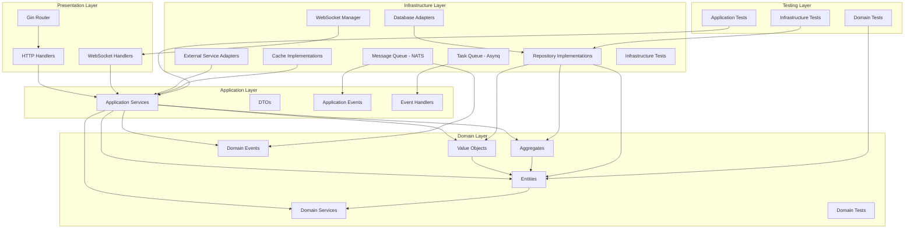

# MathFun 服务端目录结构规范

## 1. 概述

本文档定义了 MathFun 项目服务端的目录结构标准。遵循 DDD (Domain-Driven Design) Clean Architecture 架构原则，旨在实现代码的高内聚、低耦合，提升项目的可维护性、可测试性和可扩展性。

## 2. 核心设计理念

- **分层架构**: 严格区分领域层、应用层、基础设施层和接口层，确保依赖关系清晰，符合依赖倒置原则。
- **领域驱动**: 领域模型和业务逻辑是核心，其他层围绕领域层构建。
- **关注点分离**: 不同类型的代码（业务逻辑、数据访问、接口实现、配置管理）放置在不同目录下。
- **Go 语言惯用法**: 遵循 Go 项目的标准布局约定（如 `internal`, `pkg`, `cmd` 等）。
- **测试驱动**: 每个层级都有对应的测试目录和策略。

## 3. 目录结构定义

```
backend/
├── cmd/                    # 主应用程序入口
│   ├── server/             # API 服务主入口 (main.go)
│   └── worker/             # 后台任务 Worker 主入口 (main.go)
├── internal/               # 内部应用代码，不允许外部 import
│   ├── config/             # 应用配置相关代码
│   │   ├── config.go       # 配置结构体定义
│   │   └── viper.go        # Viper 配置加载逻辑
│   ├── domain/             # 领域层 (DDD Domain Layer)
│   │   ├── {domain_name}/  # 特定领域，如 user, kg (knowledge graph), learn, npc
│   │   │   ├── entity/     # 领域实体 (Entity)
│   │   │   ├── valueobject/ # 值对象 (Value Object)
│   │   │   ├── aggregate/  # 聚合根 (Aggregate Root)
│   │   │   ├── repository/ # 仓储接口定义 (Repository Interface)
│   │   │   ├── service/    # 领域服务 (Domain Service)
│   │   │   ├── event/      # 领域事件 (Domain Event)
│   │   │   └── test/       # 领域层测试代码
│   ├── application/        # 应用层 (DDD Application Layer)
│   │   ├── {domain_name}/  # 特定领域的应用服务
│   │   │   ├── service/    # 应用服务 (Application Service)
│   │   │   ├── dto/        # 数据传输对象 (Data Transfer Object)
│   │   │   ├── event/      # 应用事件处理器 (Application Event Handler)
│   │   │   └── test/       # 应用层测试代码
│   ├── infrastructure/     # 基础设施层 (DDD Infrastructure Layer)
│   │   ├── wire/           # 依赖注入 (Google Wire)
│   │   │   ├── providers.go    # 基础 Provider
│   │   │   ├── user.go        # User 模块 Wire 定义
│   │   │   ├── knowledge.go   # Knowledge 模块 Wire 定义
│   │   │   └── wire_gen.go   # 自动生成的注入代码
│   │   ├── persistence/    # 数据持久化实现 (Repository Implementation)
│   │   │   ├── gorm/       # GORM 实现
│   │   │   │   ├── model/  # GORM Model 定义
│   │   │   │   └── repo/   # Repository 接口的具体实现
│   │   │   └── mongo/      # MongoDB 实现 (按需)
│   │   ├── cache/          # 缓存实现 (Redis)
│   │   ├── queue/          # 消息队列实现 (NATS, Asynq)
│   │   ├── web/            # Web 框架适配 (Gin)
│   │   │   ├── middleware/ # Gin 中间件
│   │   │   └── ws/         # WebSocket 逻辑
│   ├── interfaces/         # 接口层 (Interface Layer)
│   │   └── http/           # HTTP 接口 (Handler/Controller)
│   │   ├── auth/           # 认证/授权适配
│   │   ├── notification/   # 通知服务适配 (Email, SMS)
│   │   ├── rpc/            # RPC 服务适配 (e.g., gRPC Client/Server, Dubbo Consumer/Provider)
│   │   ├── external/       # 外部服务适配器 (e.g., LLM Provider, Content Security)
│   │   └── test/           # 基础设施层测试代码
│   └── pkg/                # 内部可复用的通用包 (Internal Libraries)
│       ├── errors/         # 统一错误处理 (错误码定义、错误转换)
│       ├── response/       # 统一响应格式
│       ├── validator/      # 参数校验封装
│       ├── query/          # 查询参数解析 (分页、排序、过滤)
│       ├── metrics/        # 指标收集器
│       ├── logger/         # 日志封装 (e.g., Zap)
│       ├── util/           # 通用工具函数
│       ├── crypto/         # 加密解密工具
│       └── testutil/       # 测试工具函数
├── pkg/                    # 可被外部项目 import 的公共库
│   └── api/                # API 相关的公共类型定义 (e.g., Error, Response)
├── deployments/            # 部署配置文件 (Docker, Kubernetes)
│   ├── docker/
│   │   ├── Dockerfile
│   │   └── docker-compose.yml
│   └── k8s/
│       └── deployment.yaml
├── scripts/                # 构建、测试、部署脚本
├── migrations/             # 数据库迁移文件 (golang-migrate)
│   ├── 001_create_users_table.down.sql
│   ├── 001_create_users_table.up.sql
│   ├── ...
│   └── 999_create_npc_tables.up.sql # 示例：NPC 相关表的迁移
├── docs/                   # 内部开发文档 (非用户手册)
├── go.mod
├── go.sum
└── Makefile                # 常用命令集合 (build, test, migrate, run)
```

## 4. 架构图



## 5. 目录职责详解

### 5.1 `cmd/`
- **职责**: 应用程序的入口点。每个可执行文件一个子目录。
- **内容**:
  - `server/main.go`: 启动 HTTP 服务器。
  - `worker/main.go`: 启动后台任务处理 Worker。

### 5.2 `internal/`
- **职责**: 存放项目核心代码，不允许外部项目直接引用。

#### 5.2.1 `config/`
- **职责**: 管理应用的所有配置。
- **内容**: 配置结构体、加载逻辑（如 Viper）、默认值设置。

#### 5.2.2 `domain/{domain_name}/`
- **职责**: 核心业务逻辑所在，代表一个业务领域。
- **内容**:
  - `entity/`: 业务实体，包含状态和行为。
  - `valueobject/`: 无唯一标识的值对象。
  - `aggregate/`: 聚合根，管理其内部实体和值对象的生命周期和一致性。
  - `repository/`: 定义数据访问接口，由基础设施层实现。
  - `service/`: 核心业务逻辑，协调多个实体/聚合。
  - `event/`: 领域事件定义。
  - `test/`: 领域层测试代码。

#### 5.2.3 `application/{domain_name}/`
- **职责**: 协调领域层对象，编排业务流程，不包含核心业务规则。
- **内容**:
  - `service/`: 应用服务，实现用例。
  - `dto/`: 用于服务间数据传输的对象。
  - `event/`: 处理领域事件的处理器。
  - `test/`: 应用层测试代码。

#### 5.2.4 `infrastructure/`
- **职责**: 实现技术细节，如数据库访问、外部 API 调用、消息队列等。
- **内容**:
  - `wire/`: 依赖注入配置，使用 Google Wire 管理依赖。详见[依赖注入规范文档](./依赖注入规范文档.md)。
  - `persistence/`: 数据库交互的具体实现。
  - `cache/`: 缓存逻辑实现。
  - `queue/`: 消息队列生产和消费逻辑。
  - `web/`: HTTP 框架的具体实现。
  - `auth/`: 认证/授权逻辑。
  - `notification/`: 通知发送逻辑。
  - `rpc/`: RPC 服务的客户端/服务端实现与协议绑定 (e.g., gRPC, Dubbo)。
  - `external/`: 与外部服务交互的适配器。
  - `errors/`: 自定义错误类型。
  - `test/`: 基础设施层测试代码。

#### 5.2.5 `pkg/`
- **职责**: 存放项目内部可复用的通用代码。

### 5.3 `pkg/` (顶层)
- **职责**: 存放可被其他项目引用的公共库。

### 5.4 `deployments/`
- **职责**: 存放部署相关的配置文件。

### 5.5 `scripts/`
- **职责**: 存放自动化脚本。

### 5.6 `migrations/`
- **职责**: 存放数据库结构变更的 SQL 脚本。

### 5.7 `docs/`
- **职责**: 存放项目内部开发相关的文档。

## 6. 测试策略

### 6.1 领域层测试
- **位置**: `domain/{domain_name}/test/`
- **类型**: 单元测试，测试业务逻辑的正确性
- **特点**: 不依赖外部服务，快速执行

### 6.2 应用层测试
- **位置**: `application/{domain_name}/test/`
- **类型**: 集成测试，测试用例编排
- **特点**: 模拟领域层和基础设施层

### 6.3 基础设施层测试
- **位置**: `infrastructure/test/`
- **类型**: 集成测试，测试外部服务交互
- **特点**: 包含数据库、缓存、外部API的测试

## 7. 错误处理

### 7.1 统一错误处理包
- **位置**: `pkg/errors/`
- **职责**: 定义项目统一的错误码、错误类型和错误转换
- **结构**:
  - `codes.go`: 错误码定义 (按模块分组)
  - `types.go`: 错误类型定义 (AppError)
  - `factory.go`: 错误创建工厂
  - `context.go`: 请求上下文错误传递

### 7.2 统一响应包
- **位置**: `pkg/response/`
- **职责**: 定义统一的 API 响应格式

## 8. 命名约定

- **包名**: 使用小写字母，单词间无下划线 (e.g., `userservice`, `kgrepo`)。
- **结构体/函数名**: 使用驼峰命名法 (CamelCase)。
- **常量**: 使用全大写字母，单词间用下划线分隔 (SCREAMING_SNAKE_CASE)。

## 9. 总结

本规范为 MathFun 服务端提供了清晰、可维护的目录结构蓝图。相比原始规范，新增了测试目录、错误处理目录等，进一步完善了架构设计。所有新功能的开发都应遵循此规范，以确保代码库的整洁和一致性。特别是对于 `npc` 等新领域，应按照 `domain/npc/` 的结构进行组织。

---

## 变更历史

| 版本 | 日期 | 说明 |
|------|------|------|
| v1.1 | 2026-02-14 | 更新 pkg/ 目录结构，新增 errors/response/validator/query/metrics |
| v1.0 | 2026-01-20 | 初始版本 |