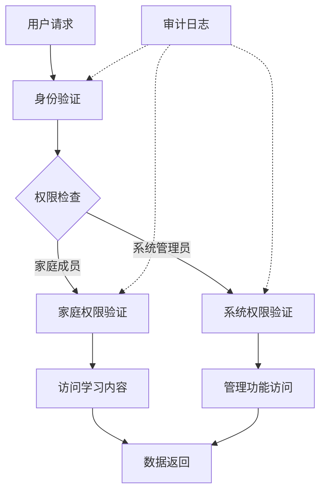

# 权限管理规范文档

## 1. 概述

本文档详细描述MathFun系统的权限管理体系，包括家庭租户内部权限和系统管理权限两大部分。

## 2. 家庭租户权限模型

### 2.1 租户结构
- **租户类型**：家庭订阅模式
- **成员构成**：父母（监护人）+ 1-3名子女
- **权限层级**：
  - 父母（监护人）：拥有最高权限，可以管理子女账户、查看学习进度、设置限制等
  - 子女：受限权限，主要进行学习活动

### 2.2 父母权限
- 管理子女账户
- 查看子女学习进度和报告
- 设置学习时间和内容限制
- 购买/续订服务
- 修改家庭信息

### 2.3 子女权限
- 访问适合年龄的学习内容
- 参与互动学习活动
- 查看个人学习进度
- 使用个性化推荐功能

## 3. 系统管理权限

### 3.1 角色定义
- **超级管理员（Super Admin）**：
  - 系统全局配置
  - 用户账户管理
  - 内容审核
  - 系统监控

- **内容管理员（Content Admin）**：
  - 教育内容管理
  - 课程发布
  - 知识图谱维护

- **运营管理员（Operations Admin）**：
  - 用户数据分析
  - 活动管理
  - 推送通知

### 3.2 权限分配矩阵

| 功能模块 | 超级管理员 | 内容管理员 | 运营管理员 |
|---------|-----------|-----------|-----------|
| 用户管理 | ✅ | ❌ | ❌ |
| 内容管理 | ✅ | ✅ | ❌ |
| 数据分析 | ✅ | ❌ | ✅ |
| 系统配置 | ✅ | ❌ | ❌ |
| 消息推送 | ✅ | ❌ | ✅ |

## 4. 技术实现

### 4.1 后端实现（Go）
- **权限框架**：Casbin（支持RBAC模型）
- **中间件**：JWT认证 + 权限验证中间件
- **数据结构**：

```go
type User struct {
    ID       uint   `json:"id"`
    Email    string `json:"email"`
    Role     string `json:"role"` // parent, child, super_admin, content_admin, operations_admin
    TenantID uint   `json:"tenant_id"` // 家庭租户ID
    ParentID *uint  `json:"parent_id"` // 子女关联的父账户ID
}

type Permission struct {
    ID          uint   `json:"id"`
    Resource    string `json:"resource"`  // 资源标识
    Action      string `json:"action"`    // 操作类型
    Effect      bool   `json:"effect"`    // 是否允许
    TenantLevel bool   `json:"tenant_level"` // 是否为租户级权限
}
```

### 4.2 前端实现（React）
- **权限组件**：基于角色的UI渲染
- **路由守卫**：权限验证路由

```jsx
import { usePermission } from './hooks/usePermission';

const ProtectedRoute = ({ children, requiredRole }) => {
  const { hasRole } = usePermission();
  
  if (!hasRole(requiredRole)) {
    return <AccessDenied />;
  }
  
  return children;
};

const PermissionGate = ({ requiredPermission, children }) => {
  const { hasPermission } = usePermission();
  
  return hasPermission(requiredPermission) ? children : null;
};
```

## 5. 安全措施

### 5.1 数据隔离
- 租户间数据完全隔离
- 严格的访问控制检查
- 审计日志记录

### 5.2 防护机制
- 防止权限提升攻击
- 定期权限审查
- 异常行为监控

## 6. 架构图



## 7. 权限管理流程

### 7.1 用户注册流程
1. 家长注册创建家庭租户
2. 创建子女账户并关联到家庭
3. 分配相应角色和权限

### 7.2 权限变更流程
1. 管理员发起权限变更请求
2. 系统验证操作者权限
3. 执行权限变更
4. 更新权限缓存
5. 记录审计日志

## 8. 最佳实践

### 8.1 权限最小化原则
- 每个角色仅授予完成其职责所需的最小权限
- 定期审查和回收不必要的权限

### 8.2 审计与监控
- 记录所有敏感操作
- 实施异常行为检测
- 定期生成权限审计报告

### 8.3 用户体验考虑
- 对于无权限的操作提供友好的提示信息
- 在界面中隐藏用户无法访问的功能
- 提供权限申请或升级的指引